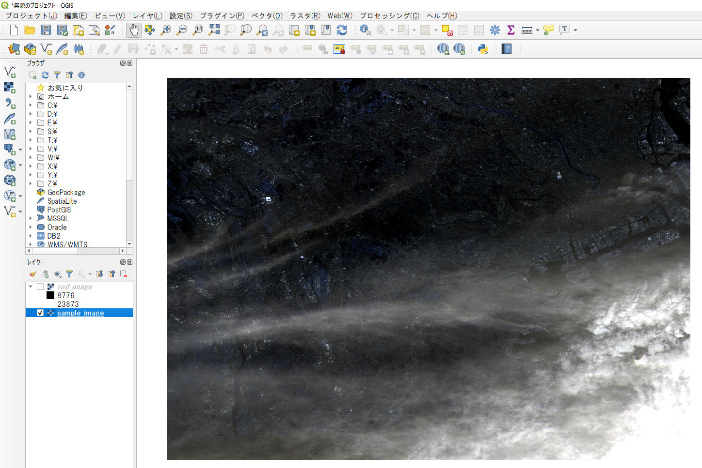
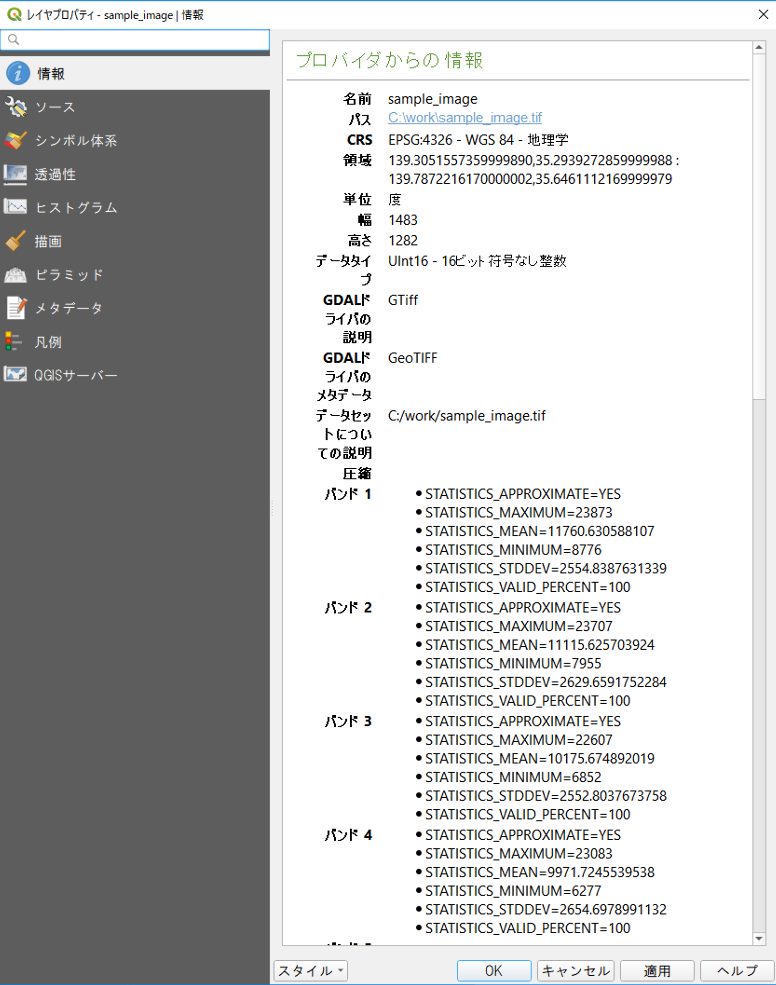
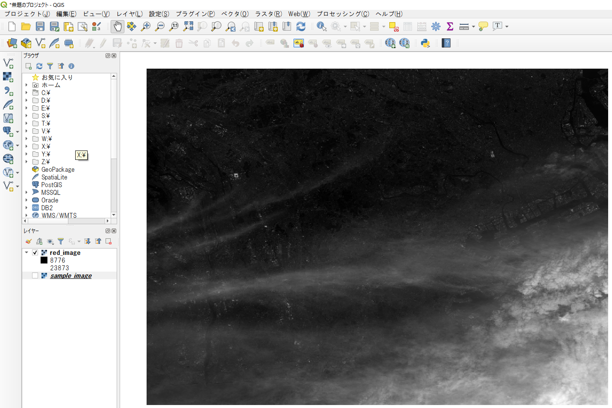

# ラスターデータの読み込み
画像のデータ出るラスターデータの読み込み方を学びます。
また、読み込んだラスターデータを配列に変換し、簡単な配列同士の計算をします。

**Menu**
-----
- [バンドの読み込みと配列化](#バンドの読み込みと配列化)
- [配列の結合](#配列の結合)
- [画像の作成](#画像の作成)

## <a name="バンドの読み込みと配列化"></a>バンドの読み込みと配列化
画像のバンドを取得し、`ndarray`オブジェクトにします。
最初に画像を読み込むためのライブラリ、gdalをインポートしましょう。

```Python
>>>from osgeo import gdal
```

※前回（NumPyについて）の続きで学習していない場合は、`import numpy as np`も行う。

QGISで`sample_image.tif`を読み込み混んだら、レイヤプロパティを開いて、情報をみておきましょう。パスや、CRS、4バンドあることがわかります。





さて、ラスターもベクターデータ同様`iface`を使ってレイヤを取得します。データのURIも取得しましょう。

```Python
>>>layer = iface.activeLayer()
>>>uri = layer.dataProvider().dataSourceUri()
>>>uri
'C:/work/sample_image.tif'
```

データを読み込み専用で開きます。

```Python
>>>src = gdal.Open(uri, gdal.GA_ReadOnly)
>>>src
<osgeo.gdal.Dataset; proxy of <Swig Object of type 'GDALDatasetShadow *' at 0x000002517233A330> >
```

バンド1を取得し配列化します。バンド1は赤色の成分なので`red`とします。

```Python
>>>red = src.GetRasterBand(1)
>>>red
<osgeo.gdal.Band; proxy of <Swig Object of type 'GDALRasterBandShadow *' at 0x000002517277B7B0> >
>>>red_a = red.ReadAsArray()
>>>red_a
array([[10099,  9860, 10110, ..., 10043,  9929,  9943],
       [ 9923,  9877,  9905, ..., 10485, 10130,  9847],
       [ 9923, 10039, 10277, ..., 10108,  9820,  9688],
       ...,
       [11876, 11917, 11973, ..., 22068, 22389, 22389],
       [11912, 11917, 11973, ..., 22082, 22389, 22389],
       [11932, 11921, 11938, ..., 22064, 22448, 22448]], dtype=uint16)
```

同様にバンド2から4、緑、青、近赤外のバンドを取得し、配列化します。

```Python
>>>green = src.GetRasterBand(2)
>>>green_a = green.ReadAsArray()
>>>blue = src.GetRasterBand(3)
>>>blue_a = blue.ReadAsArray()
>>>near_red = src.GetRasterBand(4)
>>>near_red_a = near_red.ReadAsArray()
```


## <a name="配列の基本情報の取得"></a>配列の基本情報の取得
配列の大きさや次元数など基本情報を取得してみましょう。
配列の大きさを取得します。

```Python
>>>width = red_a.shape[1]
>>>width
1483
>>>height = red_a.shape[0]
>>>height
1282
```

配列の次元数を取得します。

```Python
>>>dim = red_a.ndim
2
```

配列の全要素数を取得します。

```Python
>>>size = red_a.size
```

## <a name="配列の結合"></a>配列の結合
配列を１つにまとめて3次元の配列にしてみます。

```Python
>>>array = np.stack([red_a, green_a, blue_a, near_red_a], axis = 1)
>>>array
array([[[10099,  9860, 10110, ..., 10043,  9929,  9943],
        [ 9412,  9141,  9451, ...,  9356,  9218,  9243],
        [ 8442,  8262,  8679, ...,  8458,  8273,  8333],
        [ 8174,  7960,  8444, ...,  8257,  7986,  7999]],

       [[ 9923,  9877,  9905, ..., 10485, 10130,  9847],
        [ 9234,  9179,  9149, ...,  9837,  9429,  9100],
        [ 8350,  8257,  8308, ...,  8919,  8566,  8122],
        [ 8028,  7971,  8087, ...,  8785,  8242,  7770]],

       [[ 9923, 10039, 10277, ..., 10108,  9820,  9688],
        [ 9268,  9316,  9696, ...,  9381,  9091,  8907],
        [ 8222,  8505,  8434, ...,  8525,  8150,  7861],
        [ 8019,  8331,  8036, ...,  8179,  7733,  7410]],

       ...,

       [[11876, 11917, 11973, ..., 22068, 22389, 22389],
        [11203, 11200, 11231, ..., 21765, 22117, 22117],
        [ 9945,  9991, 10032, ..., 20642, 21016, 21016],
        [ 9496,  9537,  9593, ..., 21079, 21435, 21435]],

       [[11912, 11917, 11973, ..., 22082, 22389, 22389],
        [11224, 11200, 11231, ..., 21722, 22107, 22107],
        [ 9968,  9991, 10032, ..., 20701, 21049, 21049],
        [ 9508,  9537,  9593, ..., 21119, 21456, 21456]],

       [[11932, 11921, 11938, ..., 22064, 22448, 22448],
        [11231, 11219, 11256, ..., 21749, 22213, 22213],
        [ 9989, 10056, 10081, ..., 20767, 21037, 21037],
        [ 9551,  9588,  9658, ..., 21183, 21474, 21474]]], dtype=uint16)
```

## <a name="画像の作成"></a>画像の作成
赤色のバンドの画像を作成します。

`GetGeoTransform()`で各種座標値を取得します。
取得できる値は(左上端のX座標, ピクセル幅, 回転角, 左上端のY座標, 回転角, ピクセル高さ)です。

```Python
>>>geotransform = src.GetGeoTransform()
>>>geotransform
(139.305155736, 0.00032506128186109986, 0.0, 35.646111217, 0.0, -0.00027471445475818956)
```

取得した各種座標値を変数に代入します。

```Python
>>>originY = geotransform[3]
>>>originX = geotransform[0]
>>>pixelWidth = geotransform[1]
>>>pixelHeight = geotransform[5]
```

ここで取得した配列の大きさを元に画像を作成します。作成する画像のファイル名と形式を指定しておきます。

```Python
>>>dst = "C:/work/red_image.tif"
>>>driver = gdal.GetDriverByName('GTiff')
>>>dst_raster = driver.Create(dst, width, height, 1, gdal.GDT_UInt16)
```

各種属性値を画像に渡し、座標値を設定します。

```Python
>>>dst_raster.SetGeoTransform((originX, pixelWidth, 0, originY, 0, pixelHeight))
0
```

作成した画像のバンドに赤色の配列を書き込みます。

```Python
>>>dst_band = dst_raster.GetRasterBand(1)
>>>dst_band.WriteArray(red_a)
0
```

最後にファイルを閉じて終了です。

```Python
>>>dst_band.FlushCache()
>>>dst_raster = None
```

作成した画像をQGISで開いて表示を確認しましょう。



<h2 style="background-color:#F8F5FD;text-align:center;">教材の利用に関するアンケート</h2>　本プロジェクトでは、教材の改良を目的とした任意アンケートを実施しています。ご協力いただける方は、<a href="https://docs.google.com/forms/d/1r8RTFK3CPo4xNM6SdOEsAtdA0CrChD6KPVVU9kRxWRs/">アンケート</a>にお進みください。ご協力のほどよろしくお願いいたします。<br><br>※ 本アンケートの成果は、教材の改良のほか、学会での発表等の研究目的でも利用します。
