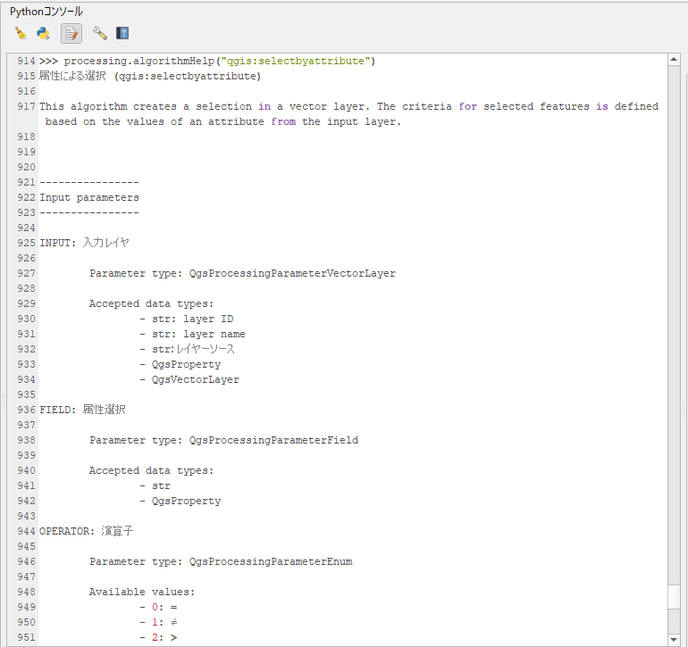
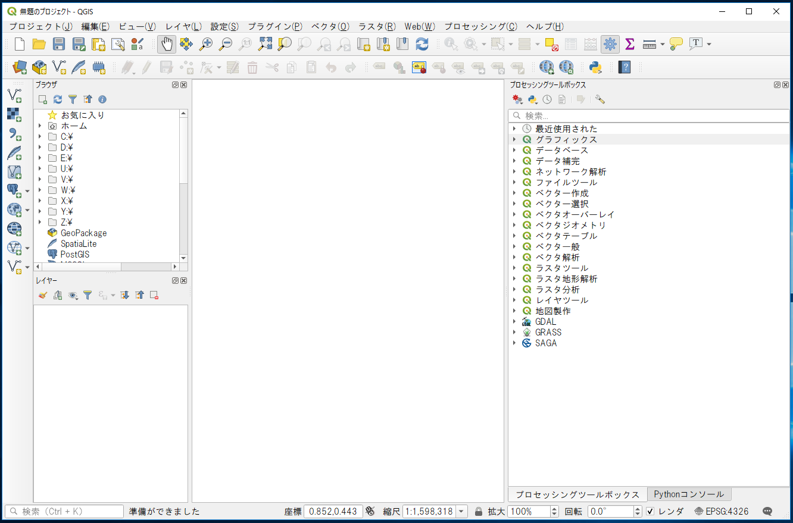
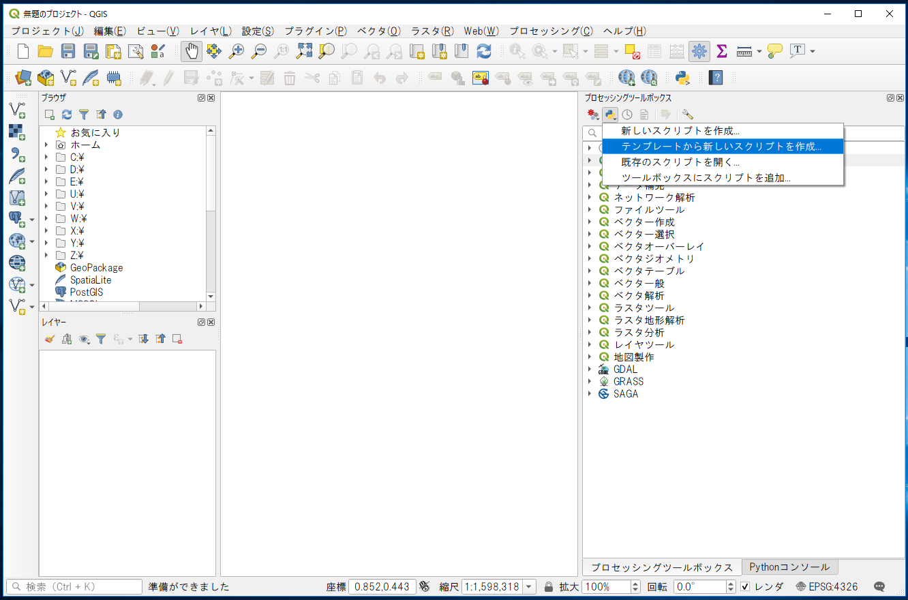
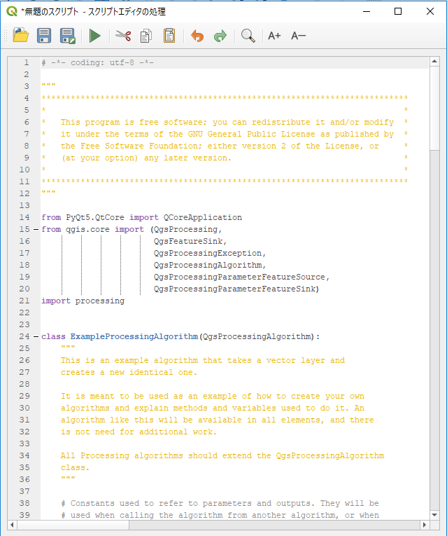
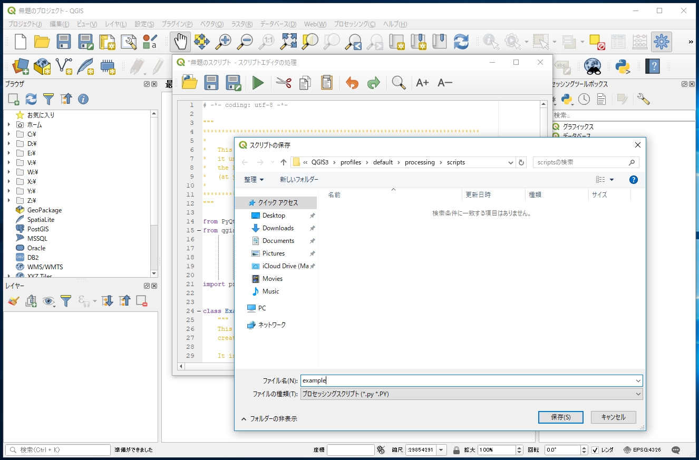
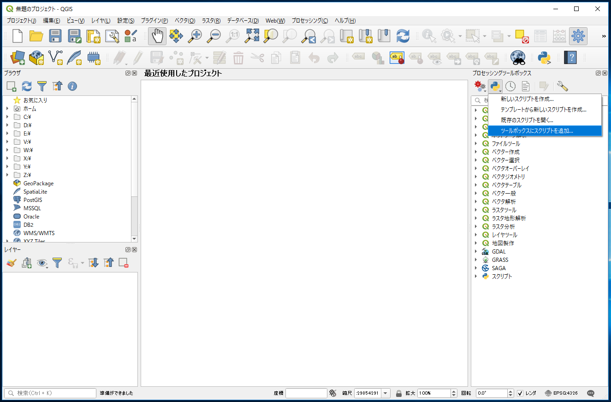
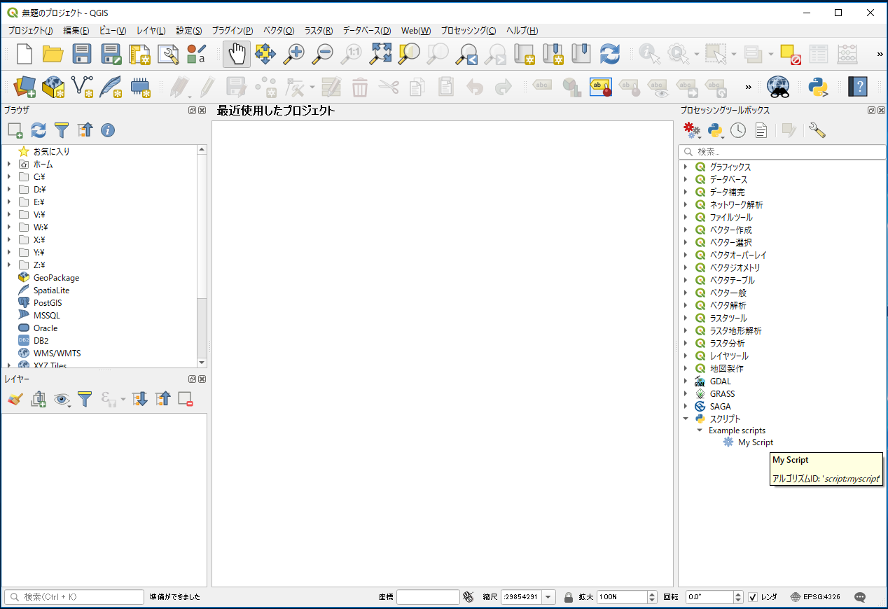
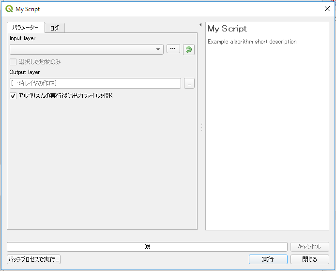

# プロセッシング入門
QGISのプロセッシングには便利な機能が多く存在しています。ここではPythonコンソール上でのプロセッシングツールの使い方を解説しています。


**Menu**
------
- [プロセッシングの呼び出し](#プロセッシングの呼び出し)
- [プロセッシングスクリプトの作成](#プロセッシングスクリプトの作成)


## <a name="プロセッシングの呼び出し"></a>プロセッシングの呼び出し
Pythonコンソールを開いて下さい。最初に行うことはプロセッシングのimportです。

```Python
>>>import processing
```

使用出来る機能の一覧を表示してみます。

```Python
>>>for alg in QgsApplication.processingRegistry().algorithms():
... print(alg.id(), "->", alg.displayName())
3d:tessellate -> テッセレーション
gdal:aspect -> 傾斜方位
gdal:assignprojection -> 投影法の割り当て
(以下略)
```

機能の使用方法の確認には、`processing.algorithmHelp()`を使用します。ここでは例として`selectbyattribute`の使い方を調べます。

```Python
>>>processing.algorithmHelp("qgis:selectbyattribute")
属性による選択 (qgis:selectbyattribute)

This algorithm creates a selection in a vector layer. The criteria for selected features is
(以下略)
```



表示された使用方法から、引数が５つ必要なこと(最後の引数OUTPUTは返り値の添字を表しているので指定の必要はありません。)がわかります。
    INPUT       : 入力レイヤ
    FIELD       : 属性選択
    OPERATOR    : 演算子
    VALUE       : 値
    METHOD      : 現在の選択を変更する

これらを引数で指定します。OPERATORに指定できる比較演算子はリストの中から選択し、対応する数字で指定します。`qgis:selectbyattribute`を実行してみましょう。
まずは`ne_50m_admin_0_countries.shp`を読み込みいつものように`iface`でレイヤを取得します。データの取得方法は[README]を参照してください。

[README]:../README.md

```Python
>>>layer = iface.activeLayer()
```

実行には`processing.run()`を使用します。最初の引数として機能名を、次の引数からは機能毎に必要とされる引数を辞書で渡します。返り値は、実行結果を反映したレイヤが入った辞書になります。

```Python
>>>result = processing.run('qgis:selectbyattribute',{
... 'INPUT': layer,
... 'FIELD': 'name',
... 'OPERATOR':0,
... 'VALUE':'Japan',
... 'METHOD':0})
>>>result
'{'OUTPUT': <qgis._core.QgsVectorLayer object at 0x0EAEBA80>}
```

`qgis:selectbyattribute` の場合、新しいレイヤは作らず入力として指定したレイヤを操作する機能ですので、入力レイヤがそのまま返ってきます。

次に選択されている図形を、別ファイルに保存してみましょう。
`native:saveselectedfeatures`の`Help`を確認します。

```Python
>>> processing.algorithmHelp("native:saveselectedfeatures")
```

入力するベクトルレイヤと出力先（ファイルか一時レイヤとしてメモリ上に作成するか）を指定することがわかります。出力先を”/tmp/tmp.shp”(実習環境によってパスを変更)として、実行した結果を読み込んでみます。

```Python
>>>result2 = processing.run('native:saveselectedfeatures',{
...'INPUT': result['OUTPUT'],
...'OUTPUT': '/tmp/tmp.shp'})
>>>processing.load(result2['OUTPUT'])
```

## <a name="プロセッシングスクリプトの作成"></a>プロセッシングスクリプトの作成
このようにプロセッシングを使うことで、QGIS本体の機能、その他のライブラリ・アプリケーションで用意された機能といった、別々に提供された解析機能を同一のインタフェースから使用することが出来るようになります。
プロセッシングには決まったルールで入力・出力を定義してあげることで、自分で書いたスクリプトを追加することができます。テンプレートからスクリプトを作成することができますので、その構成を見てみましょう。
QGISのメニューバーから`プロセッシング > ツールボックス`を選択すると、プロセシングツールボックスが表示されます。



`スクリプト（Pythonアイコン）＞テンプレートから新しいスクリプトを作成...`を選択し、スクリプトエディターにテンプレートが表示されます。





テンプレートの中身を確認しましょう。
まず、ライセンスに関する注意書きが書かれています。

```
# -*- coding: utf-8 -*-

"""
***************************************************************************
*                                                                         *
*   This program is free software; you can redistribute it and/or modify  *
*   it under the terms of the GNU General Public License as published by  *
*   the Free Software Foundation; either version 2 of the License, or     *
*   (at your option) any later version.                                   *
*                                                                         *
***************************************************************************
"""
```

次に各種ライブラリをインポートされています。

```Python
from PyQt5.QtCore import QCoreApplication
from qgis.core import (QgsProcessing,
                       QgsFeatureSink,
                       QgsProcessingException,
                       QgsProcessingAlgorithm,
                       QgsProcessingParameterFeatureSource,
                       QgsProcessingParameterFeatureSink)
import processing
```

他のスクリプトとの連携に使う定数が定義されています。ここでは、入出力に使用する定数`INPUT`と`OUTPUT`が定義されています。

```Python
class ExampleProcessingAlgorithm(QgsProcessingAlgorithm):
    """
    This is an example algorithm that takes a vector layer and
    creates a new identical one.

    It is meant to be used as an example of how to create your own
    algorithms and explain methods and variables used to do it. An
    algorithm like this will be available in all elements, and there
    is not need for additional work.

    All Processing algorithms should extend the QgsProcessingAlgorithm
    class.
    """

    # Constants used to refer to parameters and outputs. They will be
    # used when calling the algorithm from another algorithm, or when
    # calling from the QGIS console.

    INPUT = 'INPUT'
    OUTPUT = 'OUTPUT'

    def tr(self, string):
        """
        Returns a translatable string with the self.tr() function.
        """
        return QCoreApplication.translate('Processing', string)

    def createInstance(self):
        return ExampleProcessingAlgorithm()
```


スクリプトの情報を返すメソッドが並びます。
スクリプトの名称や、ツールボックスに表示される際のグループに関する情報、また短いヘルプ文章を定義しています。

```Python
    def name(self):
        return 'myscript'

    def displayName(self):
        return self.tr('My Script')

    def group(self):
        return self.tr('Example scripts')

    def groupId(self):
        return 'examplescripts'

    def shortHelpString(self):
        return self.tr("Example algorithm short description")
```

`initAlgorithm()`にスクリプトを起動した際の、各パラメータ選択のフォームを定義します。入力としてベクタレイヤと出力としてのレイヤを定義しています。

```Python
def initAlgorithm(self, config=None):
    self.addParameter(
        QgsProcessingParameterFeatureSource(
            self.INPUT,
            self.tr('Input layer'),
            [QgsProcessing.TypeVectorAnyGeometry]
        )
    )

    self.addParameter(
        QgsProcessingParameterFeatureSink(
            self.OUTPUT,
            self.tr('Output layer')
        )
    )
```

作成したスクリプトをユーザーのホームディレクトリ`AppData\Roaming\QGIS\QGIS3\profiles\default\processing\scripts`に保存すると、プロセッシングツールボックス内に表示されるようになります。名前を`example.py`とし保存しましょう。



保存したスクリプトはプロセッシングツールボックスに追加することができます。プロセッシングツールボックスのメニューバーで`スクリプト > ツールボックスにスクリプトを追加...`を選択します。



先ほど保存したexample.pyを選択します。


プロセッシングツールボックスに`My Script`が追加されます。



スクリプトを起動してGUIと比較してみましょう。`My Script`をダブルクリックします。



先ほど、スクリプト内に記述した２つのパラメータが設定できるようになっていることがわかります。
ここで設定できるパラメータの種類は、`QgsProcessingParameterType`クラスからの派生クラスを参考にしてください。
- 公式ドキュメント：https://qgis.org/api/classQgsProcessingParameterType.html

再度、スクリプトを開いて、処理内容の記述分を確認してみましょう。`スクリプト > 既存のスクリプトを開く...`を選択すると、スクリプトの内容を編集することができます。


実際の処理内容は、`processAlgorithm()`内に記述されます。パラメータを受け取り、処理を行い、最終的に辞書として返答を行います。

```Python
def processAlgorithm(self, parameters, context, feedback):
    source = self.parameterAsSource(
            parameters,
            self.INPUT,
            context
        )
(中略)
    return {self.OUTPUT: dest_id}
```

<h2 style="background-color:#F8F5FD;text-align:center;">教材の利用に関するアンケート</h2>　本プロジェクトでは、教材の改良を目的とした任意アンケートを実施しています。ご協力いただける方は、<a href="https://docs.google.com/forms/d/1r8RTFK3CPo4xNM6SdOEsAtdA0CrChD6KPVVU9kRxWRs/">アンケート</a>にお進みください。ご協力のほどよろしくお願いいたします。<br><br>※ 本アンケートの成果は、教材の改良のほか、学会での発表等の研究目的でも利用します。
