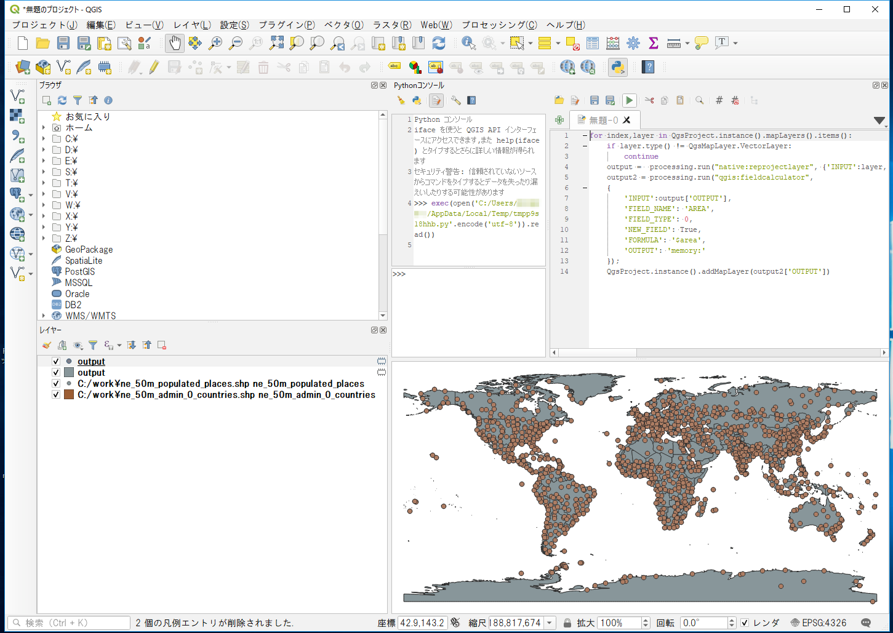
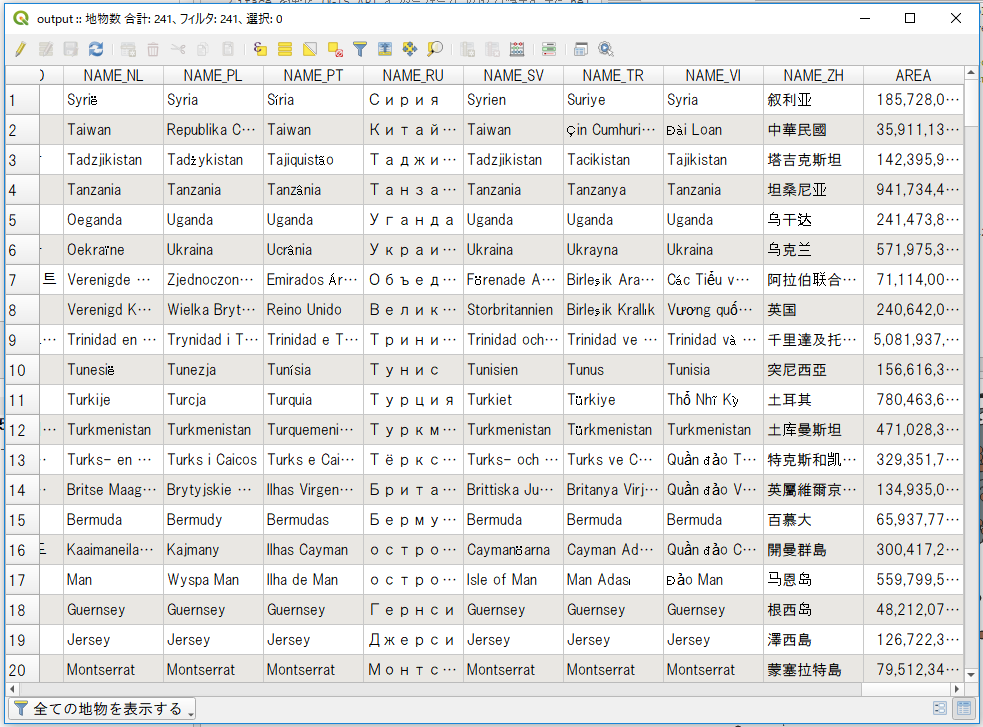

# 一括処理
データ処理を効率化するために、読み込み済みの全てのレイヤ、もしくは指定ディレクトリ内の全てのファイルに対して、同一の処理を行いたい場合があります。例えば、多数のベクトルファイルに対して投影変換を行いたい場合、QGISのインタフェースを通して、ファイルを開き、別名で保存するを繰り返すことは可能ですが、時間ばかりかかってしまいます。また、手作業では操作ミスがどうしても入ってしまいます。

ここでは、一括処理を行う際のヒントとなる情報を見ていきます。この章ではこれまでに利用したデータを使って練習していきますが、別途取得したGISデータに置き換えて実習することも可能です。

**Menu**
------
- [読み込み済みのレイヤに順次アクセス](#読み込み済みのレイヤに順次アクセス)
- [指定フォルダ内のファイルを取り込み](#指定フォルダ内のファイルを取り込み)
- [プロセッシング応用](#プロセッシング応用)

## 読み込み済みのレイヤに順次アクセス
読み込み済みのレイヤ一覧にはQgsProjectクラスのインスタンスからアクセスします。
`ne_50m_admin_0_countries.shp`と`ne_50m_populated_places`を読み込んでおきましょう。データの取得方法は[README]を参照してください。

[README]:../README.md

全てのレイヤインスタンスにアクセスして、レイヤ名を書き出してみます。

```Python
>>>for index,layer in QgsProject.instance().mapLayers().items():
...   print(layer.name())
ne_50m_admin_0_countries
ne_50m_populated_places
```

レイヤがラスターなのかベクターなのかは、`type()`によって取得できます。
特定の種別レイヤのみアクセスしたい場合は、if文等で判断します。
ここからはスクリプトが複数行にわたるのでエディタを使ってコードを書いていきましょう。エディタの使い方は[QGISでのPython入門]を参考にしてください。

[QGISでのPython入門]:../01/01.md

```Python
for index,layer in QgsProject.instance().mapLayers().items():
    if layer.type() == QgsMapLayer.VectorLayer:
        print('vector')
    elif layer.type() == QgsMapLayer.RasterLayer:
        print('raster')
    else:
        print('other')
```

ベクトルレイヤのうち、特定の図形タイプ(ポイント、ライン、ポリゴン)のレイヤのみアクセスしたい場合は、ベクトルレイヤの`geometryType()`を参照します。

```Python
for index,layer in QgsProject.instance().mapLayers().items():
    if layer.type() != QgsMapLayer.VectorLayer:
        continue
    if layer.geometryType() == QgsWkbTypes.PointGeometry:
        print('POINT')
    elif layer.geometryType() == QgsWkbTypes.LineGeometry:
        print('LINE')
    elif layer.geometryType() == QgsWkbTypes.PolygonGeometry:
        print('POLYGON')
    else:
        print('other')
```

## 指定フォルダ内のファイルを取り込み
特定のフォルダ内にあるファイルを、QGISにレイヤとして取り込んでみましょう。
Pythonのglobモジュールを使用して、拡張子指定でファイル名を取得します。C:/workから読み込むものとします。

```Python
import glob

files = glob.glob(r'C:/work/*.shp')
for file in files:
    iface.addVectorLayer(file, file, 'ogr')
```

## プロセッシング応用
各レイヤに対して同一の処理を行う場合かつ、その処理がプロセッシングに用意されている場合、その機能を用いることで容易にデータ処理を進めることができます。ここでは、複数のベクトルファイルの投影変換と面積計算を例にあげて解説していきます。

また、プロセッシング機能の特徴は、
- 使用するアルゴリズムと必要なパラメータ、対象ファイル名をプロセッシングに渡す
- 処理したファイル名(アルゴリズムによる)が返される
ことにあります。

これを利用すると、複数の処理を繋げて実行できます。

ベクトルファイルの投影変換は、プロセッシングの`native:reprojectlayer`で行うことができます。
オプションとして、レイヤと変換後の投影を指定します。例では、出力先はメモリ上の一時レイヤとしています。
読み込み済みのベクトルレイヤに投影変換を行い(EPSG:3857へ変換)、変換後のレイヤを追加してみます。

```Python
for index,layer in QgsProject.instance().mapLayers().items():
    if layer.type() != QgsMapLayer.VectorLayer:
        continue
    output =  processing.run("native:reprojectlayer", {'INPUT':layer, 'TARGET_CRS':'EPSG:3857', 'OUTPUT':'memory:'})
    QgsProject.instance().addMapLayer(output['OUTPUT'])
```



処理をつなげてみます。
ベクトルレイヤを投影変換した上で、`qgis:fieldcalculator`を使用して各図形の面積を計算した結果を`AREA`フィールドに追加します。

```Python
for index,layer in QgsProject.instance().mapLayers().items():
    if layer.type() != QgsMapLayer.VectorLayer:
        continue
    output =  processing.run("native:reprojectlayer", {'INPUT':layer, 'TARGET_CRS':'EPSG:3857', 'OUTPUT':'memory:'})
    output2 = processing.run("qgis:fieldcalculator",
    {
        'INPUT':output['OUTPUT'],
        'FIELD_NAME': 'AREA',
        'FIELD_TYPE': 0,
        'NEW_FIELD': True,
        'FORMULA': '$area',
        'OUTPUT': 'memory:'
    });
    QgsProject.instance().addMapLayer(output2['OUTPUT'])
```

QGISのインターフェースから属性テーブルを確認すると`AREA`のフィールドが追加されていることがわかります。



プロセッシングで複数処理を流していると、特にベクトルレイヤでは不正な図形ができてしまい処理が止まってしまうことがあります。
その場合QGISのメニューから`設定＞オプション＞プロセッシング＞一般情報＞無効な地物のフィルタリング`から`不正なジオメトリを持つ地物を無視する`に変更して処理が止まるのを避ける方法もあります。

<h2 style="background-color:#F8F5FD;text-align:center;">教材の利用に関するアンケート</h2>　本プロジェクトでは、教材の改良を目的とした任意アンケートを実施しています。ご協力いただける方は、<a href="https://docs.google.com/forms/d/1r8RTFK3CPo4xNM6SdOEsAtdA0CrChD6KPVVU9kRxWRs/">アンケート</a>にお進みください。ご協力のほどよろしくお願いいたします。<br><br>※ 本アンケートの成果は、教材の改良のほか、学会での発表等の研究目的でも利用します。
