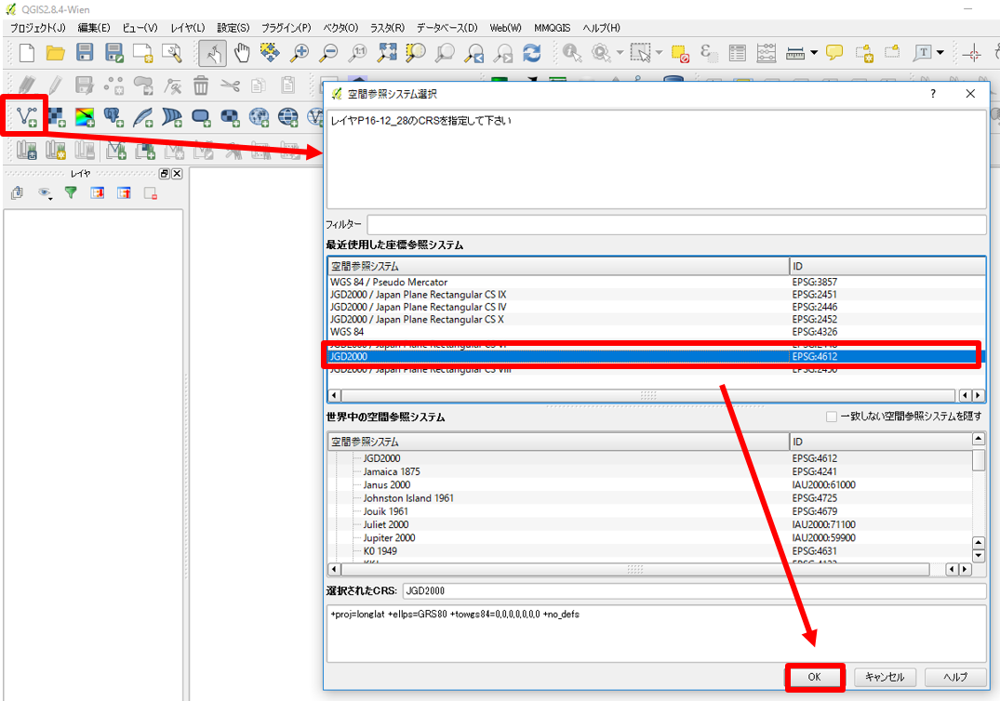
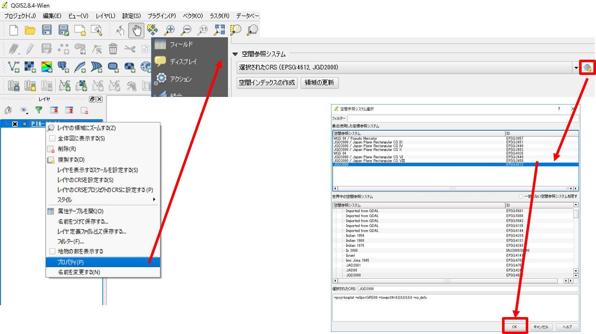
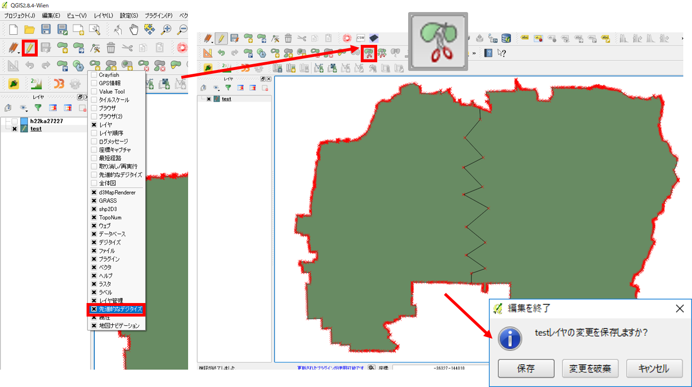
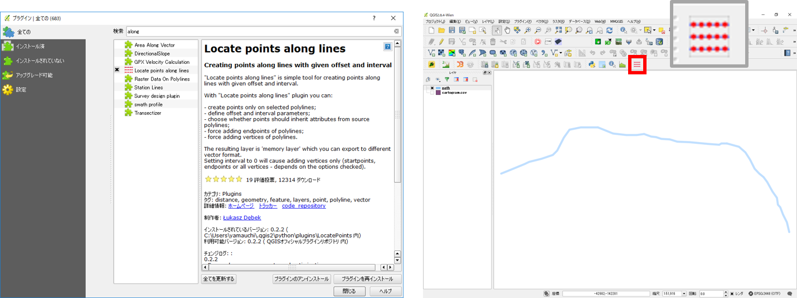
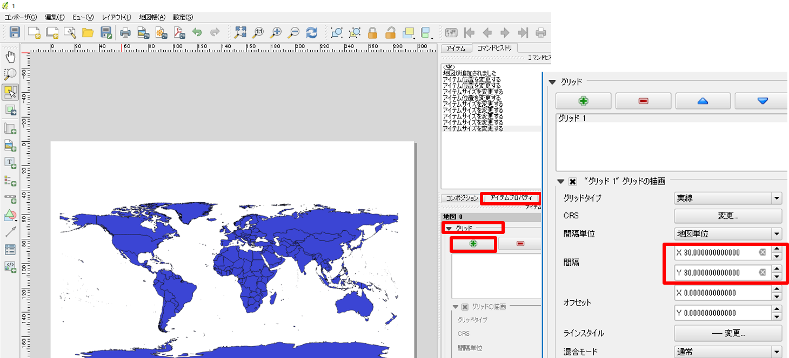

# よくある質問とエラー
以下は、QGIS(2.8)の利用時や実習におけるよくある質問とエラーについてまとめたものです。

<h2 style="background-color:#F8F5FD;text-align:center;">「よくある質問とエラー」ページの充実のためのアンケート</h2>　本プロジェクトでは、教材の改良を目的とした任意アンケートを実施しています。「よくある質問とエラー」ページに追加してほしい項目や、本ページに対する意見・提案等を、<a href="https://customform.jp/form/input/22493/">アンケート</a>に記入してください。<br><br>※ 本アンケートの成果は、教材の改良のほか、学会での発表等の研究目的でも利用します。また、本アンケートでは、個人が特定できるような質問は設けておりません。

## QGISに関する質問やエラー集
本教材の他に、QGISに関する質問やエラー集をまとめているサイトとして以下があります。

- [QGIS初心者質問グループ](https://groups.google.com/forum/#!forum/qgisshitumon01) :QGISユーザー有志によって運営されているサイトです。QGISに関する質問と回答集が蓄積されている有用なページです。誰でも自由に質問することが可能です（質問投稿の際には、「※注意」を確認する）。

## QGISの基本操作

### データ読み込みについて
* .ZIPのファイルは解凍作業が必要
* シェープファイルは複数のファイルの総称をいう(読み込みの際は.shpファイルを選択する)
* 文字コードは、日本語の場合shift-JISかutf-8を選択（文字化けする場合は、「QGISのレイヤ>プロパティ>一般情報>データソースエンコーディング」より変更）


### 新規ベクトルレイヤと属性テーブルの追加
* QGISで新規にラインやポリゴンを作成する場合は、作成後に右クリックが必要
* データ型に注意し、新規レイヤや属性テーブルの追加を行う。

 >「名称」はカラム名、「タイプ」はデータ型にあわせる、「幅」と「精度」は入力するデータによる。
「タイプ」・・・値が整数ならInteger、小数を含むならReal、テキストならStringとなる。
「幅」＞桁数、「精度」＞表示する小数の位

### シンボル（ポイントやラインの形状）変更、ラベルの追加
* ラベルは、プロパティ>ラベル から、ラベルにチェックをいれ、ラベルを表示したい属性テーブルを選択し、OKをクリックする

### 地理座標系と投影座標系
|座標系|単位|
|---|---|
|地理座標系|緯度経度|
|投影座標系|メートル等|

※ 座標系については[esriジャパンの GIS 基礎解説](https://www.esrij.com/gis-guide/coordinate-and-spatial/coordinate-system/)が詳しい。

## ジオリファレンス
### ジオリファレンスの注意点：QGISの場合
* GCPの位置が偏りすぎないようにする（まず、四隅をおさえる）
* 5箇所程度GCPが取得で来たら、ジオリファレンスの開始をクリックする
* QGISの操作画面に画像を反映させてから、細かい修正をするとよい
* GCPテーブルのresidual（誤差）の値を確認し、大きすぎる値を消去するとよい
* GCPを保存しておくと、次回も利用できる
* GCPを付けた画像は、「名前を付けて保存」からGeoTIFF形式で保存する

## プラグイン
### タイルレイヤプラグインの注意点

* QGIS>Webからタイルレイヤプラグインを起動し、設定から任意の場所に置いた.tsvファイルがあるフォルダを選択する。
* 背景画像の表示は、座標系とズームレベル（拡大レベル）に注意する
* 使わないタイルは、消しておくと表示がスムーズになる

## 測地座標系の変換
### 国土数値情報の変換
国土数値情報のデータは、世界測地系の緯度経度で提供されているため、平面直角座標系で利用する場合は、変換が必要になる。以下にその手順を示す。なお、本教材では、QGIS2.8がJGD2011に対応していない場合があるため、JGD2011のデータもJGD2000をとして扱っている。

まず、ダウンロードしたデータをQGISで読み込む。
読み込んだ際に、下の図のようなうウィンドウがでたら、JGD2000を選択し、OKをクリックする。


ウィンドウが出ない場合は、レイヤウィンドウ上で読み込んだレイヤを右クリックし、一般情報の空間参照システムをJGD2000にし、OKをクリックする。


以上のように、測地座標系の初期設定が完了させた上で、空間座標の変換を行う。空間座標の変換は、[空間データ]の教材を参照すること。
また、よくある間違いとして、空間座標の変換をプロパティ＞一般情報から行うという例がある。QGISでは、プロパティから空間座標の変換はできないため、必ず名前を付けて保存から変換すること。


※日本のデータを利用して、平面直角座標系を使用する場合は、国土地理院の[平面直角座標系のページ]を参照するとよい。

## テーブル結合
　テーブル結合は、同じフィールドをもつテキストデータと空間データを結合する処理です。例えば、市町村の境界データと同地域の人口データを結合する場合、両データで一致する市町村名等の属性を用いて、データを結合します。以下では、QGIS2.8でテーブル結合をする手法について解説します。

空間データとテキストデータを読み込み、空間データのプロパティを開く。プロパティ＞結合をクリックする。結合タブの＋ボタンをリックし、結合するレイヤ（テキストデータ）と両者のデータの一致する属性が入っているフィールドを選択する（町丁目等で結合することもできる）。


ＯＫをクリックした後、結合ができているかを確認するため、属性テーブルを開く。結合が正しくできている場合は、名前を付けて保存から、新規データとして書き出す。


## ポリゴンの分割
　以下では、QGIS2.8でポリゴンを分割する手法について解説しています。

ポリゴンを分割したいデータを読み込む。ボタンが並んでいるグレーの個所で右クリックし、先進的なデジタイズのツールを表示する。編集モードをオンにし、下の図のアイコンをクリックする。ポリゴンを分割するには、分割したい地点の外側をクリックしてから、分割したい図形を作成する。図形の作成を終えるには、レイヤの外側をクリックした後、右クリックすると反映される。最後に、編集を保存し、ポリゴンの分割を完了させる。



## ラインに沿ってポイント作成
　以下では、QGIS2.8を用いて、ラインに沿って、一定の間隔でポイントを作成する手法について解説しています。

プラグインの管理とインストールから、`Locate points along lines`プラグインをインストールする。インストールが完了したら、下図のようなアイコンが表示されるので、それをクリックする。

※以下では、50ｍ間隔でポイントを作成するため、投影座標系のデータを利用している。


表示された画面に、入力データ、出力するデータ名と点の間隔等を入力し、Runをクリックする。データが正しく表示できていれば、名前を付けて保存を行う。


## 条件式による属性の分類
### 同区画内の複数の属性から最大のものを算出する
　下の図のように、区画ごとに複数の属性がある場合、収穫量の最も多い作物を示すには、新規にフィールドを作成し、ある条件式に基づいて算出する必要があります。以下では、その条件式を紹介します。


QGISのフィールド演算機では、IF(論理式,TRUE,FALSE)を用いて条件式をつくることができる。以下は、全てが0の値を除き、それぞれの値が最大であれば、それに応じた属性を出力するというようにしている。

※フィールド名を日本語にするとエラーが起きるため、実際にデータを扱う場合は注意が必要となる。

```
IF(MAX( "米(t)" , "野菜(t)" , "その他(t)" )
=0,'',
IF(MAX( "米(t)" , "野菜(t)" , "その他(t)" )
="米(t)",'米',
IF(MAX( "米(t)" , "野菜(t)" , "その他(t)" )
="野菜(t)",'野菜',
IF(MAX( "米(t)" , "野菜(t)" , "その他(t)" )
="その他(t)",'その他',''
))))
```

## 基盤地図情報、数値標高モデルのダウンロード
①[基盤地図情報]のサイトにアクセスし、基盤地図情報のダウンロードをクリックする。②ダウンロードサービスのページから、基盤地図情報数値標高モデルを選択する。③地図からデータをダウンロードするエリアを選択する（このとき、タブがDEMになっていることを確認しておく）。④ダウンロードファイル確認をクリックする。⑤全てのデータにチェックをつけ、まとめてダウンロードをクリックする。

ダウンロードしたデータは、GeoTIFFでないため、エコリスの変換ツール等を利用する（[ラスタデータの分析]の教材を参照）。

## 緯線と経線の表示

### 通常画面
ビュー＞地図装飾＞グリッドから、グリッドを`有効にする`にチェックをつけXとYの間隔を指定（EPSGが地理座標系になっているかをあらかじめ確認しておく）する。`注記を描画する`をチェックすると値が表示される。

### プリントコンポーザー
アイテムプロパティ＞グリッドを選択する。`グリッドの描画`にチェックをつけXとYの間隔を指定（EPSGが地理座標系になっているかをあらかじめ確認しておく）する。`座標の描画`にチェックをつけ座標軸の表示設定をする。



[基盤地図情報]:http://www.gsi.go.jp/kiban/
[QGISビギナーズマニュアル]:../../QGIS/QGIS.md
[平面直角座標系のページ]:http://www.gsi.go.jp/LAW/heimencho.html
[ラスタデータの分析]:../../15/15.md
