# 地形環境分析のためのQGIS入門
　このコースでは、QGISの操作手法の解説と視覚的な地形表現を行います。前半部では、[QGISビギナーズマニュアル]の内容を中心にQGISの基本操作の解説を行います。後半部では、[ラスタデータの分析]の教材の内容を用いて、地形を視覚的に表現します。この実習を最後まで進め、設定している課題の地図を作成することができれば、受講完了になります。

　GIS初学者は、本教材を進める前に[GISの基本概念]の教材を確認しておいてください。本教材を使用する際は、[利用規約]をご確認いただき、これらの条件に同意された場合にのみご利用下さい。

**Menu**
----------
**[前半：QGIS入門](#前半：QGIS入門)** 
* [QGISとは？](#qgisとは？)
* [インストール](#インストール)
* [起動](#起動)
* [ウインドウ](#ウインドウ)
* [各種ボタン](#各種ボタン)
* [データの読み込み](#データの読み込み)
* [機能説明](#機能説明)
* [属性テーブル](#属性テーブル)
* [プロパティ](#プロパティ)
* [地図タイルの読み込み](#地図タイルの読み込み)
* [地図のレイアウト](#地図のレイアウト)
* [作業ファイルの保存](#作業ファイルの保存)
* [前半の課題](#前半の課題)

**[後半：視覚的な地形表現](#後半：視覚的な地形表現)** 
* [数値標高モデルの視覚的分析](#数値標高モデルの視覚的分析)
* [基本的な統計量の確認](#基本的な統計量の確認)
* [標高データの取得](#標高データの取得)

## 前半:QGIS入門
実習をはじめる前に、[tokyo.zip]をダウンロードしてください。

[tokyo.zip]:https://github.com/gis-oer/datasets/raw/master/tokyo.zip

## QGISとは？
　QGISは、無償で利用できるオープンソース（GNU General Public License v2で提供）のGISです。Windows,Mac,Linux,Unix, Androidなど様々な環境で動作します。様々なプラグインや、GRASSやPostGISなど他のオープンソースGISと連携して使用することで、多種類の分析が可能です。GISの基本操作に必要な機能を網羅しているだけでなく、Web上に多数のマニュアルがアップロードされているため、GISの学習がしやすいソフトウェアです。  

> http://qgis.org/ja/site/about/index.html を参考に作成

[▲メニューへもどる]

## インストール
　QGISは、最新版と1年間のバグ修正のサポートがあるLTR版があります。GIS実習オープン教材では、LTR版のQGIS3.4を中心に利用しています。下記に従って、QGISをインストールしてください（LTR版のダウンロードを推奨）。

### 最新版のインストール
[QGIS](https://qgis.org/ja/site/index.html)のホームページにアクセスし、`ダウンロードする`をクリックする。

PCの環境にあわせて、32bit版か64bit版を選択するとダウンロードが開始される。

ダウンロードが終了したら、.exeファイルを実行し、QGISをインストールする。

[▲メニューへもどる]

### Mac版のインストール
Mac版のインストールは、QGISのインストーラを実行する前にPython 3.6をインストールする必要があります。Python 3.7系では正常に稼働しません。dmgファイルを開くと'1 Instal Python 3.rtf'がありますので、このドキュメントに従ってPython 3.6をインストールしてください。その後に'2 Install QGIS LTR.pkg'をダブルクリックしてQGISをインストールします。

[▲メニューへもどる]

## 起動
　デスクトップのQGISアイコンをダブルクリックする。しばらくするとQGISが起動する。
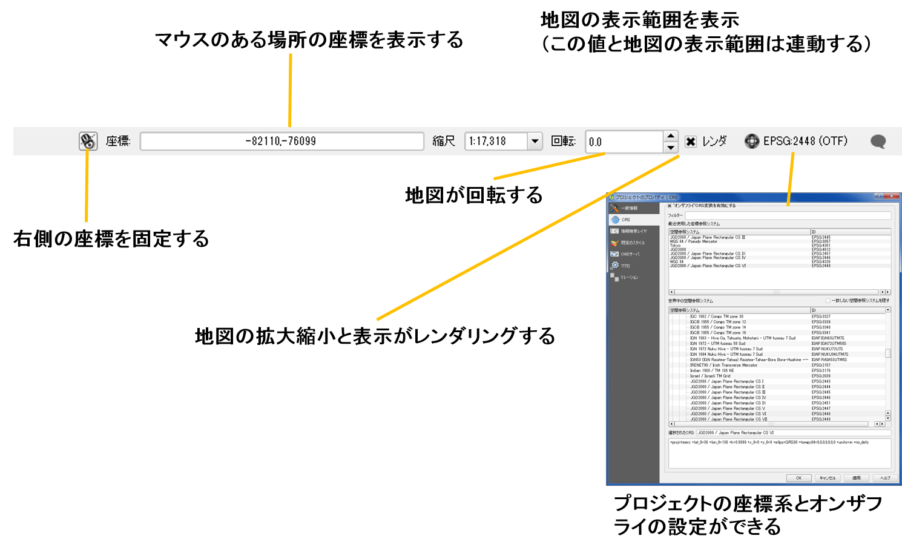

最初にQGIS3を起動した時には、下記の様に古いバージョンのGIS2からの設定を取り込むか聞かれることがあります。この演習ではQGIS2とは関係なくQGIS3を利用していきますので、「QGIS 2の設定をインポートせずクリーンな状態でスタートする」を選んでください。この設定は最初の1回だけで済みます。

[▲メニューへもどる]

## ウインドウ
　QGISを起動すると、下の図のようなウィンドウが表示されます。ウインドウ上のアイコンの配置は自由に変更することができます。アイコンのない箇所（グレーの部分）で右クリックして出てくる「パネル」メニューからパネルを選択することにより、別機能のパネルを呼び出すことができます。アイコンの数は、インストールしているプラグインの数によっても異なります。そのため、インストール直後のQGISと教材の画像が異なっていることを確認してください。

[▲メニューへもどる]

## 各種ボタン
　以下では、QGISで主に使用するボタンについて解説しています。

1. QGISファイルを保存
2. 名前をつけてQGISファイルを保存
3. 地図移動
4. 地図の拡大と縮小
5. 選択領域にズーム
6. 動作の前後移動
7. 地物情報の表示
8. 選択と選択取り消し
9. 長さ、面積計測（手動）
10. レイヤ編集
11. レイヤの読み込み

また、ウィンドウの下部にはカーソルの座標や縮尺、拡大、回転、座標系などを確認できるツールバーがあります。

[▲メニューへもどる]

## データの読み込み
　GISでは、位置情報を保持するベクトルデータとラスタデータを用いて、空間分析等を行います。各データの特徴は、[GISの基本概念_ベクトルデータとラスタデータ](../00/00.md)を参照してください。以下では、代表的なデータ形式を取り上げ、それらをQGISで読み込む手法について解説します。教材中に記載されている使用データ([tokyo.zip])を用意してください。そして、tokyo.zipファイルをダウンロード後に解凍してください）。

### ベクトルデータ読み込み
以下では、GISで扱う代表的なベクトルデータ形式のシェープファイルを読み込む手法について解説する。シェープファイルの特徴は、[GISの基本概念_シェープファイル](../00/00.md)を参照してください。

`データソースマネージャーを開く`のアイコンをクリックし、`ベクタ`のタブに切り替える。エンコーディングをUTF-8とし、ソースから、cvs_jgd2011_9.shpを指定する。`追加`をクリックするとデータが表示される。
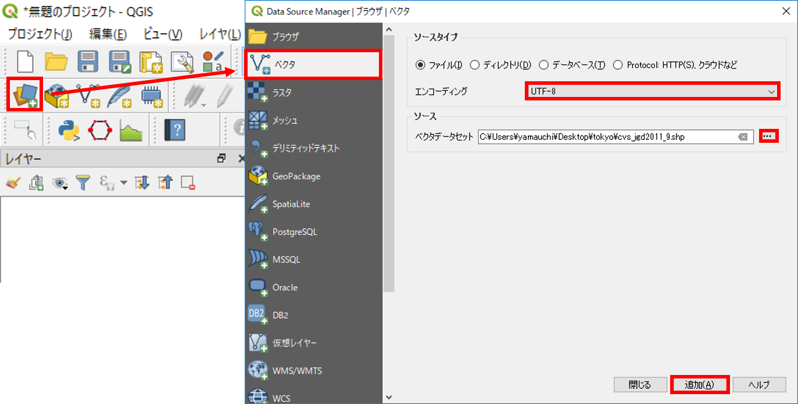

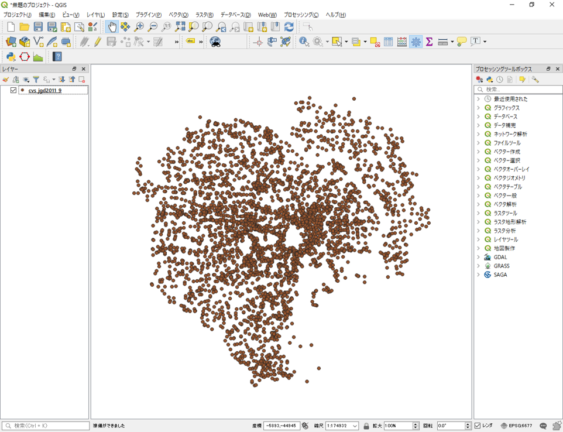

上記のように、cvs_jgd2011_9.shpを読み込むと、東京23区内のコンビニが表示される（ポイントデータ）。ベクトルデータには、ポイント、ライン、ポリゴンのデータ形式がある。ラインとポリゴンも同様の手法で読み込むことができる。

#### ライン
東京周辺の河川(river_9kei.shp)を表示する。

#### ポリゴン
東京23区のエリア(tokyo_23ku_jgd2011_9.shp)を表示する。

【註】ここまで続けてベクトルデータを読み込むと、ポイントの上にラインが被さり、さらにポリゴンのデータが被さって表示されます。これはレイヤーで後から読み込んだものが、一番上に表示されるためです。3つのデータがうまく表示されるように、レイヤーパネルでレイヤー名をドラッグしてレイヤー順番を変えます。委細については、後の「レイヤ構造」で説明します。

### ラスタデータの読み込み
以下では、GISで扱う代表的なラスタデータ形式のGeotiffを読み込む手法について解説する。`データソースマネージャーを開く`のアイコンをクリックし、`ラスタ`のタブに切り替える。ソースから、tokyo_srtm.tifを指定し追加をクリックする。
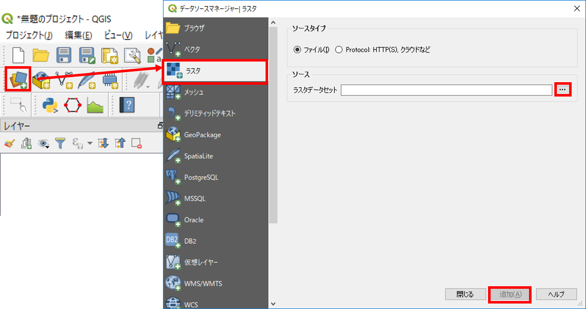

[▲メニューへもどる]

## レイヤ構造
　GISでは、レイヤ構造に従ってデータの切り替えや重ね合わせを行います。以下では、レイヤの切り替え、重ね合わせ、削除の手法を解説します。

### レイヤ表示の切替
各レイヤの横にあるチェックボックスにチェックをいれると、地図表示画面にレイヤが表示される。

### レイヤの重ね合わせ
レイヤウィンドウでレイヤを上下にずらすと、地図表示画面が連動して切り替わる。

### レイヤの削除
レイヤウィンドウでレイヤの上で右クリックし、`レイヤの削除`をクリックする。この処理では、レイヤウィンドウ上からレイヤが消えるのみで、データそのものは削除されていない点に注意する。
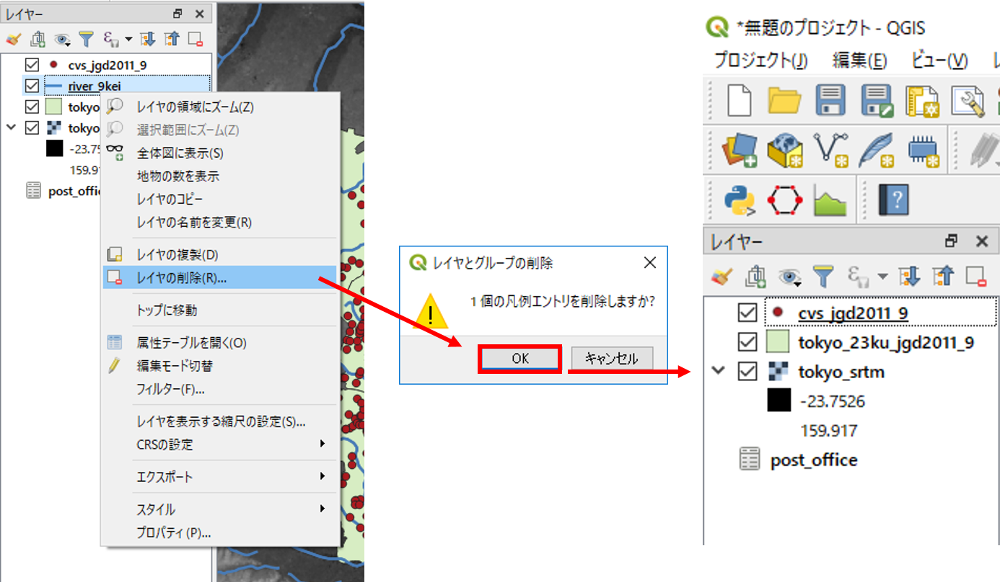

[▲メニューへもどる]

## 機能説明
　QGISには、地図のレイアウト、データの作成、分析など様々な機能があります。以下では、QGISの機能について説明しています。

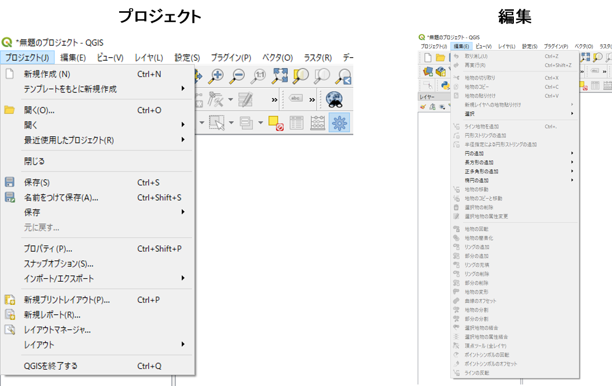
プロジェクト：QGIS（.qgs）ファイルの保存や読み込み、地図のレイアウト、エクスポートができる。

編集：ベクタレイヤの編集ができる。編集状態になると、アクティブになる。

ビュー：地図の移動や拡大、縮小など、地図画面の操作ができる。

レイヤ：ベクタやラスタなどのレイヤが追加できる。

ポイント、ライン、ポリゴン新規レイヤの作成もできる。

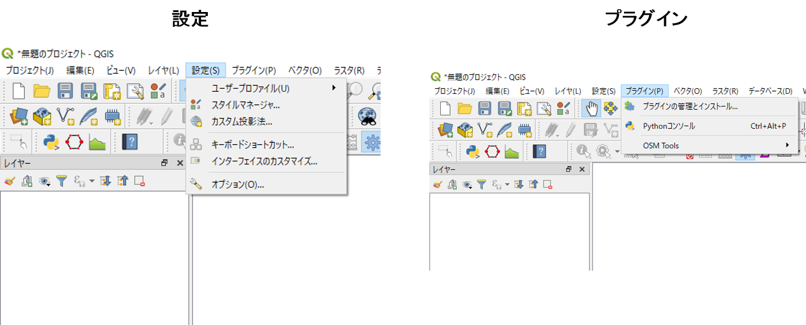
設定：オプションから、プロジェクトの設定やスナップオプションが設定できる。

プラグイン：プラグインの管理とインストールができる。Python入力画面が開ける。

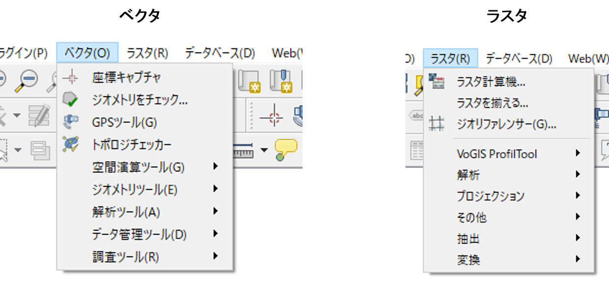
ベクタ：バッファやクリップなどベクタに関する処理ができる。

ラスタ：斜面方位図や陰影図の作成などラスタに関する処理ができる。

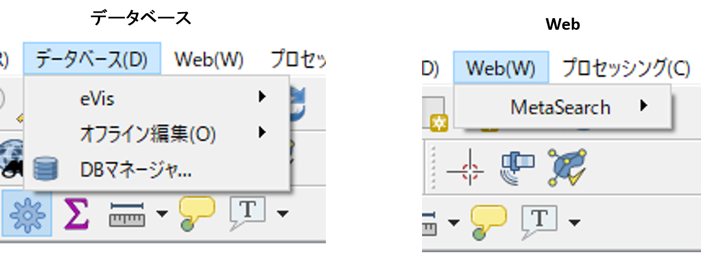
データベース：PostGISなどのデータベースへの接続やeVisプラグインによる外部ファイルとの連携が可能。

Web：背景地図の設定やweb地図の書き出しができる（プラグインによる）。

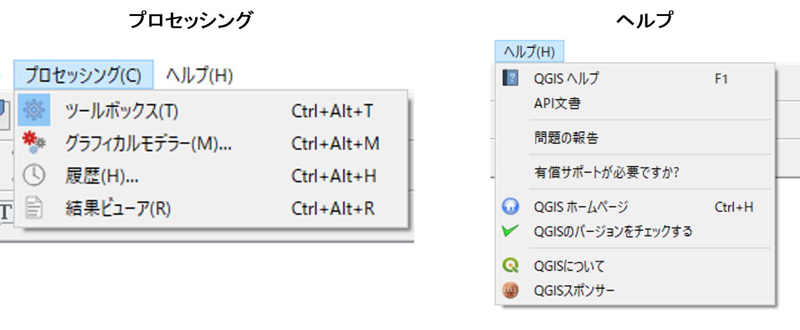
プロッセッシング：他のGISソフトウェアと連携して操作ができる（R,GRASS,SAGAなどがQGIS内で処理できる）。

ヘルプ：QGISのヘルプが確認できる。

[▲メニューへもどる]

## 属性テーブル
　ベクトルデータは、複数の属性情報を保持することができます。以下では、QGISで属性情報を参照する手法について、解説しています。

**以下では、cvs_jgd2011_9.shpのみ利用します。不要なレイヤを削除してください。**

データを読み込み、レイヤウィンドウのレイヤの上で右クリックすると、属性テーブルを開くことができる。

属性テーブルで選択したものは、地図上で黄色で表示される。選択アイコンで地図上の地物を選択した場合は、その地物に対応する属性テーブルの行が選択される。
地図上の地物を選択した時に、そのままでは属性テーブルの中で全てのデータが表示され、選択したものがわかりにくい時がある。その時には属性テーブルの下部にあるポップアップメニューから「選択した地物を表示する」を選択し、選択された地物に関する属性だけが表示されるようにすることで見やすくなります。
なお、ポリゴンによる選択（選択ボタンの右側にある小さな三角を押すとポップアップメニューが表示され、ポリゴン、フリーハンド等が選択できます）は、右クリックで終了し、フリーハンドによる選択は左クリックで終了と、操作性に一貫がなく分かりにくい状態です。

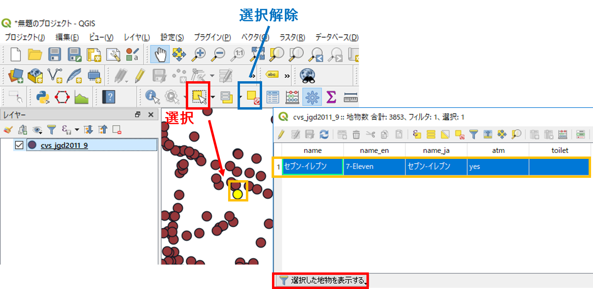

[▲メニューへもどる]

## プロパティ
　QGISでは、レイヤごとにレイヤのプロパティから、データの表示情報やスタイルの変更ができます。ポイントでは形や大きさ、ラインでは線の形や太さ、ポリゴンでは塗りつぶしの色等を変更することができます。属性情報に応じて、スタイルを分けることもできます。これは、レイヤの表示が変化するのみの処理で、データそのものの形状は変更されません。

以下では、レイヤのプロパティについて解説し、ポイントデータのスタイルの変更を行います。

レイヤウインドウからプロパティを表示したいレイヤを選択し、右クリックからプロパティをクリックする。

### ソース
座標系を確認したり、文字コード、表示名の変更がきます。
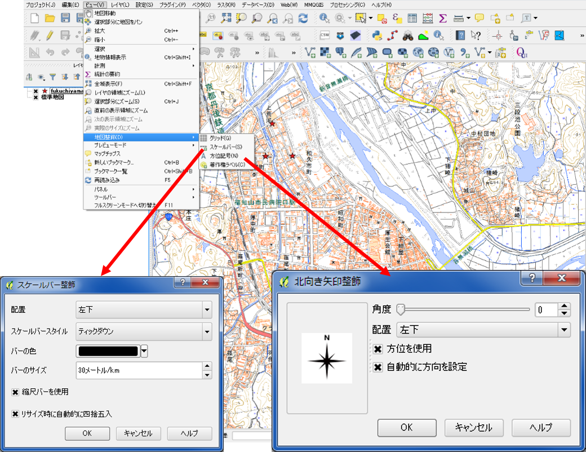

### シンボロジー
データのスタイルを整えることができる機能です。データの値に応じて配色やスタイルを変えることができます。分類方法は「単一シンボル」、「分類された」、「段階に分けられた」等があります。

ここでは、ポイントデータの大きさと色を変更します。`単一シンボル`を選択し、色と大きさを指定する。指定できた状態で`OK`をクリックすると変更が適用される。
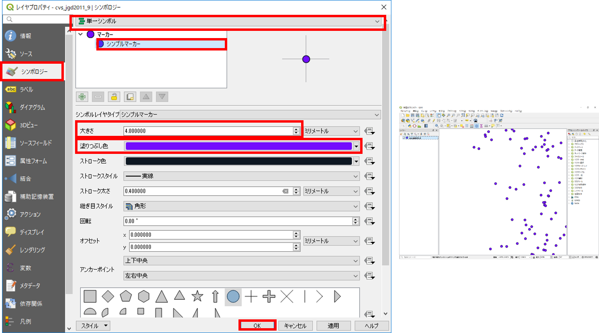

以下のように、形を変更することもできる。

属性テーブルの値によって、大きさと色を変更するには、シンボロジーの画面の一番上にあるポップアップメニューにおいて、`分類された`を選択し、分類したいフィールドを選択する。

ここではコンビニごとに色を変更するため、「カラム」フィールドのポップアップメニューから`name_en`を選択する。この状態で、左下の「分類」ボタンをクリックすると、自動的に`name_en`の値による色分けが生成される。各色は、シンボルをダブルクリックすることで調整でき、凡例（ラベル）も変更できる。

最後に、不要な分類を選択し削除する。`OK`をクリックすると変更が適用される。

### ラベル
データを表示する際に、属性情報に基づいてラベルを作成する機能です。以下では、属性値を用いて、ラベルを表示する手法について解説しています。

デフォルトでは「ラベルなし」になっているので、`ラベル`のポップアップメニューを選択し、`単一のラベル`を指定し、ラベルのもととなる属性を指定する。ここでは、`name_en`を指定する。`OK`をクリックすると変更が適用され、地図上にラベルが表示される。

[▲メニューへもどる]

## 地図タイルの読み込み
　以下では、QGISにXYZタイル形式の背景地図（地理院タイル等）を読み込む手法について解説します。

アイコンが並ぶ箇所（グレーの個所）で右クリックし、`パネル＞ブラウザパネル`をクリックする。`ブラウザパネル＞XYZ Tiles`を探し、右クリックし`新しい接続`をクリックする。

国土地理院の[地理院タイル]のページから、`２．基本測量成果以外で出典の記載のみで利用可能なもの＞タイル一覧＞空中写真・衛星画像＞2007年～`を選択し、URLをコピーする。コピーしたURL、名前、ズームレベルを以下のように設定する。`OK`をクリックすると、ブラウザパネルにタイルが追加される。追加されたタイルをクリックすると、レイヤウィンドウにレイヤとして追加でき、地図も表示される。

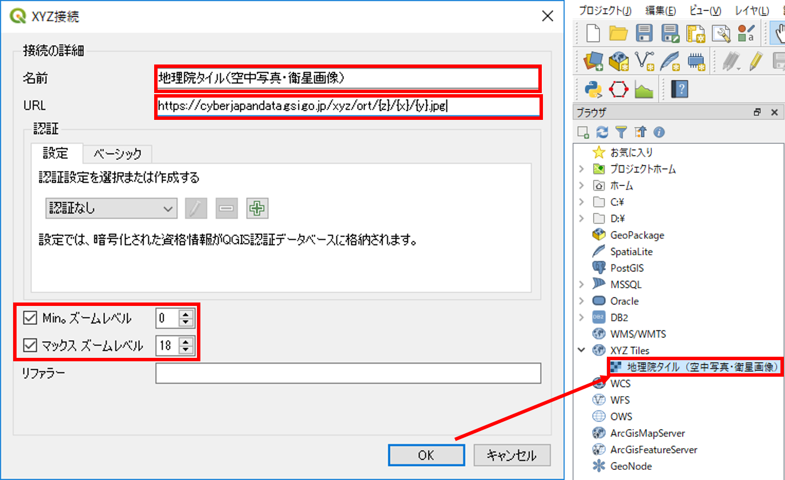

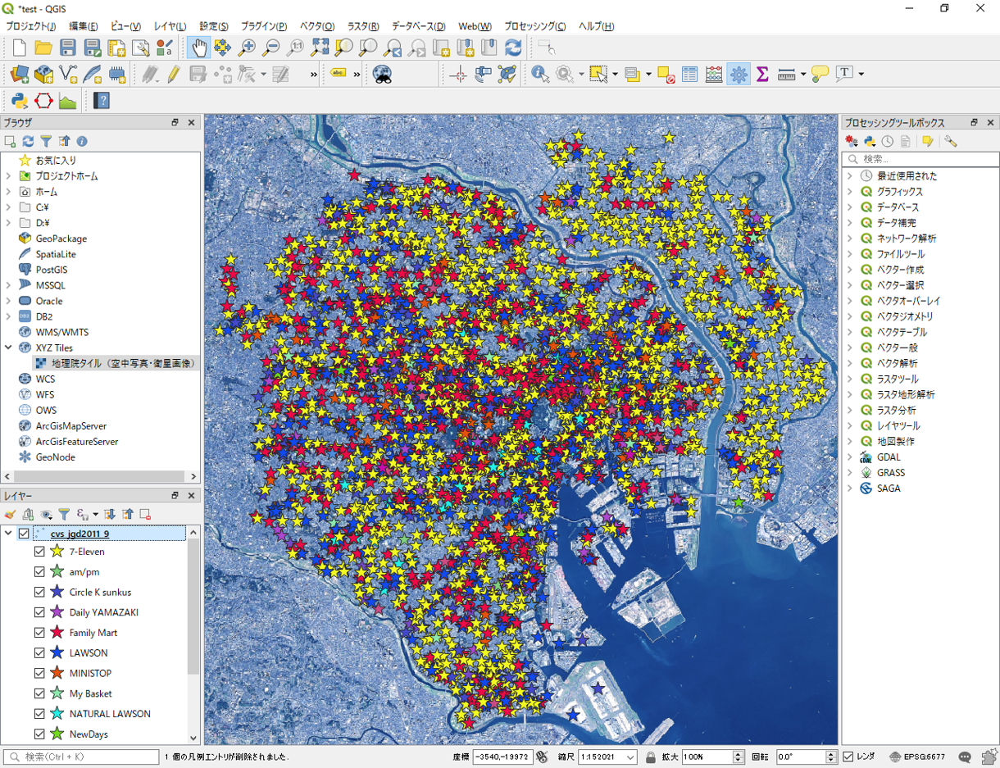

※ 地理院タイルを利用する場合は、利用規約に従ってください。

【註】画像上に地物のラベルを重ね合わせて表示すると、ラベルが画像に紛れて読みにくいことがあります。そのような場合は、レイヤプロパティ＞ラベル＞バッファにて、「テキストバッファを描画する」をクリックし、テキストを縁取り表示させることで見やすくなります。

### XYZタイルの一括読み込み
事前にタイル情報を記述したxmlファイルを用いて、`接続をロード`から、複数のタイルをを一括で読み込むことが可能です。ここでは、使用データのファイル内にある`gisoer_tiles.xml`を利用します。

> gisoer_tilesは、株式会社MIERUNEの[GitHub(MIERUNE/mierune-qgis)](https://github.com/MIERUNE/mierune-qgis)を参考に作成したものです。

[▲メニューへもどる]

## 地図のレイアウト
　以下では、スタイリングしたデータと地理院タイルを用いて、地図をレイアウトして画像として出力する手法について解説します。この実習をはじめる前に、地図画面を任意の地域に拡大してください（以下では、東京大学本郷キャンパス周辺を表示しています）。

`プロジェクト＞新規プリントレイアウト`を選択し、タイトル（地図名など任意）を入力する。データが重ならない場合は、オンザフライCRS投影がうまくいっていない可能性があるので、QGISを再起動する。その後、サンプルデータ、XYZタイルの順で読み込む。

### プリントコンポーザ
プリントレイアウトでは、以下の機能を利用して地図を作成することができる。

1. アイテムの選択と移動
2. 地図の移動
3. 地図の追加
4. 画像の追加
5. テキストの追加
6. 凡例の追加
7. 縮尺バーの追加
8. 地図の出力

※アイテムの削除は編集から行う。

#### レイアウト

以下のような地図を作成するため、地図、縮尺バー、凡例、タイトル等を追加する。

#### 地図の追加
地図の追加ボタンをクリックし、地図のレイアウト画面上でドラッグして大きさを指定して、地図を追加する。※追加される地図は、QGISで表示している範囲となる。
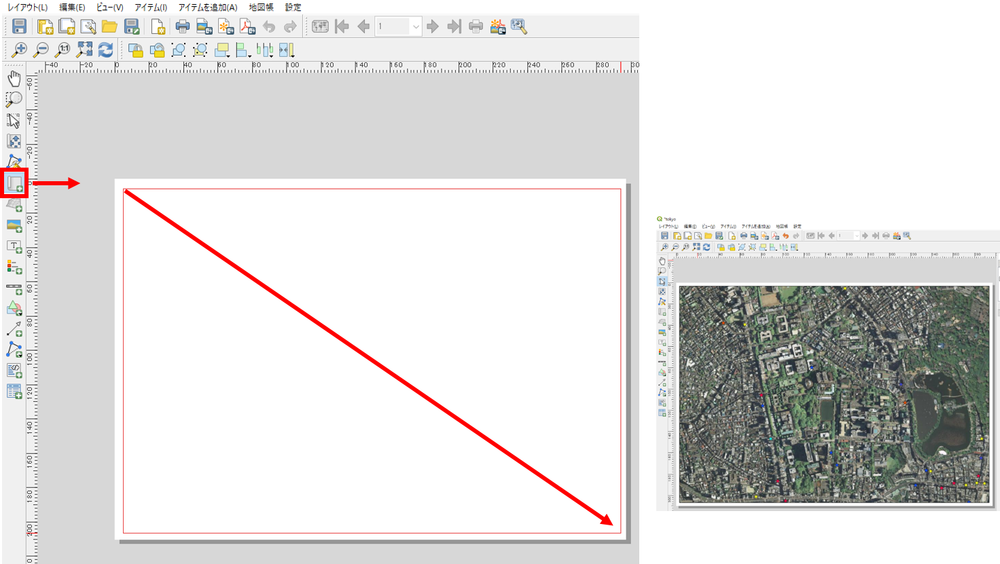

#### 縮尺バーの追加
　以下のように、矢印の位置をクリックし、縮尺バーを追加する（ドラッグでの追加も可能）。縮尺バーを選択した状態で、アイテムプロパティのタブに切り替え、線分列の大きさの値等を変更する。

#### 凡例の追加
縮尺と同様に凡例を追加する。凡例を選択し、アイテムプロパティで調整する。自動アップデートのチェックをはずすと凡例が編集できる。名称の変更、凡例項目の追加と削除ができる。

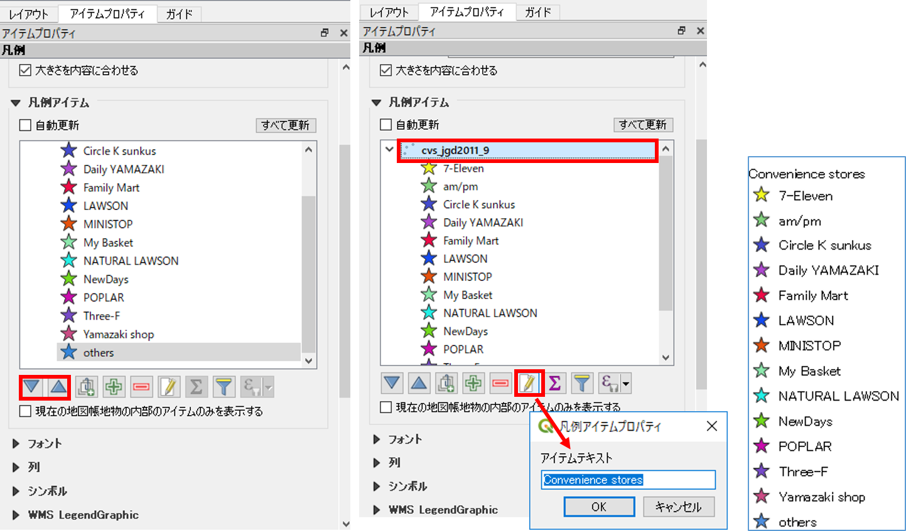

#### 方位記号の追加
画像の追加から方位記号を追加する。`アイテムプロパティ＞検索ディレクトリ`をクリックし、方位記号を選択する。デフォルトの状態では、図の赤枠部分をクリックしないと検索ディレクトリが開かないため、注意する。以下のように、アイテムプロパティで、画像の調節を行う。

#### テキストの追加
テキストの追加からテキストを追加する。メインプロパティに入力したいテキストを記述する。

以下のように、フォントのサイズや配置等を調節する。

同様の手法で、任意の個所に、背景地図やデータのライセンス等必要な情報をテキストで追加する。

### 画像の出力
地図のレイアウトを整えた後、画像としてエクスポートする。`レイアウト＞画像としてエクスポート`を選択する。
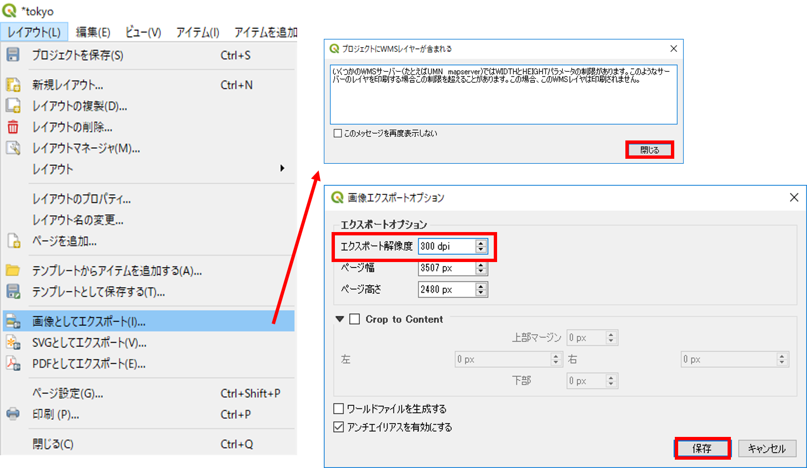

エクスポートした画像ファイルをダブルクリックすると、以下のような地図が表示できる。画像を出力した後、プリントレイアウトを閉じる。

## 作業ファイルの保存
QGISには、作業ファイルを保存する機能がある。これにより、一度QGISを閉じた後でも、前回の状態から作業を再開することができる。

`プロジェクト＞名前を付けて保存`をクリックし、任意の名称で出力する。次回開くときは、出力した.qgzファイルをダブルクリックするとQGISが立ち上がる。

【註】Macではインストール後に.qgzファイルとQGIS3の関連付けがなされていませんので、クリックしたときにアプリケーションの選択を聞かれますので、そこでQGIS3を「開くアプリケーション」として指定してください。

[▲メニューへもどる]

## 前半の課題
QGISを再起動した後、[福知山豪雨災害聞き取り調査データ]を読み込み、下の図と同じように空中写真を背景にした地図を作成してください（どの年代でも可）。作成する地図の縮尺、方位記号、ポイントのデザインは、下の図と異なったものを指定してください。

[▲メニューへもどる]

## 後半：視覚的な地形表現
実習をはじめる前に、[aso]をダウンロードしてください。

[aso]:https://github.com/gis-oer/datasets/raw/master/aso.zip

## 数値標高モデルの視覚的分析
各セルごとに標高値を保持しているラスタデータを用いることで、傾斜区分図、斜面方位図、陰影図、3D地図、断面図を作成することができます。以下では、その手法について解説しています。QGISを起動し、`データソースマネージャ>ラスタ`からラスタデータを表示してください。
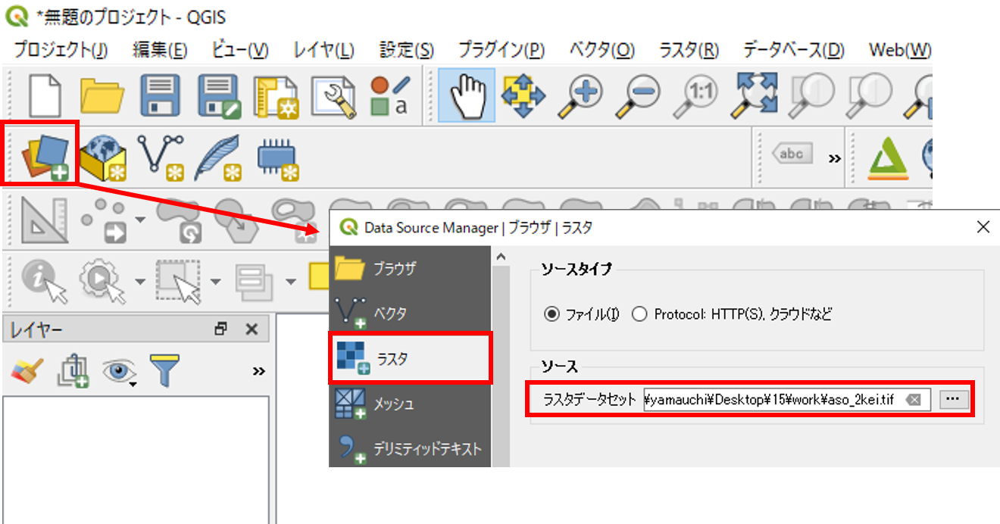

### 標高段彩図の作成
`プロパティ＞シンボル体系`を選択し、レンダリングタイプを`単バンド疑似カラー`を選択し`OK`をクリック押すとラスターの配色が変更できる。
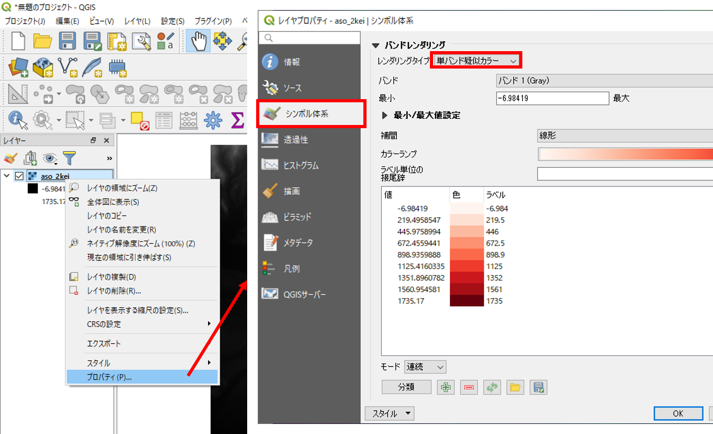
下の図のように、ラスターの配色が変更された。

シンボル体系では、最小、最大値、分類モード、分類数等を指定できる。各項目を設定後、分類をクリックすると反映される。また、各値、ラベルの上で、ダブルクリックすると値、ラベルの指定ができる。

以下では、200ｍ間隔で標高値を色分けした。
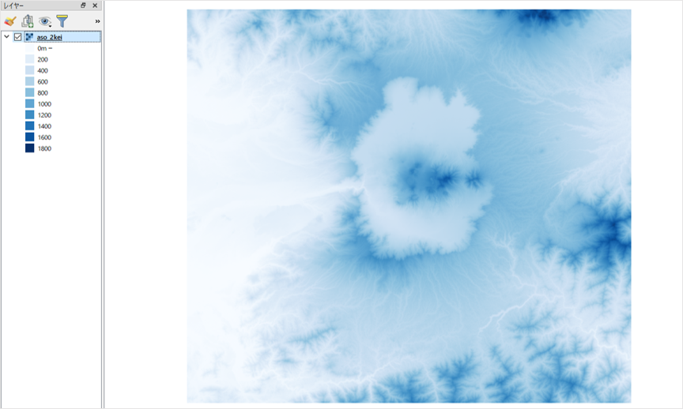

### 傾斜区分図の作成
`ラスタ＞解析＞傾斜`を選択し、`実行`をクリックすると傾斜区分が計算できる。

下の図のように、傾斜区分図が表示された。
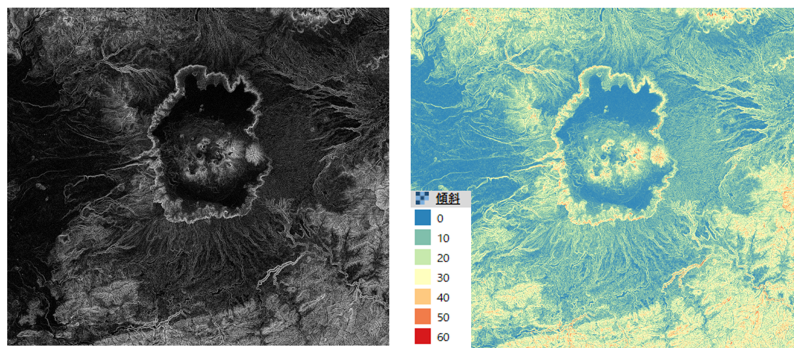

### 斜面方位図の作成
`ラスタ＞地形解析＞傾斜方位`を実行すると傾斜方位が計算できる。
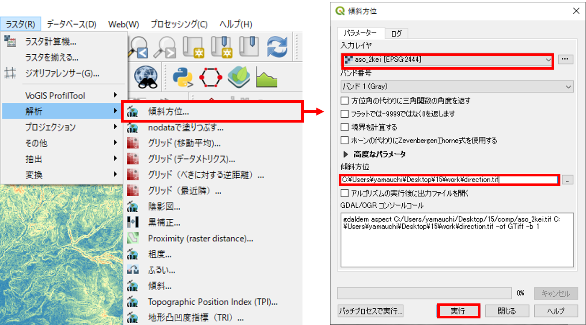

下の図のように、斜面方位図が表示された。
斜面は、360°で計算されるため角度に応じて値を分類する。

### 陰影図の作成
`ラスタ＞地形解析＞陰影図`を実行すると陰影図が計算できる。
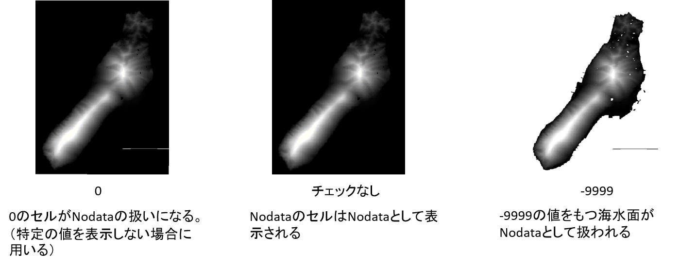

下の図のように、陰影図が表示された。
右下の図のように陰影図を元にしたラスタを重ねて、透過率を設定することで立体的な地形表現ができ地形の高低差が読み取りやすくなる。

※透過率は、`プロパティ＞透過性`から設定する。

### 鳥瞰図の作成
`ビュー＞新しい3Dマップビュー`を選択し、`3Dビューの設定`アイコンをクリックする。

高さに標高値のラスタデータを指定し、ＯＫをクリックする。ウィンドウ内で地図を動かすと3次元表示されていることが確認できる。鉛直スケールを1以上とすると、下の図のように地形を誇張して表現できる。

### 地形断面図の作成
`プラグイン＞プラグインの管理とインストール`から`VoGIS Profile tool` をインストールする。

`ラスタ>VoGIS ProfileTool > VoGIS Profile Tool`から起動する。
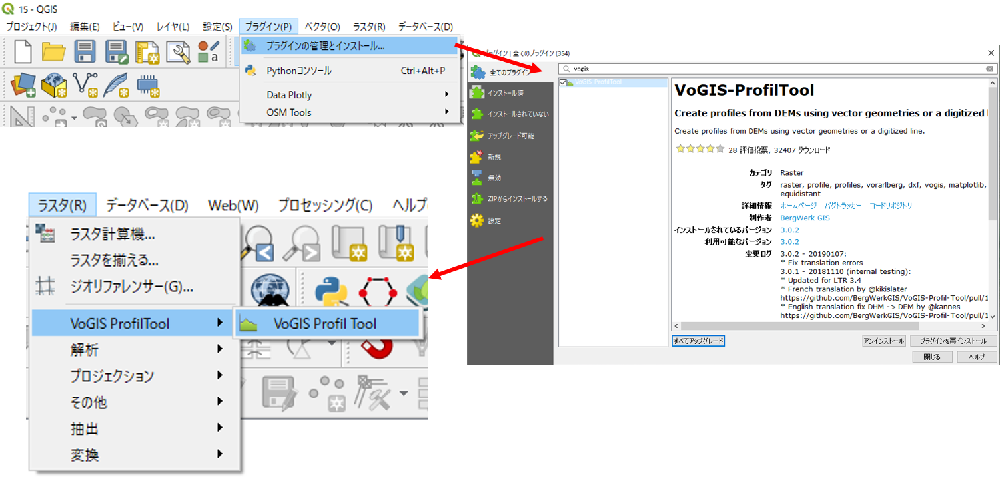

1. 断面図を作成するラスタにチェックを入れる。
2. `Digitize (new) profile line` をクリックする。
3. QGISの地図上でクリックしながらラインを作成する。（右クリックで終了）
4. `Create Profile`をクリックすると別ウィンドウに断面形状が表示される。

[▲メニューへもどる]

## 基本的な統計量の確認
以下では、QGISでラスタデータが保持する情報を確認する手法を解説しています。

`ラスタ＞その他＞ラスター情報`を開き、統計情報を表示するラスタを選択し、`画像統計量を読み込んで表示する`にチェックをつけ、実行をクリックする

実行結果は、結果ビューアの`File path`をクリックし、html形式で確認する（座標系、セルサイズ、最低標高、最高標高、平均標高、標高の標準偏差等）。

[▲メニューへもどる]

## 標高データの取得
　以下では、課題用の標高データ（基盤地図情報数値標高モデル）を取得する手法について解説する。基盤地図情報は、国土交通省国土地理院が整備しているデータです。地形表現や解析等で用いることのできるDEM（Digital Elevation Model）もダウンロードすることができます。基盤地図情報として提供されているデータは、ダウンロード後に変換が必要です。教材に従って、課題例の香川県高松市周辺を選択し、ダウンロードしてください。

**標高データの取得、変換が困難な場合は、[tokyo.zip]の.tiffファイルを用いて課題を実施してください**

### アカウントの作成
[基盤地図情報ダウンロードサービス](https://fgd.gsi.go.jp/download/menu.php)にアクセスし、右上にある「ログイン」メニューからログインする。アカウントがない場合は、ログイン画面の所で「新規登録」のリンクがあるので、アカウントの新規登録を行う。

### 基盤地図情報基本項目：ベクタデータの取得
ログインした状態で、[基盤地図情報ダウンロードサービス]から`基盤地図情報　数値標高モデル＞ファイル選択へ`をクリックする。地図をスクロールし、ダウンロードするデータを選択する。5ｍメッシュにチェックがついていることを確認し、`513440`を選択し、`ダウンロードファイル確認へ`をクリックする。データが選択できたら、全てチェックをクリックし、まとめてダウンロードをクリックする。

### 基盤地図情報からダウンロードしたDEMを変換する
　基盤地図情報からダウンロードした数値標高モデルをGISソフトウェアで処理するためには、ラスタデータへの変換が必要です。以下では、[株式会社エコリスのＨＰ]のコンバーターを用いた変換について解説しています。[株式会社エコリスのＨＰ]から、`標高DEMデータ変換ツール`をダウンロードし、DEMtool.zipを解凍する。解凍したファイルを開き、変換結合.vbsを実行する。

投影法を尋ねるダイアログが出るので、緯度経度を選択するために'0'を入力する。陰影図の作成が必要な場合は、「はい」をクリックする（今回はいいえとした）。

基盤地図情報からダウンロードしたDEMが入っているフォルダを選択し、海域の標高値を選択する（今回は「はい → 0」を選択した）。変換作業を開始し、完了のメッセージを待つ。変換対象として選んだフォルダー内に、[番号].tifの名前を持つファイル群が出力されているかを確認する。

ファイルの変換が終了すると、ファイル内に`merge.tif`が出力されるため、これをQGISで読み込み、データを確認する（標高に応じて白と黒の濃淡が表現されていることを確認する）。

## 後半の課題
　課題用に用意したデータ（課題用データを作成していない場合は、[tokyo.zip]の.tiffを利用）を用いて、以下の完成例を参考に段彩図、傾斜区分図、斜面方位図のいずれかを作成してください。画像の配色を調整した後、縮尺、方位記号、凡例を入れた地図をレイアウトしてください。

#### ライセンスに関する注意事項
本教材で利用しているキャプチャ画像の出典やクレジットについては、[その他のライセンスについて]よりご確認ください。

[▲メニューへもどる]:1day実習コース.md#menu
[国土数値情報]:http://nlftp.mlit.go.jp/ksj/
[空間データ]:../../08_空間データ/空間データ.md
[基本的な空間解析]:../../11_基本的な空間解析/基本的な空間解析.md
[既存データの地図データと属性データ]:../../07_既存データの地図データと属性データ/既存データの地図データと属性データ.md
[空間データの結合・修正]:../../10_空間データの結合・修正/空間データの結合・修正.md
[ラスタデータの分析]:../../15_ラスタデータの分析/ラスタデータの分析.md
[福知山豪雨災害聞き取り調査データ]:https://github.com/gis-oer/datasets/raw/master/vector/fkuchiyama_sample.zip
[利用規約]:../../利用規約.md
[GISの基本概念]:../../01_GISの基本概念/GISの基本概念.md
[その他のライセンスについて]:../../その他のライセンスについて.md
[ラスタデータの分析]:../../15_ラスタデータの分析/ラスタデータの分析.md
[株式会社エコリスのＨＰ]:http://www.ecoris.co.jp/contents/demtool.html
[QGISビギナーズマニュアル]:../../QGISビギナーズマニュアル/QGISビギナーズマニュアル.md
[利用規約]:../../../policy.md
[その他のライセンスについて]:../../license.md
[よくある質問とエラー]:../../questions/questions.md

[GISの基本概念]:../../00/00.md
[QGISビギナーズマニュアル]:../../QGIS/QGIS.md
[GRASSビギナーズマニュアル]:../../GRASS/GRASS.md
[リモートセンシングとその解析]:../../06/06.md
[既存データの地図データと属性データ]:../../07/07.md
[空間データ]:../../08/08.md
[空間データベース]:../../09/09.md
[空間データの統合・修正]:../../10/10.md
[基本的な空間解析]:../../11/11.md
[ネットワーク分析]:../../12/12.md
[領域分析]:../../13/13.md
[点データの分析]:../../14/14.md
[ラスタデータの分析]:../../15/15.md
[傾向面分析]:../../16/16.md
[空間的自己相関]:../../17/17.md
[空間補間]:../../18/18.md
[空間相関分析]:../../19/19.md
[空間分析におけるスケール]:../../20/20.md
[視覚的伝達]:../../21/21.md
[参加型GISと社会貢献]:../../26/26.md

[地理院地図]:https://maps.gsi.go.jp
[e-Stat]:https://www.e-stat.go.jp/
[国土数値情報]:http://nlftp.mlit.go.jp/ksj/
[基盤地図情報]:http://www.gsi.go.jp/kiban/
[地理院タイル]:http://maps.gsi.go.jp/development/ichiran.html

[課題ページ_QGISビギナーズマニュアル]:../../tasks/t_qgis_entry.md
[課題ページ_GRASSビギナーズマニュアル]:../../tasks/t_grass_entry.md
[課題ページ_リモートセンシングとその解析]:../../tasks/t_06.md
[課題ページ_既存データの地図データと属性データ]:../../tasks/t_07.md
[課題ページ_空間データ]:../../tasks/t_08.md
[課題ページ_空間データベース]:../../tasks/t_09.md
[課題ページ_空間データの統合・修正]:../../tasks/t_10.md
[課題ページ_基本的な空間解析]:../../tasks/t_11.md
[課題ページ_ネットワーク分析]:../../tasks/t_12.md
[課題ページ_基本的な空間解析]:../../tasks/t_13.md
[課題ページ_点データの分析]:../../tasks/t_14.md
[課題ページ_ラスタデータの分析]:../../tasks/t_15.md
[課題ページ_空間補間]:../../tasks/t_18.md
[課題ページ_視覚的伝達]:../../tasks/t_21.md
[課題ページ_参加型GISと社会貢献]:../../tasks/t_26.md
