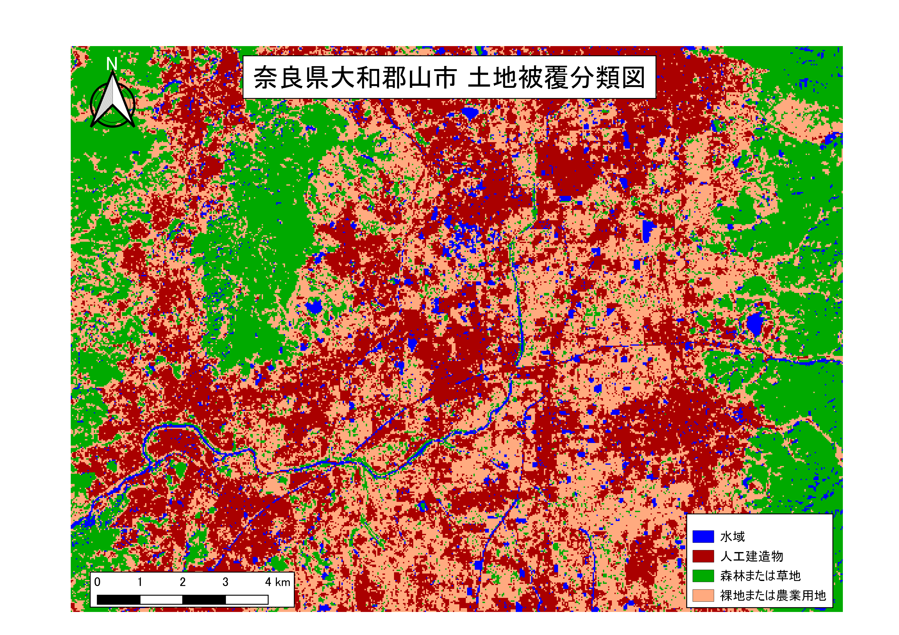

# 課題：リモートセンシングとその解析
　この実習では、リモートセンシングとその解析入門としてLANDSATの衛星画像を用いて、衛星画像データのダウンロードとRGB合成や土地被覆図の作成を行います。実習で使われる用語や概念は、[地理情報科学教育用スライド（GIScスライド）]の2章を参照してください。
　
 以下の手順とGISオープン教材の[リモートセンシングとその解析]の教材を参考に、完成例のような地図が作成できれば実習完了となります。

**Menu**
--------
- [課題1_衛星画像データのダウンロードとRGB合成](#課題1_衛星画像データのダウンロードとrgb合成)
- [課題2_土地被覆図の作成](#課題2_土地被覆図の作成)

## 課題1_衛星画像データのダウンロードとRGB合成
　以下の手順と[リモートセンシングとその解析]教材を参考に、衛星画像データ（LANDSAT-8）のダウンロードし、そのデータを用いてRGB合成を行いフォールスカラー、ナチュラルカラー、トゥルースカラー図を作成し、フォールカラーのみ完成例のようにレイアウトしてください。また、「それぞれの図が何を示すものか」について400字程度でまとめて下さい（光学センサ、波長帯、反射特性などの語句を用いることが望ましい）。

### 完成例

※LANDSAT-8を利用し作成

### 手順
1. [LandBrowser]を利用して、LANDSAT-8の衛星画像をダウンロードする。データの範囲や時期は、任意で選択する。
2. ダウンロードしたデータをQGISに読み込み、Semi-Automatic Classification Pluginを用いて、フォールスカラー、ナチュラルカラー、トゥルースカラーのカラーコンポジットを作成する。
3. 各図が何を示す図であるかをまとめる。

## 課題2_土地被覆図の作成
　以下の手順と[リモートセンシングとその解析]教材を参考に、ダウンロードした衛星画像データ（LANDSAT-8）をもちいて教師つき分類を行い、土地被覆図を作成してください。土地被覆図のレイアウトには、QGISを用いてください。

### 完成例

※LANDSAT-8を利用し作成

### 手順
1. ダウンロードしたデータをQGISに読み込み、Semi-Automatic Classification Pluginを起動する。
2. トレーニングエリアを作成する。
3. 教師つき分類を実行し、ラスタデータを出力する。
4. 完成例のように、地図をレイアウトする。

#### 実習用データのソース
実習用データは、無償で利用可能なデータを加工して作成したものです。データのソースは、各ファイルのREADME.mdにまとめています。

[地理情報科学教育用スライド（GIScスライド）]:http://curricula.csis.u-tokyo.ac.jp/slide/4.html
[LandBrowser]:http://landbrowser.geogrid.org/landbrowser/
[利用規約]:../../../policy.md
[その他のライセンスについて]:../../license.md
[よくある質問とエラー]:../../questions/questions.md

[GISの基本概念]:../../00/00.md
[QGISビギナーズマニュアル]:../../QGIS/QGIS.md
[GRASSビギナーズマニュアル]:../../GRASS/GRASS.md
[リモートセンシングとその解析]:../../06/06.md
[既存データの地図データと属性データ]:../../07/07.md
[空間データ]:../../08/08.md
[空間データベース]:../../09/09.md
[空間データの統合・修正]:../../10/10.md
[基本的な空間解析]:../../11/11.md
[ネットワーク分析]:../../12/12.md
[領域分析]:../../13/13.md
[点データの分析]:../../14/14.md
[ラスタデータの分析]:../../15/15.md
[傾向面分析]:../../16/16.md
[空間的自己相関]:../../17/17.md
[空間補間]:../../18/18.md
[空間相関分析]:../../19/19.md
[空間分析におけるスケール]:../../20/20.md
[視覚的伝達]:../../21/21.md
[参加型GISと社会貢献]:../../26/26.md

[地理院地図]:https://maps.gsi.go.jp
[e-Stat]:https://www.e-stat.go.jp/
[国土数値情報]:http://nlftp.mlit.go.jp/ksj/
[基盤地図情報]:http://www.gsi.go.jp/kiban/
[地理院タイル]:http://maps.gsi.go.jp/development/ichiran.html

[課題ページ_QGISビギナーズマニュアル]:../../tasks/t_qgis_entry.md
[課題ページ_GRASSビギナーズマニュアル]:../../tasks/t_grass_entry.md
[課題ページ_リモートセンシングとその解析]:../../tasks/t_06.md
[課題ページ_既存データの地図データと属性データ]:../../tasks/t_07.md
[課題ページ_空間データ]:../../tasks/t_08.md
[課題ページ_空間データベース]:../../tasks/t_09.md
[課題ページ_空間データの統合・修正]:../../tasks/t_10.md
[課題ページ_基本的な空間解析]:../../tasks/t_11.md
[課題ページ_ネットワーク分析]:../../tasks/t_12.md
[課題ページ_基本的な空間解析]:../../tasks/t_13.md
[課題ページ_点データの分析]:../../tasks/t_14.md
[課題ページ_ラスタデータの分析]:../../tasks/t_15.md
[課題ページ_空間補間]:../../tasks/t_18.md
[課題ページ_視覚的伝達]:../../tasks/t_21.md
[課題ページ_参加型GISと社会貢献]:../../tasks/t_26.md
