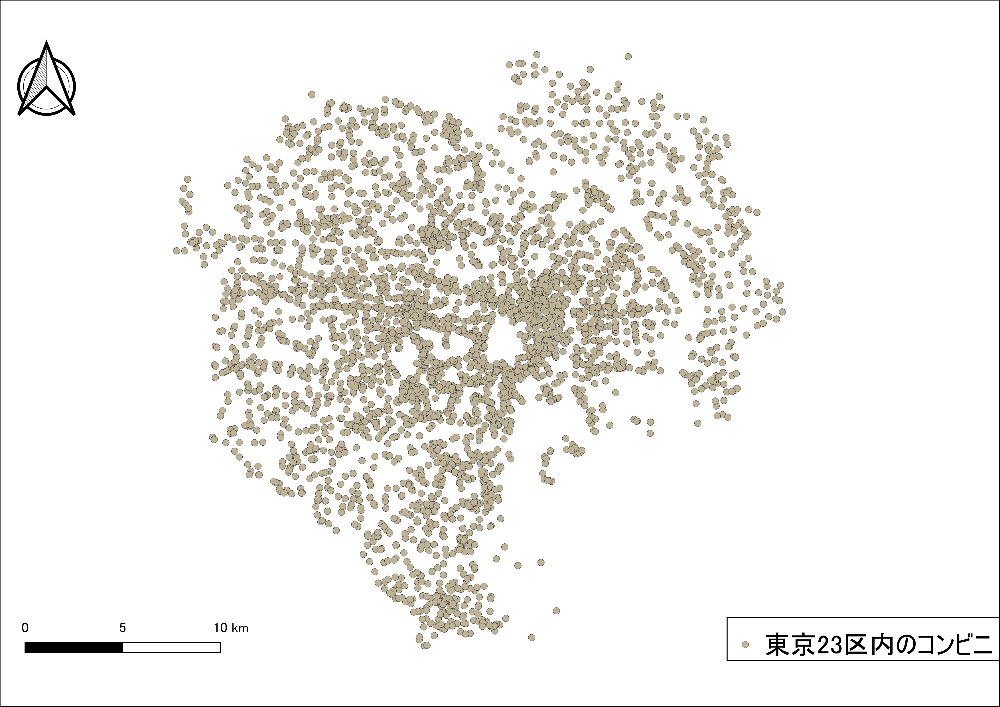

# 課題:空間データ
　この実習は、空間座標の変換、ジオリファレンス、ジオコーディングなどデータの保持する位置情報の変換やデータに位置情報を付加する手法について学ぶためのものです。以下の手順と[空間データ]の教材を参考に、完成例のような地図を作成してください。実習で利用するデータの一部は、[既存データの地図データと属性データ]の教材を参考にダウンロードしてください。GIS初学者は、本教材を進める前に[GISの基本概念]の教材を確認しておいてください。

**Menu**
--------
* [課題1_空間座標の変換](#課題1_空間座標の変換)
* [課題2_ジオリファレンス](#課題2_ジオリファレンス)
* [課題3_ジオコーディング](#課題3_ジオコーディング)

### 使用データ
本課題では、以下のデータを使用しています。

- 課題1 [東京23区コンビニ]
- 課題2 [鯖江市_古地図006]
- 課題3 [裾野市_AED設置施設]

## 課題1_空間座標の変換
　まず、[東京23区コンビニ]のデータを世界測地系の平面直角座標系へ投影変換し、地図をレイアウトしてください。次に、地理座標系と投影座標系の違いについて、WEBで調べて300字程度でまとめてください。

### 完成例

### 手順
1. `tokyo23ku-cvs_jgd2000.shp`をQGISに表示する。
2. 平面直角座標系（JGD2011の9系）に変換する。変換後の座標変換の結果がわかりづらいため、QGIS画面右下のEPSGコード6677に設定し直す。
3. 地図をレイアウトする。
4. QGISの作業ファイル（.qgs）に任意の名前をつけ保存し、画面を閉じる。
5. 地理座標系と投影座標系の違いについて、300字程度でまとめる。

-------

## 課題2_ジオリファレンス
　ジオリファレンスは、位置情報のもたない画像などのデータに位置情報を持たせる際に用いる手法です。鯖江市のオープンデータより古地図006をダウンロードし、地理院タイルをもとにGCPを取得し、完成例のようにジオリファレンスした図を作成してください。

### 完成例

### 手順
1. [鯖江市_古地図006]をダウンロードする。
2. way.shpを読み込む
4. 古地図を読み込みQGISのジオリファレンサーを起動する
5. 古地図にGCP(Ground Control Point)を付加する(完全には一致しないため、おおまかでよい)
6. QGISビギナーズマニュアルを参考に、地図をレイアウトする(古地図のプロパティを開き、画像を透過すると良い)
7. QGISの作業ファイル（.qgs）に任意の名前をつけ保存し、画面を閉じる

-------

## 課題3_ジオコーディング
　ジオコーディングは、緯度経度や住所などの情報を保持したテキストファイル等を用いてGISで扱えるデータを作成する手法です。サンプルデータ[susono_AED.csv]を用いて、ジオコーディング（アドレスマッチング)を行い地図を作成して下さい。

### 完成例

### 手順
1. [裾野市_AED設置施設]をダウンロードし、susono_AED.csvのfx（経度）とfy（緯度）のフィールドを利用し、QGISでCSVデータを読み込む。
2. QGISで読み込んだCSVデータを名前を付けて保存から新規のシェープファイルとして出力する。名前を付けて保存のデータ形式を`ESRI Shapefile`に切り替え、CRSはJGD2000とする。
3. [空間データ] の教材を参考に、2.で作成したシェープファイルを世界測地系の平面直角座標系第Ⅷ系に変換する（名前を付けて保存から、新規のデータ作成を行う）。
4. [QGISビギナーズマニュアル]を参考に、地図をレイアウトする(背景地図を設定すると良い)。

#### 完成例で使用したデータ
本ページで使用しているデータの出典については、該当する教材よりご確認ください。

[東京23区コンビニ]:https://github.com/gis-oer/datasets/raw/master/tasks/tokyo23ku-cvs_task.zip
[鯖江市_古地図006]:https://github.com/gis-oer/datasets/raw/master/tasks/sabae_task.zip
[裾野市_AED設置施設]:https://github.com/gis-oer/datasets/raw/master/tasks/susono_task.zip
[地理情報科学教育用スライド（GIScスライド）]:http://curricula.csis.u-tokyo.ac.jp/slide/4.html
[裾野市オープンデータ AED設置施設]:http://linkdata.org/work/rdf1s1034i
[データシティ鯖江ポータルサイト]:http://data.city.sabae.lg.jp/
[空間座標の変換]:../08/08.md
[QGISビギナーズマニュアル]:../QGIS/QGIS.md
[利用規約]:../../../policy.md
[その他のライセンスについて]:../../license.md
[よくある質問とエラー]:../../questions/questions.md

[GISの基本概念]:../../00/00.md
[QGISビギナーズマニュアル]:../../QGIS/QGIS.md
[GRASSビギナーズマニュアル]:../../GRASS/GRASS.md
[リモートセンシングとその解析]:../../06/06.md
[既存データの地図データと属性データ]:../../07/07.md
[空間データ]:../../08/08.md
[空間データベース]:../../09/09.md
[空間データの統合・修正]:../../10/10.md
[基本的な空間解析]:../../11/11.md
[ネットワーク分析]:../../12/12.md
[領域分析]:../../13/13.md
[点データの分析]:../../14/14.md
[ラスタデータの分析]:../../15/15.md
[傾向面分析]:../../16/16.md
[空間的自己相関]:../../17/17.md
[空間補間]:../../18/18.md
[空間相関分析]:../../19/19.md
[空間分析におけるスケール]:../../20/20.md
[視覚的伝達]:../../21/21.md
[参加型GISと社会貢献]:../../26/26.md

[地理院地図]:https://maps.gsi.go.jp
[e-Stat]:https://www.e-stat.go.jp/
[国土数値情報]:http://nlftp.mlit.go.jp/ksj/
[基盤地図情報]:http://www.gsi.go.jp/kiban/
[地理院タイル]:http://maps.gsi.go.jp/development/ichiran.html

[課題ページ_QGISビギナーズマニュアル]:../../tasks/t_qgis_entry.md
[課題ページ_GRASSビギナーズマニュアル]:../../tasks/t_grass_entry.md
[課題ページ_リモートセンシングとその解析]:../../tasks/t_06.md
[課題ページ_既存データの地図データと属性データ]:../../tasks/t_07.md
[課題ページ_空間データ]:../../tasks/t_08.md
[課題ページ_空間データベース]:../../tasks/t_09.md
[課題ページ_空間データの統合・修正]:../../tasks/t_10.md
[課題ページ_基本的な空間解析]:../../tasks/t_11.md
[課題ページ_ネットワーク分析]:../../tasks/t_12.md
[課題ページ_基本的な空間解析]:../../tasks/t_13.md
[課題ページ_点データの分析]:../../tasks/t_14.md
[課題ページ_ラスタデータの分析]:../../tasks/t_15.md
[課題ページ_空間補間]:../../tasks/t_18.md
[課題ページ_視覚的伝達]:../../tasks/t_21.md
[課題ページ_参加型GISと社会貢献]:../../tasks/t_26.md
