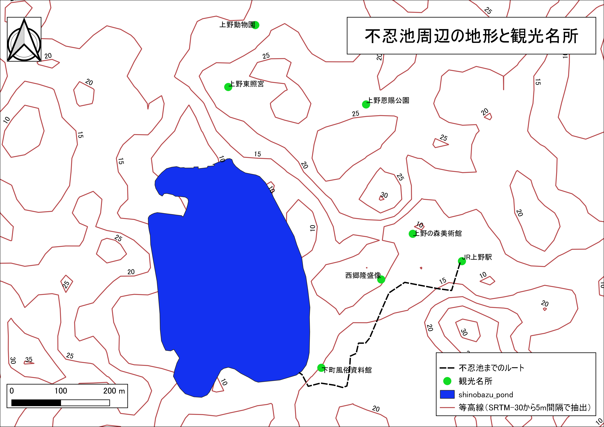

# 課題：空間データの統合・修正
　この実習は、既存のラスタデータの結合による新規ラスターデータ作成と背景地図をトレースした新規ベクトルデータ作成を行うものです。実習で使われる用語や概念は、地理情報科学教育用スライド（GIScスライド）の4章を参照してください。以下の手順と[空間データの統合・修正]の教材を参考に、完成例のような地図が作成できれば、実習完了となります。GIS初学者は、本教材を進める前に[GISの基本概念]の教材を確認しておいてください。

**実習用データ**

本実習を始める前に、[tokyo]をダウンロードしてください。本実習では、tokyo_srtm.tiffのみを使用します。

**Menu**

- [ラスタデータのクリップと新規ベクトルデータの作成](#ラスタデータのクリップと新規ベクトルデータの作成)

--------

## ラスタデータのクリップと新規ベクトルデータの作成
　この実習では、前半で、ラスタデータを任意の範囲で切り抜く処理と、対象範囲内の等高線抽出および標高値の取得を行います。後半では、ベクトルデータの作成の練習として、完成例のような地図を作成します。以下の手順と[空間データの統合・修正]教材を参考に実習を進めてください。

### 完成例

### 手順
1. tokyo_srtm.tiffをQGISに読み込む
2. [QGISビギナーズマニュアル]を参考に、ブラウザパネルから地理院タイル（空中写真または標準地図）を読み込む。
3. 地理院タイルを参考に、不忍池、JR上野駅周辺の範囲で、tokyo_srtm.tiffをクリップし、新規ラスタの配色を`プロパティ＞シンボロジー`で5段階に調整する。  
4. クリップしたラスタデータを用いて、5m間隔で等高線を抽出する。抽出した等高線のスタイルを整える。
5. 完成例を参考にポイントデータを作成する。ポイントの作成時の属性情報は、id(Integer,幅2)、NAME(String,幅20)、とし、Id(通し番号)、NAME(建物名）を記入する。
6. 地理院タイル（空中写真）を利用して、不忍池のポリゴンを作成する（おおまかでよい）。属性は、id(Integer,幅10)のみとする。ポリゴンの新規作成は、作成後右クリックで新規レイヤとして反映される点に注意する。
7. 地理院タイル（空中写真）を利用して、JR上野駅から不忍池までのルートをラインデータを作成する（おおまかでよい）。
8. 完成例のように作成したレイヤのスタイルを整える。次、ラベルの設定をする。ラベルは、`プロパティ＞ラベル`から`ラベルなし→単一のラベル`を選択し、ラベルにするフィールドを指定する。今回は、ポイントをNAME、ラインをELEVで設定する。
9. 背景地図をオフにし、プリントコンポーザから、地図をレイアウトする。

--------

#### 完成例で使用したデータ
本ページで使用しているデータの出典については、該当する教材よりご確認ください。

[空間座標の変換]:../08_空間データ/空間データ.md#空間座標の変換(測地系変換、投影変換)
[QGISビギナーズマニュアル:各種ボタンについて]:../QGIS/QGIS.md#各種ボタンについて
[QGISビギナーズマニュアル:TileLayerPluginのインストール]:../QGIS/QGIS.md#tilelayerpluginのインストール
[利用規約]:../../../policy.md
[その他のライセンスについて]:../../license.md
[よくある質問とエラー]:../../questions/questions.md

[GISの基本概念]:../../00/00.md
[QGISビギナーズマニュアル]:../../QGIS/QGIS.md
[GRASSビギナーズマニュアル]:../../GRASS/GRASS.md
[リモートセンシングとその解析]:../../06/06.md
[既存データの地図データと属性データ]:../../07/07.md
[空間データ]:../../08/08.md
[空間データベース]:../../09/09.md
[空間データの統合・修正]:../../10/10.md
[基本的な空間解析]:../../11/11.md
[ネットワーク分析]:../../12/12.md
[領域分析]:../../13/13.md
[点データの分析]:../../14/14.md
[ラスタデータの分析]:../../15/15.md
[傾向面分析]:../../16/16.md
[空間的自己相関]:../../17/17.md
[空間補間]:../../18/18.md
[空間相関分析]:../../19/19.md
[空間分析におけるスケール]:../../20/20.md
[視覚的伝達]:../../21/21.md
[参加型GISと社会貢献]:../../26/26.md

[地理院地図]:https://maps.gsi.go.jp
[e-Stat]:https://www.e-stat.go.jp/
[国土数値情報]:http://nlftp.mlit.go.jp/ksj/
[基盤地図情報]:http://www.gsi.go.jp/kiban/
[地理院タイル]:http://maps.gsi.go.jp/development/ichiran.html

[課題ページ_QGISビギナーズマニュアル]:../../tasks/t_qgis_entry.md
[課題ページ_GRASSビギナーズマニュアル]:../../tasks/t_grass_entry.md
[課題ページ_リモートセンシングとその解析]:../../tasks/t_06.md
[課題ページ_既存データの地図データと属性データ]:../../tasks/t_07.md
[課題ページ_空間データ]:../../tasks/t_08.md
[課題ページ_空間データベース]:../../tasks/t_09.md
[課題ページ_空間データの統合・修正]:../../tasks/t_10.md
[課題ページ_基本的な空間解析]:../../tasks/t_11.md
[課題ページ_ネットワーク分析]:../../tasks/t_12.md
[課題ページ_基本的な空間解析]:../../tasks/t_13.md
[課題ページ_点データの分析]:../../tasks/t_14.md
[課題ページ_ラスタデータの分析]:../../tasks/t_15.md
[課題ページ_空間補間]:../../tasks/t_18.md
[課題ページ_視覚的伝達]:../../tasks/t_21.md
[課題ページ_参加型GISと社会貢献]:../../tasks/t_26.md
