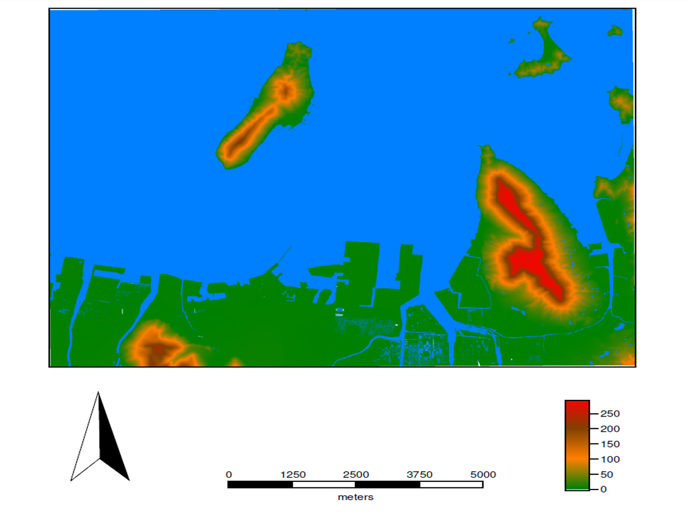

# 課題：GIS入門(GRASS)
　GISでは、地理空間情報の可視化、編集、分析などができます。この実習はGIS入門として、GRASS GISを用いて地図の作成を行うものです。この教材は、GIS初学者やおよびGRASS GISの初心者向けです。各課題の手順とGISオープン教材の[GRASS]を参考に、完成例のような地図が作成できれば、完了となります。GIS初学者は、本教材を進める前に[GISの基本概念]教材を確認しておいてください。

### 使用データ

* 国土地理院「 基盤地図情報　数値標高モデル　5ｍメッシュ　高松周辺（513440）」

## GRASS入門
　この実習では、GRASS GISと基盤地図情報の5mDEMを用いて、標高区分をした地図を作成します。GRASS GISは、無償で利用できるオープンソースのGISです。[GRASS]を参考にインストールした後、実習を進めてください。QGISのインストールも必要です。

### 課題
　QGISとGRASS GISを用いて、高松市の地形(標高)の概観図を作成してください。

### 完成例

### 手順
1. [QGISでラスタデータを読み込む](../QGIS/QGIS.md#データの読み込み)

2. [QGISでGRASSのマップセットを作成する](../GRASS/GRASS.md#qgisでマップセットの作成)

3. [マップセットにデータを読み込む](../GRASS/GRASS.md#データの読み込み)

4. [GRASS GISを開く](../GRASS/GRASS.md#マップセットをgrassで表示する)

5. [マップセットからラスタを読み込む](../GRASS/GRASS.md#マップセットからラスタデータを読み込む)

6. [値に合わせて、カラーを調整する](../GRASS/GRASS.md#ラスタデータの色分け)

7. [地図をレイアウトする](../GRASS/GRASS.md#レイアウト)

-------------

#### 完成例で使用したデータ
本ページで使用しているデータの出典については、該当する教材よりご確認ください。
[利用規約]:../../../policy.md
[その他のライセンスについて]:../../license.md
[よくある質問とエラー]:../../questions/questions.md

[GISの基本概念]:../../00/00.md
[QGISビギナーズマニュアル]:../../QGIS/QGIS.md
[GRASSビギナーズマニュアル]:../../GRASS/GRASS.md
[リモートセンシングとその解析]:../../06/06.md
[既存データの地図データと属性データ]:../../07/07.md
[空間データ]:../../08/08.md
[空間データベース]:../../09/09.md
[空間データの統合・修正]:../../10/10.md
[基本的な空間解析]:../../11/11.md
[ネットワーク分析]:../../12/12.md
[領域分析]:../../13/13.md
[点データの分析]:../../14/14.md
[ラスタデータの分析]:../../15/15.md
[傾向面分析]:../../16/16.md
[空間的自己相関]:../../17/17.md
[空間補間]:../../18/18.md
[空間相関分析]:../../19/19.md
[空間分析におけるスケール]:../../20/20.md
[視覚的伝達]:../../21/21.md
[参加型GISと社会貢献]:../../26/26.md

[地理院地図]:https://maps.gsi.go.jp
[e-Stat]:https://www.e-stat.go.jp/
[国土数値情報]:http://nlftp.mlit.go.jp/ksj/
[基盤地図情報]:http://www.gsi.go.jp/kiban/
[地理院タイル]:http://maps.gsi.go.jp/development/ichiran.html

[課題ページ_QGISビギナーズマニュアル]:../../tasks/t_qgis_entry.md
[課題ページ_GRASSビギナーズマニュアル]:../../tasks/t_grass_entry.md
[課題ページ_リモートセンシングとその解析]:../../tasks/t_06.md
[課題ページ_既存データの地図データと属性データ]:../../tasks/t_07.md
[課題ページ_空間データ]:../../tasks/t_08.md
[課題ページ_空間データベース]:../../tasks/t_09.md
[課題ページ_空間データの統合・修正]:../../tasks/t_10.md
[課題ページ_基本的な空間解析]:../../tasks/t_11.md
[課題ページ_ネットワーク分析]:../../tasks/t_12.md
[課題ページ_基本的な空間解析]:../../tasks/t_13.md
[課題ページ_点データの分析]:../../tasks/t_14.md
[課題ページ_ラスタデータの分析]:../../tasks/t_15.md
[課題ページ_空間補間]:../../tasks/t_18.md
[課題ページ_視覚的伝達]:../../tasks/t_21.md
[課題ページ_参加型GISと社会貢献]:../../tasks/t_26.md
