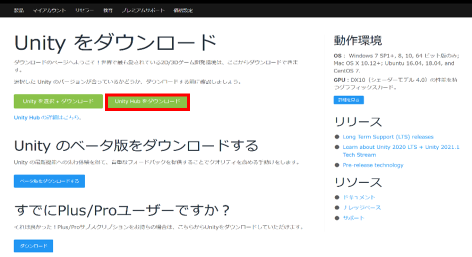
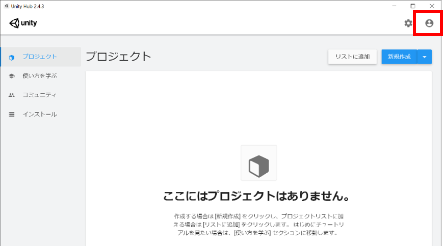
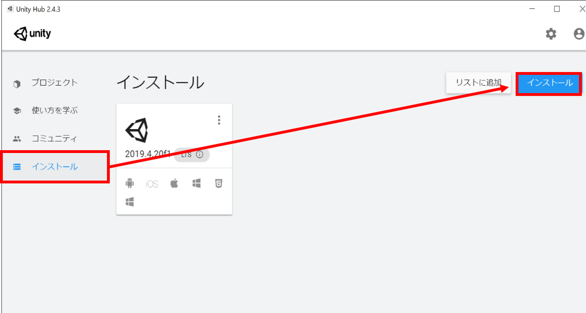
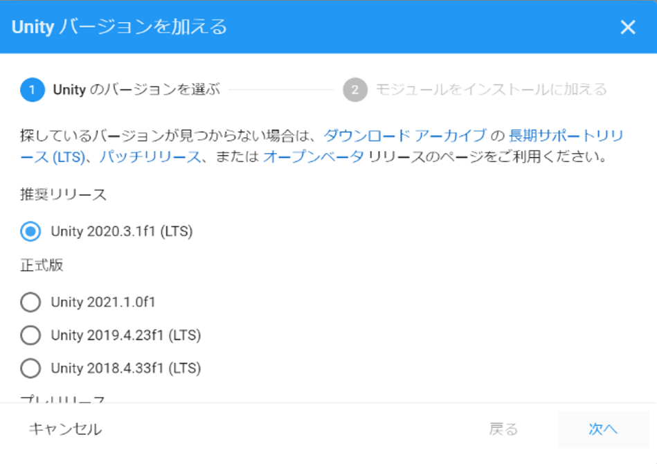
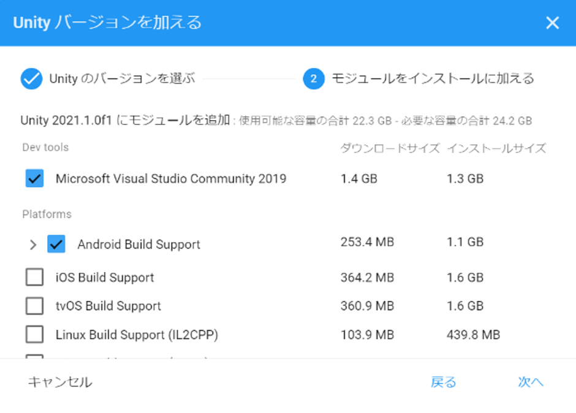

# Unityのインストールと初期設定

## Unity Hubのインストール
Unityをシンプルにインストールするために、[Unity Hub](https://unity3d.com/jp/get-unity/download)を利用します。Unityの公式ページから、`Unity Hubをダウンロード`のボタンをクリックし、Unity Hubのインストールプログラムをダウンロードし、Unity Hubをイントールして下さい。

## Unity Hubの起動
Unity Hubをインストールしたら、Unity Hubを起動して下さい。Unityの利用には、Unity IDが必要です。Unity Hubの右上に表示されている人型のアイコンをクリックし、`サインイン`を選択して表示されるダイアログから、Unity IDを作成して下さい。また、[Unityサインイン](https://unity.com/ja)からも、アカウントが作成できます。

## Unityのインストール
この時点では、まだUnity HubにUnityがインストールされていません。以下のように、左側の操作リストの`インストール`をクリックします。次に、右上の青背景ボタンの`インストール`をクリックします。

なお、上図のように、Unityがインストールされた状態の場合、導入済みのモジュールの種類がアイコンで表示されている（Android、Windows, Macのマークなどが並んでいることがわかる）。モジュールを追加または削除する場合、`︙`のアイコンをクリックして操作する。

`インストール`をクリックすると、現在、インストールできるUnityのバージョンの候補が複数表示されます。本教材では、Unity 2020.3.2f1による開発手法を解説します。もし、バージョン番号が異なっていても、バージョン番号が近ければ、基本的な機能に大きな違いはないことが多いため、おそらく問題なく動くと思います。Unityは、バージョンアップが頻繁に行われているため、古いバージョンから最新のバージョンまでたくさんのバージョンが公開されています。バージョンによって、機能や操作画面が異なったり、互換性の問題が起こることもあるため、開発者は希望するバージョンをインストールできます。複数のバージョンを共存してインストールしておくことも可能です。Unityの末尾に`(LTS)`という文字が書かれていますが、LTSは長期保証版を意味します。

インストールでは、Unity のバージョンを選んで`次へ`を進むと、インストールするモジュールを選ぶことができます。ここで、Unityのほかに、開発に必要なモジュールを加えます。本教材の解説でアプリをプログラミングをするために利用する`Microsoft Visual Studio 2019 Community 2019`を選択します。他のコンポーネントとして、`Android Build Support`と`WebGL Build Support`も選択して下さい。本教材では、WebGL向けのアプリ開発のために`WebGL Build Support`、Meta Quest 2向けのアプリ開発のために`Android Build Support`が必要になります。

`次へ`をクリックすると、インストールがはじまります。インストールには、ダウンロードが必要なため、インターネット接続が必須です。ダウンロード・インストールには時間がかかると思いますので、完了するまで、しばらくお待ち下さい。

※　上記のインストール画面については、他にもさまざまなモジュールがあります。たとえば、`iOS Build Support`は、iOSアプリをビルドするためなどのモジュールです。
