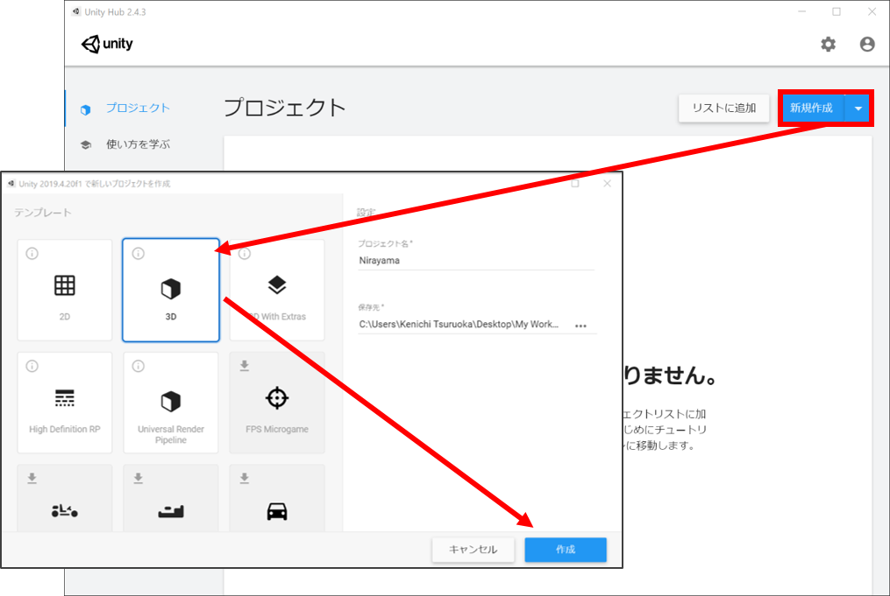
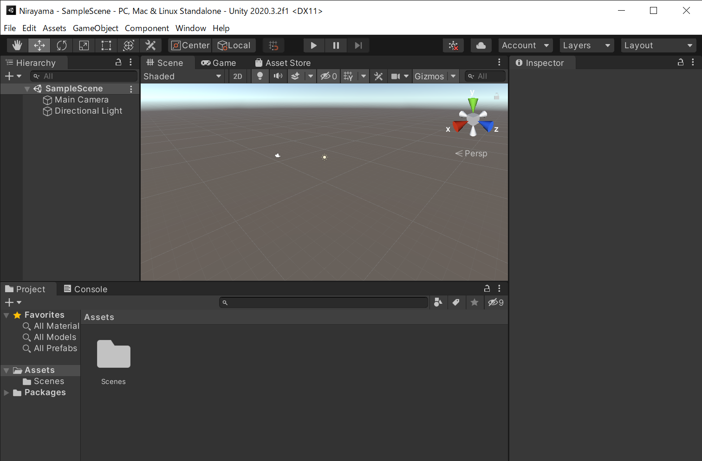
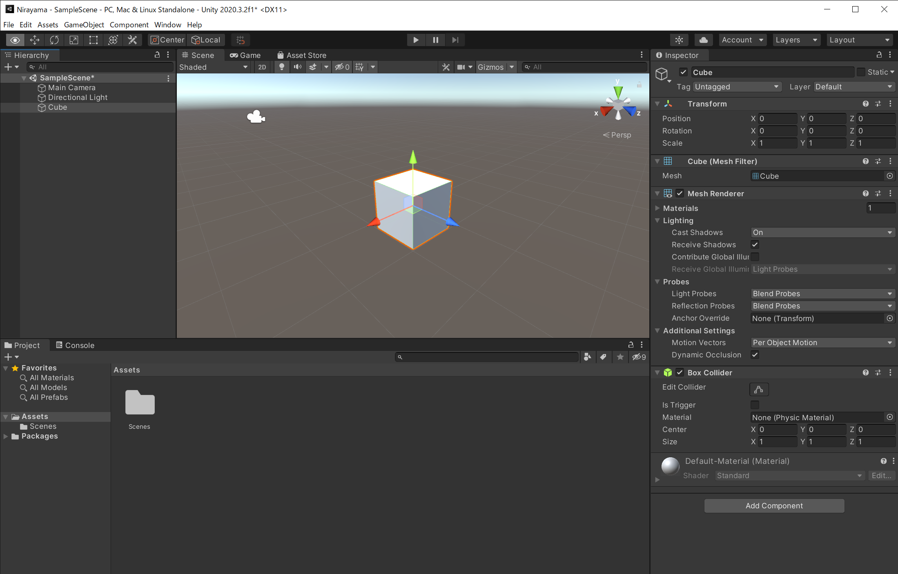
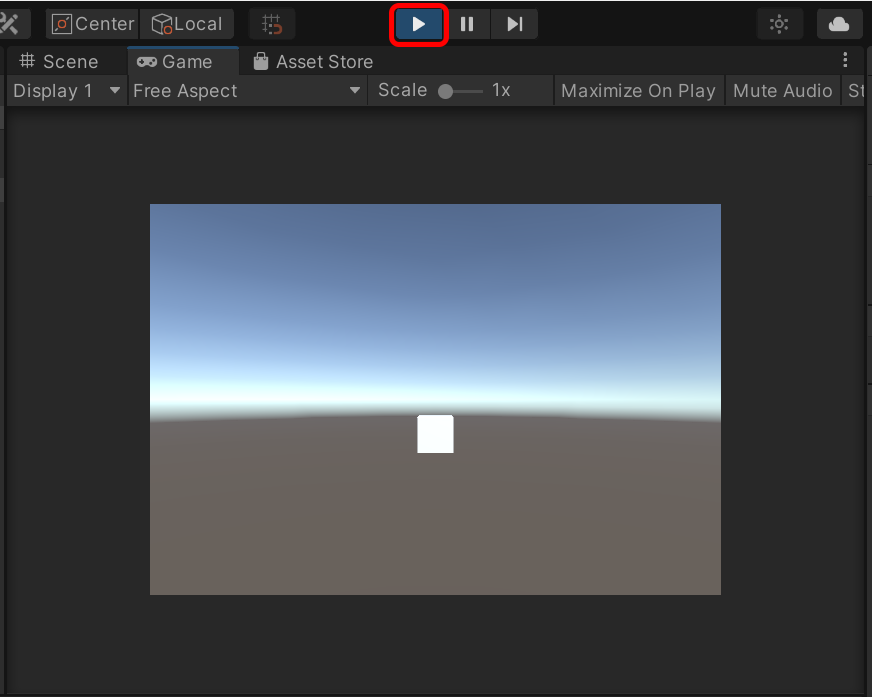
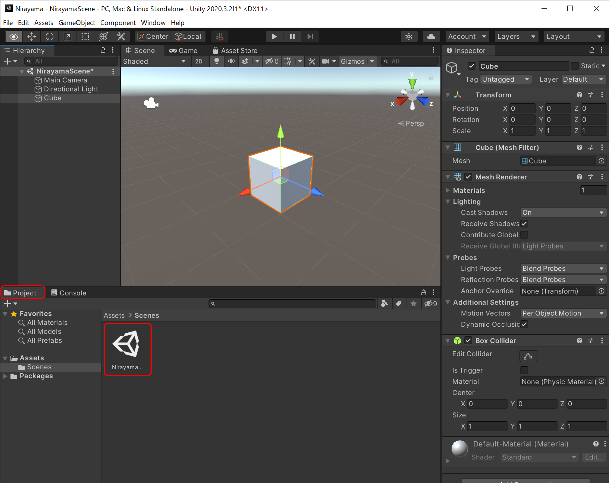
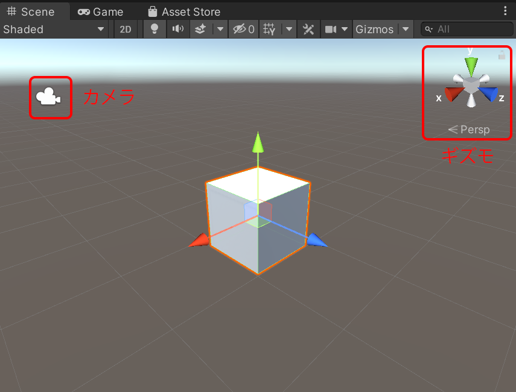
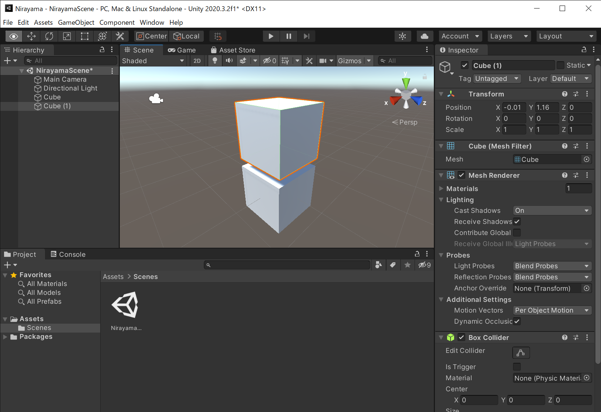

# Unityの基本画面と操作方法

## 新規プロジェクトの作成
アプリケーションは、新規プロジェクトを作成して行います。Unity Hubを起動し、以下のように`プロジェクト`を表示し、画面右上の青背景ボタンから`新規作成`をクリックします。次に、プロジェクトの名前や保存場所や利用する雛形（テンプレート）を決めます。今回は、3Dモデルを使うので、テンプレートは`3D`にします。プロジェクト名は、任意の名前を付けても構いませんが、本教材では韮山反射炉（にらやま）を扱うので、ここでは`Nirayama`にします。プロジェクトの保存先も決めて下さい。プロジェクト名および保存先は、必ず英数字を用いて下さい。名前・保存先が問題ない場合は、`作成`をクリックします。

※　Unityを起動した直後に、最新バージョンのUnityをインストールすることを提案するダイアログが表示されることがあります。最先端の技術を使うなどでなければ、以前のバージョンでも問題ないと思います。ただし、セキュリティで問題がある場合は、最新バージョンをインストールすることをお勧めします。

## Unityの基本画面・操作
新規のプロジェクトを起動すると、以下の画面が表示されます。画面中央のグレーの画面は、ここに3Dモデルなど、さまざまなコンポーネント（部品）を配置して、アプリやコンテンツを開発します。Unityには、`Scene`（シーンビュー）と`Game`（ゲームビュー）があります。起動直後に表示されているのがシーンビューです。

- シーンビュー： 開発時に使う画面。シーンの3Dモデルの位置・大きさ・角度・配置などを編集するときに利用する。
- ゲームビュー：アプリを動作させたときに見える画面。開発中のアプリの動作テストするときに利用する。

まずはシーンビューの状態で、シーンにシンプルな3Dモデルを配置してみましょう。Unityのファイルメニューから`GameObject`→`3D Object`→`Cube`を選択します。すると、以下のように画面の3D空間にCube白い立方体が追加されます。

ここで、画面上部の`プレイ`ボタンをクリックしてみて下さい。以下のように画面がシーンビューからゲームビューに切り替わります。この時に表示されるゲームビューの画面は、アプリを実行した時に表示される動作テスト用の画面です。再度プレイボタンをクリックする（または、キーボードのESCキーを押す）と、ゲームビューが終了できます。

簡単に操作方法を解説しました。現在、カメラやCubeなどが配置されているシーンの名前は`SampleScene`というデフォルトの名前になっているはずです。これを`NirayamaScene`という名前に変更しましょう。アプリ開発では、ソースコードや素材の名前をわかりやすく付けておくことが重要です。プロジェクトのシーンは、プロジェクトウィンドウから確認することができます。シーンは、Assetsフォルダの傘下の`Scenes`というフォルダに入っています。`SampleScene`を選択し、Renameで名前を`NirayamaScene`へ変更して下さい。なお、Unityのプロジェクトでは、複数のシーンを作ることができます。たとえば、山のシーン、海のシーンなどを分けて作ることが可能です。本教材では、韮山反射炉を表示するための１つのシーン（NirayamaScene）だけを制作します。

### カメラ・ライト・3D空間座標（X, Y, Z）
シーンビューに戻ると、この画面に、カメラ、太陽みたいな絵柄のアイコン、追加した白い立方体が表示されていることがわかります。この画面では、マウスホイールを回すと拡大・縮小できます。まずは、`カメラ`をクリックしてみましょう。このカメラが、アプリを表示したときに、ユーザが見ることができる画面になります。つまり、制作時などに、このカメラの位置や角度・画角などを指定することによって、ユーザが見る画面の様子を作ることができます。なお、シーンビュー右上に`赤、青、緑`の操作バーがありますが、これはギズモといって、操作するとシーンビューの座標（X, Y, Z）の表示の向きを変えることができます。試しに、ギズモのそれぞれの部分をクリックしてみると、シーンビューの表示が切り替わるはずです。

カメラは、静止のみでなく、移動させることができます。そのように設定することで、実際に仮想空間を歩くような視覚表現を作ることが出来ます。空間情報のデータであれば、地上1.5m程度の視点にすれば、歩行者の視点を再現できます。カメラの高度を高い位置に持ってくれば、俯瞰的に地形を眺めたり、カメラを動かし続ければ飛行機で飛んでいるようなコンテンツを作ることができます。

### 3Dモデルのスケール・位置
コンテンツを制作するには、3Dモデルのスケールと位置が重要になります。Unityでの3Dモデルの位置は、X軸（左右）、Y軸（奥行き）、Z軸（高さ）で表現されます。それでは、3Dモデルの位置・大きさ、カメラの位置などを変更してみましょう。編集操作したい対象物をクリックして選択後、赤・青・緑の立方体をクリックすると、それぞれを移動できます。ゲームビューを表示すれば、カメラと各3Dモデルのそれぞれの位置関係から、テスト画面が表示されます。カメラを3Dモデルに移動させて近づけたり、3Dモデルを追加してみて下さい。Unityのプリセットの3Dモデルには、Cube以外にも、Sphere（球体）などさまざまなものがあります。試しに、Cubeをもう一つ追加してみて下さい。追加してみると、シーンビューのCubeが2個になったはずです。ただし、1個目のCubeを追加して位置を移動しないまま、2個目のCubeを追加した場合、同じ位置・スケールで合計2個のキューブが重なっているため、1個のキューブのように見えるはずです。どちらかのCubeのシーン上の位置を移動すれば、２個のCubeがあることが確認できるはずです。

次の解説で、韮山反射炉の３Dモデルを配置するので、いまシーンにある全てのCubeを削除して下さい。もし追加した3Dモデルを削除したいときは、シーンビューで対象の3Dモデルをクリック選択して、キーボードのDeleteキーを押せば、削除できます。

Unityでの開発に慣れないうちは、3Dモデルやカメラの位置を編集中や確認中に間違って動かしてしまったために、アプリの画面表示がおかしくなってしまうことがあります。意図せずに移動させてしまった場合、画面の表示の倍率を変えたりして3Dモデルを探したり、3Dモデルやカメラの位置を意図する位置に置き直して下さい。操作は`Ctrl+Z`を押せば、一つ前の操作に戻せます。また、編集状態の意図しない喪失を防ぐためには、正しい状態のときにプロジェクトのこまめな保存（バックアップ）も大事です。保存はファイルメニューの`File`→`Save`もしくは`Save As`で行って下さい。

*このUnityのプロジェクトは、次の解説でも使います。シーンの全てのCubeを削除したうえで、一旦、プロジェクトを保存して下さい。
