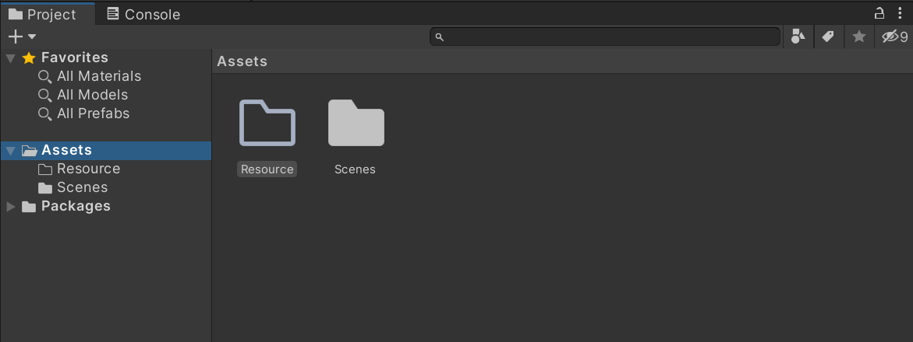
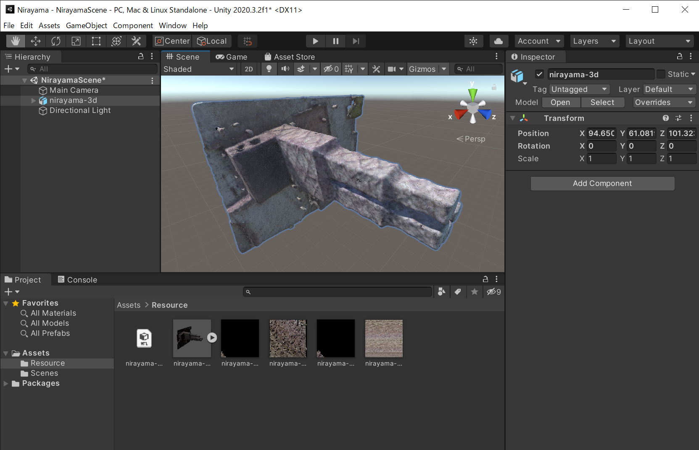
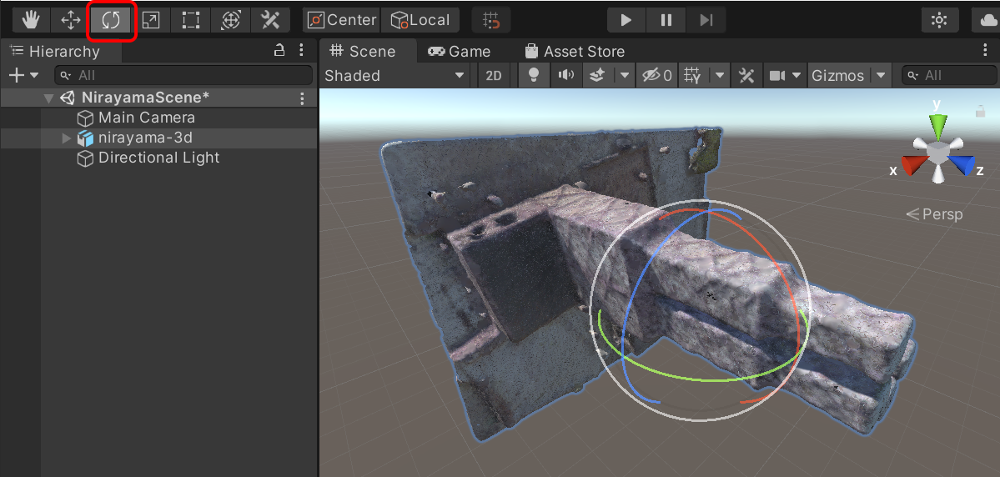
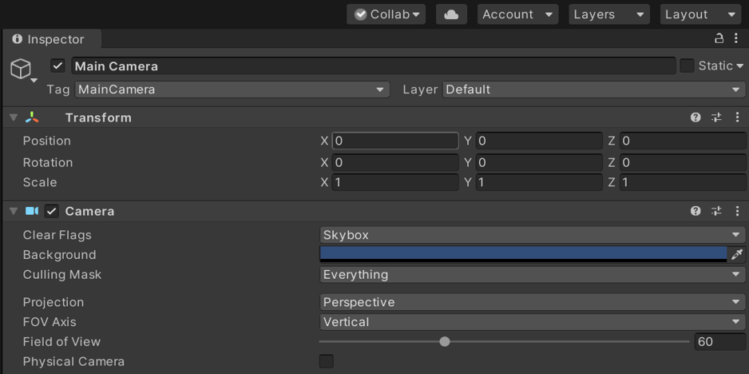

# 地理情報の取り込みと表示設定
この教材では、韮山反射炉の３Dモデルをさまざまな角度から眺めるアプリを作成しながら、Unityによるアプリ開発を解説します。学習をはじめる前に、実習用データをダウンロードしてください。Zipファイルをダウンロードしたら展開してください。実習用の3Dモデルは、OBJ形式です。OBJ形式は、3Dモデルのスタンダードな形式のひとつです。Unityでは、難しい操作をしなくても、OBJファイルをそのままUnityに取り込んで利用するこができます。本教材では、韮山反射炉の表面のテクスチャが含まれていますので、それらも扱います。

[実習用データ・韮山の反射炉](https://github.com/gis-oer/datasets/raw/master/3d/nirayama.zip)
> [30-XXX01-01-00-01　©静岡県ＰＣＤＢ　CC-BY](https://pointcloud.pref.shizuoka.jp/lasmap/ankenmap?ankenno=30XXX01010001)・[G空間センター](https://www.geospatial.jp/ckan/dataset/h30nirayama)を改変し、作成

## 3Dモデルの読み込み
3Dモデルを読み込んでみましょう。Projectウィンドウの`Assets`のフォルダを右クリックして下さい。その後、表示されるメニューから`Create`→`Folder`を選んで下さい。すると、Assetsの傘下に新しいフォルダが作られます。`New Folder`という名前になっていると思いますので、`Resource`に変更します。

UnityでResourceフォルダを作ったら、展開した韮山の3Dモデル（OBJファイル、MTLファイル、PNGファイル）など全てのファイルを、Resourceフォルダにドラッグ・アンド・ドロップします。すると、3Dモデルの取り込み処理が自動的に行われるので、少しお待ち下さい。無事に取り込みが完了すると、ProjectウィンドウのAssetsのResourceの傘下に`nirayama-3d`が追加されます。このように、Projectウィンドウは、プロジェクトで使うファイルを管理できます。

## モデルの表示
`nirayama-3d`のファイル(obj)を、シーンにドラッグ・アンド・ドロップして下さい。すると、シーンに韮山反射炉が追加されます。カラー画像が読み込まれない場合は、一緒に取り込んだPNGファイルをドラッグアンドドロップします。Hierarchyウィンドウに`Main Camera`（カメラ）、`Directional Light`（ライト）、そして追加した韮山の`nirayama-3d`が入っていることがわかります。

## モデルの向きの調整
もともとの3Dモデルが横向きなので、シーンの韮山反射炉も横転しています。Unityのメニューの`２つの矢印が回転しているアイコン`を選択します。次に、Hierarchyウィンドウの`nirayama-3d`を選んで下さい。すると、`nirayama-3d`の角度を変更操作できるようになります。この時、シーンビューの韮山の3Dモデルに球形の操作バーが出ます。操作バーの赤、緑、青のいずれかをドラッグしながら、マウスを動かし、ドラッグを話すと角度を調整できます。なお、メニューで`手のアイコン`は、シーンの編集時の表示位置を移動させる時（3Dモデルの位置移動ではない）、`4つの矢印のアイコン`は3Dモデルの上下左右の移動です。

## モデルの位置の調整
シーンの3Dモデルの位置や角度は、数値を入力して変更することも可能です。以下のように、`nirayama-3d`の`Postion`の`X, Y, Z`を`0, 0, 0`にして下さい。

ここでは、それぞれの3Dモデルを、XYZ座標の原点あたりに置くことで、カメラと韮山反射炉を互いに近づけて見やすく調整しやすくしてみましょう。それぞれの位置を原点あたりに置き直したら、プレイボタンをクリックして、Gameビューで表示します。更に編集してみてカメラの位置の座標を調整してさらに遠ざければ、Gameビューで韮山反射炉全体を表示させることもできます。

*このUnityのプロジェクトは次の解説でも使います。3Dモデルの向きをうまく直せたら、一旦、プロジェクトを保存して下さい。

