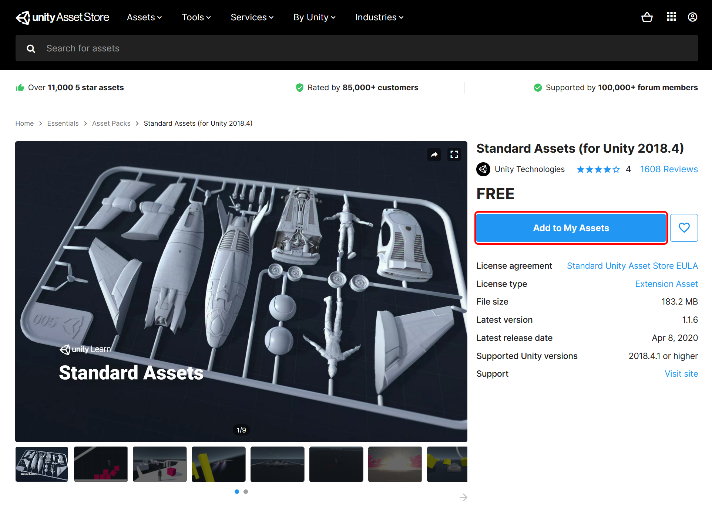
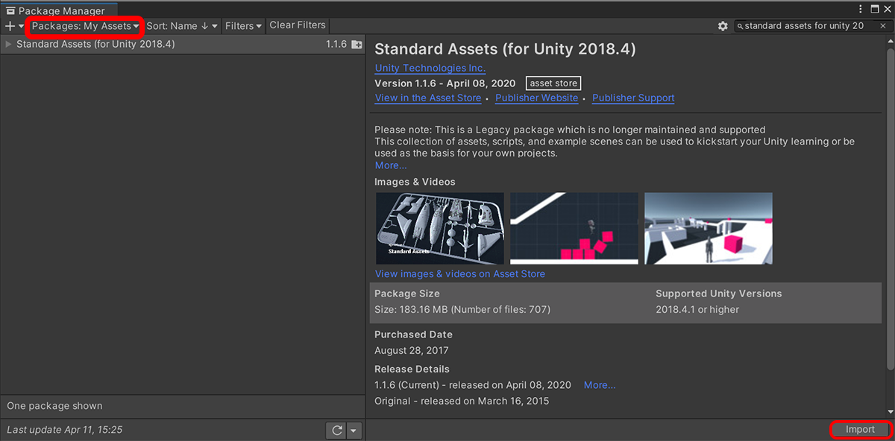
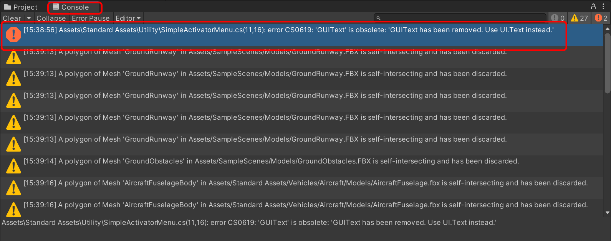
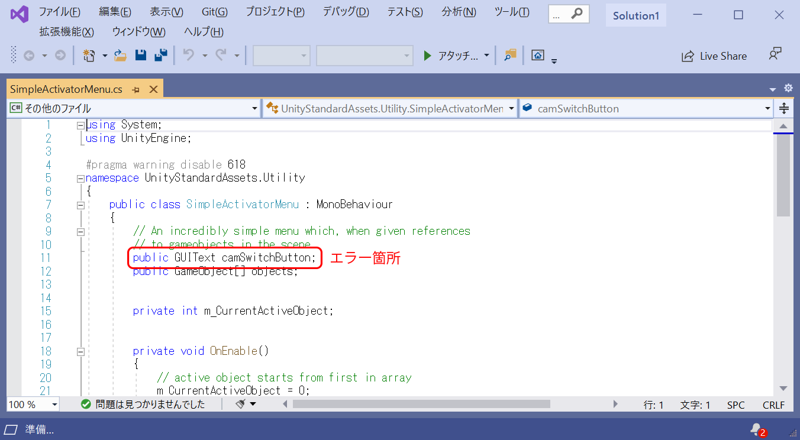
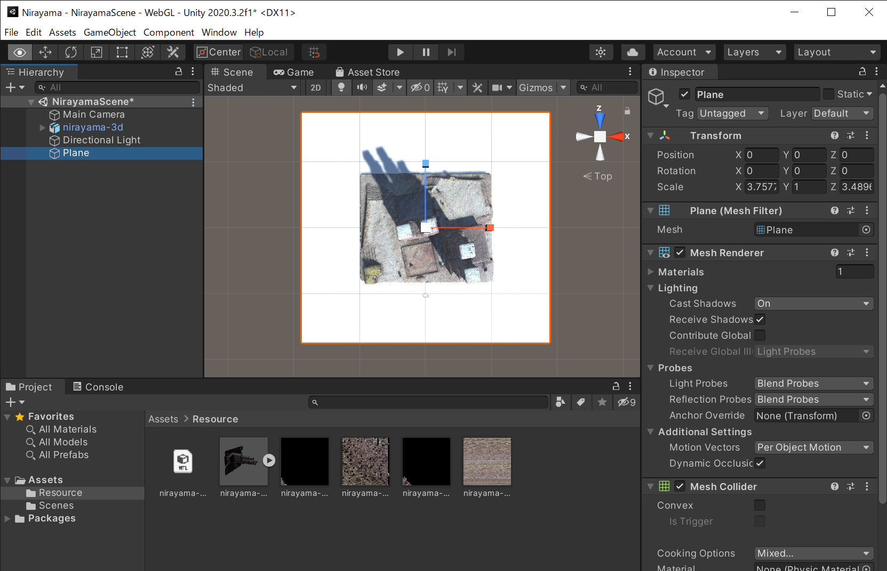

# アセットの利用と設定

## プロジェクトを開く
まず、これまでに作ったUnityのプロジェクトを開いて下さい。このプロジェクトを編集して開発を進めていきます。

## アセットの利用
以下では、`アセット`を利用して、3D空間を自由に歩けるようにする開発手法を解説します。アセットとは、3Dモデルの素材やソフトウェアなどのことで、開発作業を便利にするためのものです。UnityのAssetsストアでは、膨大な種類のUnity専用のアセットが無料配布や販売されています。今回は、Unity Technologiesが無償配布している`Standerd Assets`というアセットを利用していきます。

## アセットの入手
まず、ウェブブラウザを起動し、Unityの公式アセットストア（Unity Assets Store）にアクセスします。そして、自分のUnity IDでログインして下さい。ログインが完了したら、Unity Assets Storeの検索バーで`Standard Assets`を検索して下さい。検索結果からStandard Assetsを選び、Standard Assetsのページを表示して下さい。このアセットの配布者が`Unity Technologies`、価格が無料であることを確認し、`Add To My Assets`をクリックして下さい。この際、アセットの利用規約が表示されることがあります。よく読んで同意したうえで入手して下さい。この作業を行うと、自分のUnity IDにアセットが追加されました（アセットの入手完了）。なお、一旦入手したアセットは、自分のUnity IDに記録されますので、次回以降の入手作業は必要ありません。

Unityアセットストアのトップページ: https://assetstore.unity.com/




## プロジェクトへのアセットの導入（Package Mangerの使い方）
では、上記で入手したStandard Assetsを、韮山反射炉のアプリのプロジェクトへ導入する方法を解説します。Unityで韮山反射炉アプリのプロジェクトを開いて下さい。Unityのメニューから`Window`>`Package Manger`を選択して下さい。Package Mangerのウィンドウが表示されます。Package Managerとは、Unityのプロジェクトで利用するアセットなどのパッケージを管理する機能です。まず、このウィンドウの左上の操作メニューから、`Packages: My Assets`を選んで下さい。この操作を行うと、自分のUnity IDが所有するアセットのリストが表示されます。今回初めてアセット操作をする場合、リストに`Standard Assets`のみが表示されていると思います。`Standard Assets`を選択すると、このアセットに関する情報が右側のページに詳しく表示されるはずです。この`Standard Assets`をプロジェクトに取り込むためには、このページが表示された状態で、Pakage Managerの左下の`Import`をクリックし、インポートを行って下さい。この操作を行うと、`Standard Assets`がプロジェクトに取り込まれます。無事に取り込まれた場合、UnityのProjectビューのAssetsのフォルダの傘下の`Standard Assets`のフォルダにファイルが取り込まれていることがわかります。



### Standard Assetsの修正
`Standard Assets`には、修正する箇所があります。Unity 2019または2020で、Standard Assetsを開くと、このアセットの部品（プログラム）に問題があり、エラーが必ず起きます。プレイモードを押し、エラーを確認してください。エラーを解決するには、まずUnityの最下部にオレンジ色の感嘆符マークでエラーが表示されていることを確認します。これをクリックすると`Console ウィンドウ`が表示されます。`Console ウィンドウ`は、アプリのエラーや注意のリストです。オレンジ色の感嘆符マークの箇所は、以下のように表示されているはずです。リストで、このエラーメッセージをダブルクリックしてみます。

```
Assets\Standard Assets\Utility\SimpleActivatorMenu.cs(11,16): error CS0619: 'GUIText' is obsolete: 'GUIText has been removed. Use UI.Text instead.'
```
エラーメッセージをダブルクリックすると、Microsoft Visual Studio Community 2019が起動し、問題のソースコードが自動的に表示されます。ソースコードの修正にはVisual Studioを使います。Windows版のUnityではアプリのプログラムを書く時は、Visual Studioを標準で使うようになっています。

では、ソースコードのエラーを修正してみましょう。今回の問題は、ソースコードの１行だけです。以下の１行を書き換えて下さい。書き換えたら、Visual Studioで上書き保存します。ソースコードの修正保存については、Unityでの保存でなく、Visual Studioで保存が必要ということを忘れないで下さい。無事に修正できれば、Visual Studioは終了して構いません。

- 修正前： public GUIText camSwitchButton;
- 修正後： public UnityEngine.UI.Text camSwitchButton;




エラーが問題なく修正されていると、プレイボタンでゲームビューが無事に表示されます。今回は、エラー修正の作業に留めましたが、Visual Studioでプログラムを新規に書いたり、加えたりすることで、アプリの機能や動作を作り出すことができます。たとえば、ボタンをクリックすると音が再生されたり、テキストが表示されたり、さまざまなことができます。

## アセットのカメラの設定
　アセットのプログラムのエラーを修正しましたが、Standard Asssetsのカメラにまだ置き換えていませんので、アプリの表示は全く変化していません。最初からあったMainCameraの静止カメラを、Standard Assetsの動くカメラに置き換えましょう。ProjectウィンドウからAssetsフォルダ傘下の`Standard Assetsフォルダ＞Charactersフォルダ＞FirstPersonCharacterフォルダ＞Prefrabsフォルダ＞FPSController`を見つけて下さい。そして、`FPSController`を、シーンビューにドラッグ・アンド・ドロップして下さい。これで、シーンにFPSControllerのカメラが追加されます。

現在、このシーンにはMainCameraのカメラとFPSControllerのカメラが競合しています。プレイボタンを押してGameビューを表示すると、MainCameraが優先表示されてしまいます。そのため、Hierarchyウィンドウから、`MainCamera`を選択し、`MainCamera`を削除します。

## 地面の設置・調整
次に、重力加速度に関わる問題を調整します。現状、カメラは重力で下に落ち続ける設定になっています。カメラが落ち続けることを防ぐ方法として、カメラの下に地面を置きます。Unityのメニューから`Game Object＞3D Object＞Plane`をクリックすると、地面（Plane）が追加されます。しかし、現在の状態は、韮山反射炉の底面よりも地面（Plane）の面積が小さい状態です。そこで、Planeの面積を広げるため、ツールバーのスケール変更のアイコンを選択します。すると、Planeにスケールを変更するバーが表示されるので、バーを移動させてPlaneを大きくします。以下のように、カメラがPlaneの範囲内かつ上面に乗るようにして下さい。カメラがPlaneの範囲外にある場合、カメラが落ちてしまうので注意して下さい。画像は、ギズモを操作して、シーンを真上から見た様子です。白色の地面（Plane）のスケールを変更できる状態です。白い地面（Plane）の面積が、韮山反射炉の3Dモデルの底面よりも広いことがわかると思います。



*アセット導入と地面の設置がうまく完了したら、このUnityプロジェクトを保存して下さい。次の解説で利用します。

## 当たり判定
（任意、必要な方のみ）取り込んだ建物のモデルをすり抜けて移動する設定になっています。これを解消するには、左のウィンドウでnirayama-3Dのモデルの▲を開き、mmGroup0をクリックします。次に、右ウィンドウでAdd componentから、Mesh colloderを追加します。
