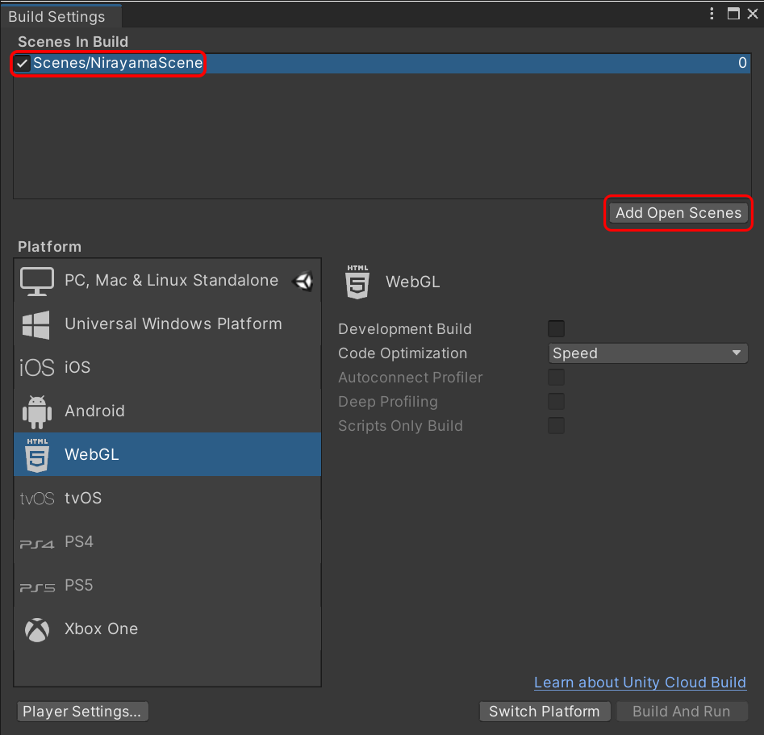
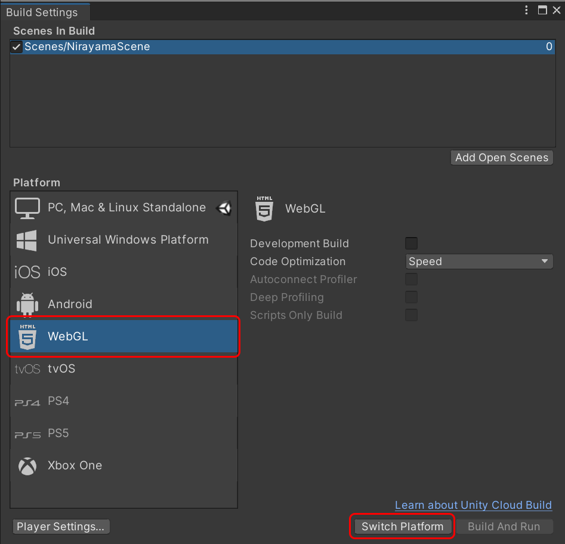
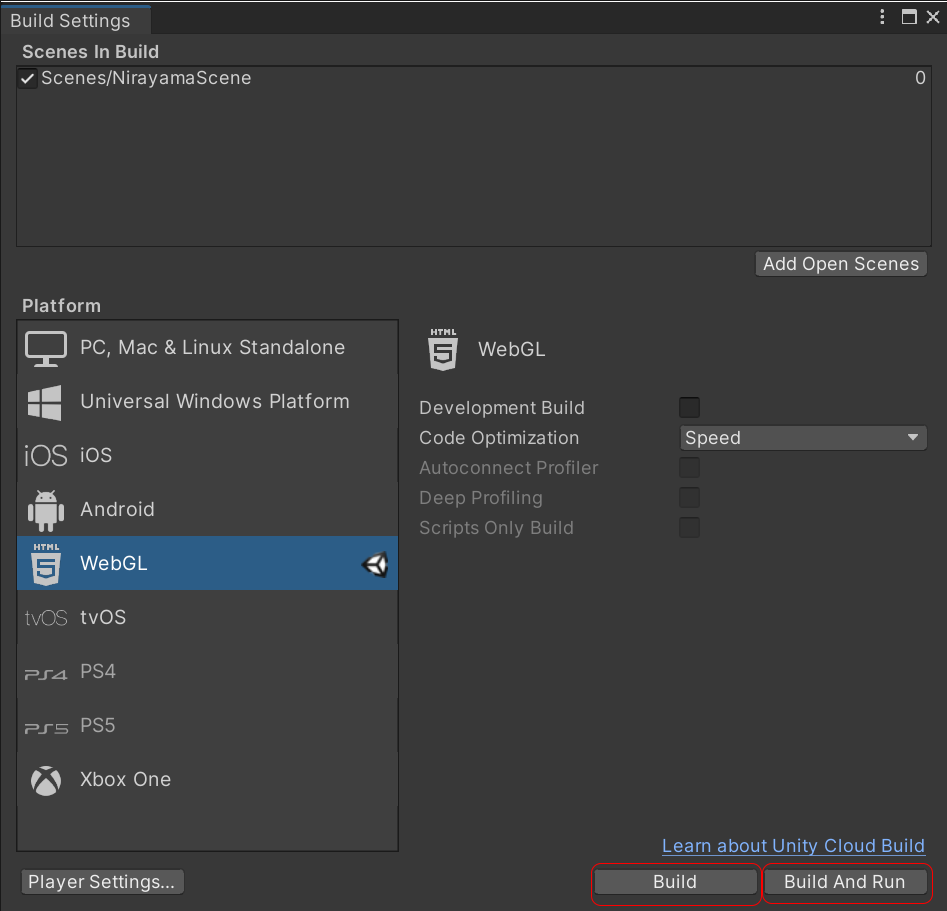

# テストとビルド

## 動作テスト
韮山反射炉のアプリが、うまく動作するかテストしてみます。韮山反射炉のアプリのプロジェクトを、Unityで開いて下さい。そして、Unityのツールバーのプレイボタンを押して、ゲームビューでうまく動作しているかを確認します。うまく動作した場合、マウス操作でカメラの向きを変更したり、キーボードの矢印キーで前後左右に移動できるはずです。韮山反射炉をいろいろな角度から眺めてみましょう。カメラの位置がPlaneの範囲から出てしまうと、カメラは落ちてしまいます。落ちた場合は`Esc`キーで、ゲームビューから抜けて下さい。テストを行ってみて、もし反射炉や平面の大きさや位置を移動させたい場合は、シーンビューで微調整して下さい。Unityでは、シーンビューで編集、ゲームビューでテストを行います。これらのビューを切り替えながら微調整を行って、実装を進めます。

## アプリのビルド
うまく動作した場合、これで実装が成功です。テストが問題なく完了し、アプリが完成した場合、それぞれのプラットフォーム（Windows、Mac、iOSなど）で動かせるアプリとして、`ビルド`することができます。ビルドしたアプリを公開・配布すれば、Unityを持ってないユーザでもアプリを起動して実行することができます。

### WebGLとは
この教材では、WebGLに対応したアプリをビルドしてみます。WebGLとは、ウェブブラウザで3Dモデルなど表示できる規格です。Unityでは、WebGL向けにアプリをビルドすることが可能です。なお、WebGL版のビルドでは、UnityのWebGLの追加モジュールのインストールが必須です。この方法は、Unityのインストールで解説していますので、もしWebGLの追加モジュールを、まだインストールしていない場合は読んで下さい。

### WebGLのビルド（実行・ファイルの書き出し）
WebGL向けにビルドする設定方法を解説します。Unityで、ビルドしたいプロジェクトを開いてから、`File`→`Build Settings`のウィンドウを開いて下さい。まず、ビルドするシーンを指定する必要があります。`Build Settings`のウィンドウの`Add Open Scenes`のボタンをクリックして下さい。これで、これまで作ってきた`Scenes/NirayamaScenes`がビルドするリストに追加されたはずです。

次に、ビルドするプラットフォームを指定します。`Build Settings`の左側のリストに表示されるプラットフォームのリストから`WebGL`を選んでから、`Switch Platform`のボタンをクリックして下さい。この操作を行うと、プロジェクトがWebGL向けに自動処理されます。この自動処理が完了したら、ビルド作業を開始できます。

ビルドするには、`Build Settings`のウィンドウの`Build and Run`をクリックして下さい。そこで、WebGLアプリのローカルの保存場所を決めて、半角英数字のファイル名を付けて下さい。正常に進めば、ビルドが完了し、ウェブブラウザ（Google ChromeやMozila Firefoxなど）が起動し、ウェブブラウザで韮山反射炉のアプリが起動し、動作テストできるはずです。保存されたフォルダごとファイル一式を、ウェブサーバへアップロードすれば、ウェブサイトでアプリを公開することが可能です。なお、`Build Setting`で、`Build and Run`と`Build`の2種類の選択肢がある理由は、ビルドを実行し・保存するか、ビルドを保存するだけかの違いです。ウェブブラウザでは、PCのローカルに保存されたWebGLアプリを直接実行できません（ブラウザのセキュリティ確保のため）。このため、開発者がビルドの動作を試す場合、`Build and Run`で、Unityからビルド・ブラウザを実行し、動作させることになります。いっぽう、ビルドのファイルを保存する作業だけであれば、`Build`を選択します。ただし、この場合、ローカルへ保存したファイル（index.html）を実行しても、そのPC・ブラウザでは起動しないはずです。なお、WebGLのビルドで、よくある失敗例としては、保存するファイル名を日本語文字で付けてしまったため、ビルドに失敗します（保存場所のパス名も含めて、ファイル名は必ず半角英数字にして下さい）

### さまざまなプラットフォーム向けのビルド
本教材では、ビルド例として、WebGL向けのアプリのビルドを解説しました。以降では、VR向けのビルドについて解説します。Unityのビルドでは、WebGLやVR向けのビルド以外にも、WindowsやMacなど、さまざまなプラットフォームの選択肢がありますので、試してみても良いでしょう。たとえば、iOS向けのビルドを行った場合、Apple App StoreでiPhone向けのアプリとして公開することも可能です（ただし、アプリ公開のためのApple社の審査を経る必要があります）。