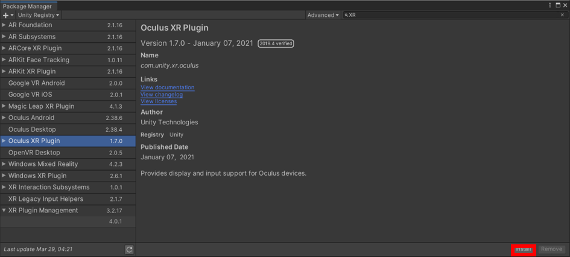
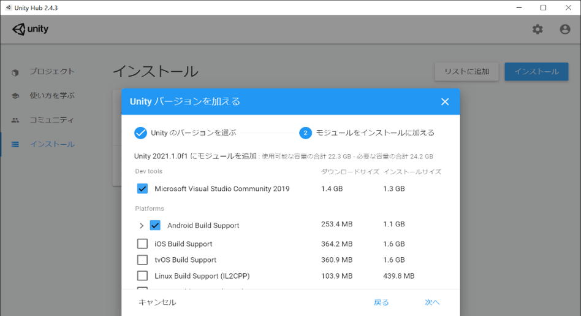

# Meta Quest 2向けのUnityの初期設定

## VRアプリの作成準備
これまでに作成した韮山反射炉のアプリを、VRデバイスのMeta Quest 2で動作するようにUnityで初期設定の作業します。

## UnityのVR設定（XR）
近年のアプリ開発では、VR、AR、MRなどの需要が増えており、Unityでは、これらのアプリを開発するための機能が備わっています。Unityで、VR向けの開発機能有効し、Meta Quest 2でアプリを動作させるための下準備をします。まず、韮山反射炉のアプリのプロジェクトを開いた状態で、Unityのメニューの`Windows＞Package Manager`を表示します。

`Package Manager`は、Unityに追加するさまざまな機能やアセットを、有効にするか無効にするかなどを設定できるリストのウィンドウです。ここでは、VR開発のために`XR Plugin Management`を導入します。`Package Manager`で`Packeges: Unity Registry`を選択し、リストから`XR Plugin Management`を表示して、ダウンロード・インストールをして下さい。複数のバージョンがあることもありますが、安定版のバージョンを使うことをお勧めします。

次に、`XR Plugin Management`の設定を行います。Unityメニューから`Edit＞Project Settings`を選択して下さい。そして、リストから`XR Plug-in Management`を表示し、左側のタブからAndroidアイコンをクリックし、Androidの項目を選びます。`Plug-in Providers`から`Oculus`にチェックを入れて有効にして下さい。この操作で、`Oculus XP Plugin`が導入されます（`Package Manager`で確認可）。

## Oculus Integrationについて
WebGLでは、マウスとキーボードで操作する韮山反射炉のアプリを作りました。Meta Quest 2では、両手で持つ専用のコントローラを使うため、マウスとキーボードを前提としたUnityの`Standard Assets`では操作ができません。このため、Facebook社が配布している無料のOculus向けの公式アセット`Oculus Integration`を導入します。Oculus Integrationには、Oculusを利用するために便利なプログラムなどが収録されています。このアセットを導入することで、Meta Quest 2向けのカメラやコントローラを簡単に利用できます。

## Oculus Integrationの導入方法
ウェブブラウザから、Unityアセットストアにアクセスし、アセットストアの検索から`Oculus Integration`を探します（パブリッシャー名:Oculus）。アセットの入手・ダウンロードとインポートについては、`Standard Assets`の導入で解説した内容と同様に、Unityの`Package Manager`の`Packages: MyAssets`から行います。ダウンロードとインポートには時間がかかりますので、しばらくお待ち下さい。Oculus Integrationのダウンロードとインポートが成功すると、`Project`ビューを見ることで、Assets傘下に`Oculus Integration`が追加されたことがわかります。

## Androidモジュールの追加
なお、Meta Quest 2のシステムは、Androidがベースとなっています。このため、UnityでMeta Quest 2向けにアプリをビルドして動作させるためには、UnityのモジュールにAndroid Build Support（Android SDK&NDK ToolsおよびOpenJDK）が導入されている必要があります。これらが、Unityに導入されていない場合、Unity Hubを起動し、インストール項目からモジュールを追加して下さい。このウィンドウでのインストールしたUnityの表示箇所の`︙`アイコンからモジュールを追加できます。なお、最初のインストール時などに、これらのモジュールを導入済みの場合は、改めてのこの操作は不要です。

