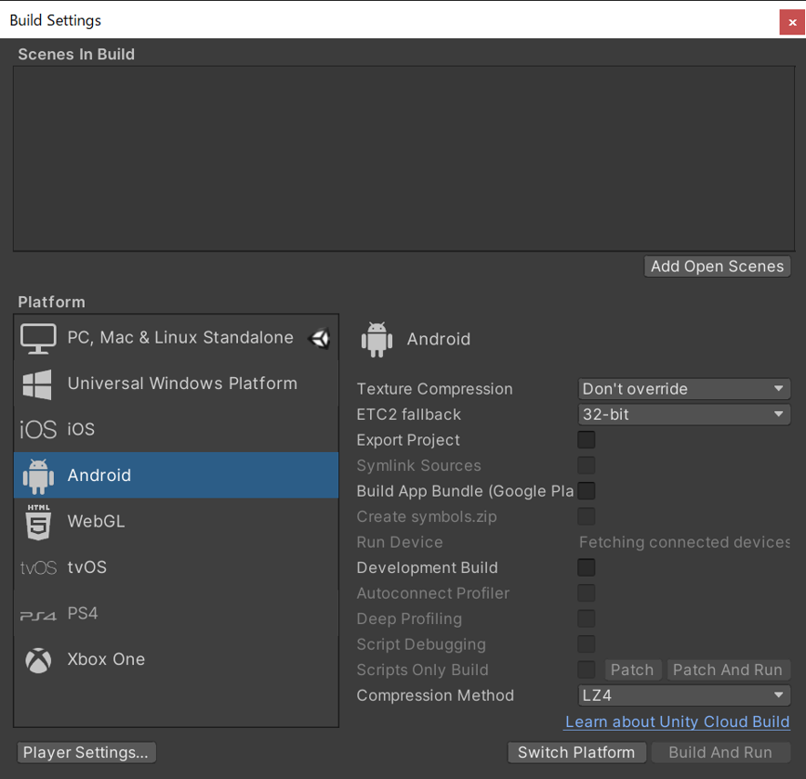

# Meta Quest 2への転送と動作確認
ここから、Meta Quest 2の実機で動かすための作業に入ります。Unityでは、開発したアプリを、WebGL、Windows、Mac、iPhone、Androidなど、さまざまな種類のデバイスなどへビルドすることができます。Meta Quest 2は、Androidのシステムをベースにしているため、アプリを動作させるには、Unityのビルドし設定をAndroidにする必要があります。このために、Unityのビルド画面でビルドの設定を行います。Unityのメニューから`File＞Build and Setting`の項目を設定します。このウィンドウでは、Meta Quest 2は、Androidのため、一覧からAndoridを選択し、`Switch Platform`を選びます。`Switch Platform`が完了するには、時間がかかると思います。しばらくお待ち下さい。これが完了したら、`Player Settings...`をクリックして出てくる`Project Settings`のダイアログの`Player`で、ビルド設定を行います。膨大な数の項目があると思いますが、ビルドの項目は、VRの目的やクオリティなどによって細かい設定は異なってくると思います。目的や用途によって最適解が異なると思いますので、開発者がチューニングしてうまく動作させるようにする必要があります。

`Project Settings`のダイアログの`Player`のAndroidの設定画面で、以下の項目の設定が必須です。

- [Other Settings]>[Graphics APIs]で[OpenGLES3]を指定（また、リストに他のAPIも表示されている場合は[OpenGLES3]をリストの最上部へ移動）
- [Other Settings]>[Minimum API Level]を[Android 6.0 'Marshmallow'(API level 23)] (なお、上部のMinum API Levelでは、Android 6.0以上であれば、Android 7.1などでも動作します。)
- [XR plug-in Management]から[Oculus]にチェックをつける

## アプリの転送
Meta Quest 2へビルドしたアプリの転送を行います。PCとMeta Quest 2をUSBケーブルで接続します。これまでの設定が全て済んだうえで、Unityの`Build And Settings`で`Build and Run`をクリックします。すると、ビルドしたファイル（.apk）をPCに保存するダイアログが表示されます。半角英数字の保存場所（パス）を指定したうえで、ファイル名が半角英数字になるように、保存して下さい（つまり、パス・ファイル名が半角英数字）。この際、日本語文字が含まれていると、ビルドや保存にエラーが出てうまくいかないことがありますので、注意して下さい。Meta Quest 2の画面に、韮山反射炉のアプリが起動します。一度アプリを転送すれば、USBケーブルの接続を外した後でも、Meta Quest 2でアプリを起動できます。
ビルド・転送したアプリをUnityなしでMeta Quest 2から起動する場合、Meta Quest 2のホーム画面が表示されている時に、ホームボタンを押し、アプリのウィンドウ右上の`すべて`などが表示されているメニューから、`提供元不明`を選びます。そして、`提供元不明`のリストに表示されている`Nirayama`を選択すれば、実行できます。

## ビルドや動作がうまくいかない場合
プログラムのバグやUnityのエラーが残ったまま、ビルドを行うと、これらが原因でビルドに失敗します。UnityやVisual Studioのエラーメッセージを確認し、解決したうえでビルドを行って下さい。また、シーンのオブジェクト（カメラ、3Dモデル）などのそれぞれの座標位置、スケールなどがうまく作れていないと、意図した表示にならないこともあります。シーンビューをよく確認して、それぞれをうまく調整して下さい。
