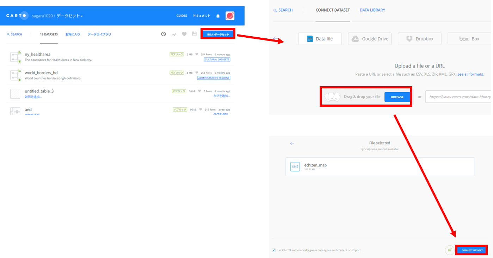
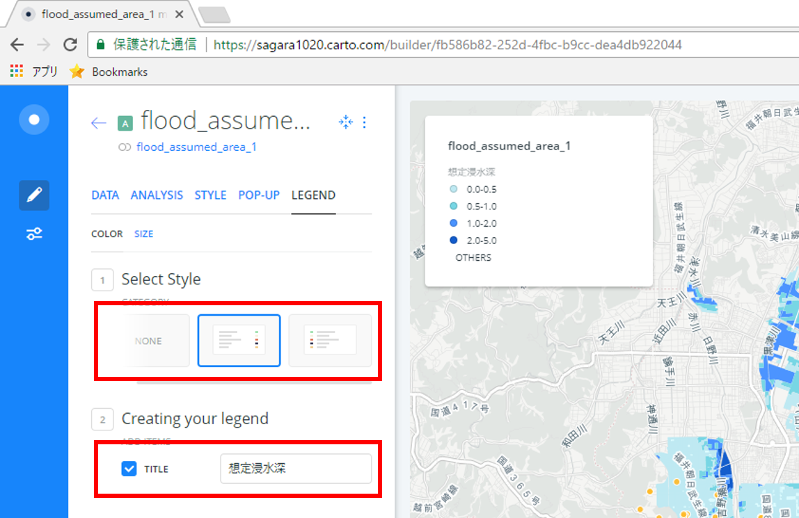
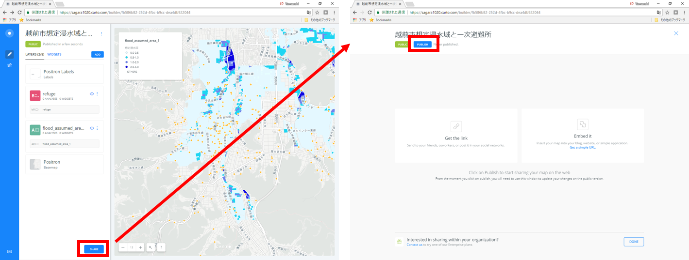

# CARTO入門
本教材は、[CARTO]を用いて空間データを表示する手法について解説しています。以下の教材を参考に[完成例](https://sagara1020.carto.com/builder/5d219b3c-08ac-411a-9e57-3f762075046c/embed)のような地図が作成できれば実習完了となります。CARTOは無償版のサービスが終了していますが、CARTOのTHE MAP ACADEMYという学習向けのサイトが無償で利用できます。以下では、THE MAP ACADEMYを利用しています。

本教材を使用する際は、[利用規約]をご確認いただき、これらの条件に同意された場合にのみご利用下さい。

**Menu**
------
* [CARTOとは？](#CARTOとは？)
* [アカウント取得](#アカウント取得)
* [データを読み込む](#データを読み込む)
* [NEWマップを作成する](#NEWマップを作成する)

**使用データ**

* [KMLサンプル](https://raw.githubusercontent.com/gis-oer/datasets/master/vector/kml/cesium/flood_assumed_area.kml)

* [CSVサンプル](https://raw.githubusercontent.com/gis-oer/datasets/master/text/carto/refuge.csv)

> [越前市オープンデータ] 越前市防災安全課　一次避難場所（風水害）、浸水想定区域（風水害）のデータを加工し、利用。

[越前市オープンデータ]:http://www.city.echizen.lg.jp/office/010/021/open-data-echizen.html

--------

## CARTOとは？

- 地図データや地図を編集・共有できるWEBサービス
- データのインポートや表示が容易
- データの分析や視認性の高い視覚化がブラウザ上で可能
- 教育向けに、[THE MAP ACADEMY]というサイトが無償で利用できる

[▲メニューへもどる]

## アカウント取得
[THE MAP ACADEMY]にアクセスする、`SIGN UP`をクリックし、アカウント作成を行う。

[▲メニューへもどる]

## データを読み込む
`DATASETS`をクリックして、`dashboard`を開く。

`NEW DATASET`をクリックし、`BROWSE`からKMLファイルを選択し、データを読み込み、`CONNECT DATASET`をクリックする。

`Create MAP`をクリックし、地図を作成する。
`ADD NEW LAYER`のボタンで別のデータも追加できるため、一次避難所(CSV)のデータも表示する。`YOUR DATASETS`からタブを`CONNECT DATASET`に切り替えて、データを読み込む。

[▲メニューへもどる]

## NEWマップを作成する

各レイヤのスタイル、凡例などを調整し、公開用の地図を作成する。レイヤ名をクリックすると、表示設定や分析などの以下のような機能が利用できる。

|メニュー名|機能|
|---|---|
|DATA|属性値のグラフ化、WIDGETSの追加等|
|ANALYSIS|バッファ等のデータ分析|
|STYLE|レイヤスタイルの設定|
|POP-UP|ポップアップの設定|
|LEGEND|凡例の設定|

### 属性値による分類
`STYLE > COLOR > BY VALUE` を選択し、想定浸水深で色分けを行う。

### ポップアップの表示
想定浸水深のフィールドを選択し、ポッポアップで浸水深が表示されるようにする。

### 凡例の設定
`Legend`から、凡例の設定を行う。

### タイトルの変更とその他の設定
地図の名前を変更し、Optionsから地図表示の設定を行う。

### グラフの追加

DATA＞必要なレイヤを選択し、`EDIT`をクリックするとグラフが表示される。`Apply Auto Style`のボタンをクリックすると属性値に基づいてスタイルが切り替わる。

### SHAREリンクの作成
レイヤの設定が完了したら`SHARE`をクリックし、次のページで左上の`PUBLISH`をクリックする。
`Get the link` からURLをコピーし、ブラウザで検索する。

以下のように、ブラウザで地図が表示できる。

[▲メニューへもどる]

#### ライセンスに関する注意事項
本教材で利用しているキャプチャ画像の出典やクレジットについては、[その他のライセンスについて]よりご確認ください。

[その他のライセンスについて]:../../license.md
[▲メニューへもどる]:./CARTO.md#Menu
[CARTO]:https://carto.com
[THE MAP ACADEMY]:https://carto.com/academy/
[利用規約]:../../../policy.md
[利用規約]:../../../policy.md
[その他のライセンスについて]:../../license.md
[よくある質問とエラー]:../../questions/questions.md

[GISの基本概念]:../../00/00.md
[QGISビギナーズマニュアル]:../../QGIS/QGIS.md
[GRASSビギナーズマニュアル]:../../GRASS/GRASS.md
[リモートセンシングとその解析]:../../06/06.md
[既存データの地図データと属性データ]:../../07/07.md
[空間データ]:../../08/08.md
[空間データベース]:../../09/09.md
[空間データの統合・修正]:../../10/10.md
[基本的な空間解析]:../../11/11.md
[ネットワーク分析]:../../12/12.md
[領域分析]:../../13/13.md
[点データの分析]:../../14/14.md
[ラスタデータの分析]:../../15/15.md
[傾向面分析]:../../16/16.md
[空間的自己相関]:../../17/17.md
[空間補間]:../../18/18.md
[空間相関分析]:../../19/19.md
[空間分析におけるスケール]:../../20/20.md
[視覚的伝達]:../../21/21.md
[参加型GISと社会貢献]:../../26/26.md

[地理院地図]:https://maps.gsi.go.jp
[e-Stat]:https://www.e-stat.go.jp/
[国土数値情報]:http://nlftp.mlit.go.jp/ksj/
[基盤地図情報]:http://www.gsi.go.jp/kiban/
[地理院タイル]:http://maps.gsi.go.jp/development/ichiran.html

[課題ページ_QGISビギナーズマニュアル]:../../tasks/t_qgis_entry.md
[課題ページ_GRASSビギナーズマニュアル]:../../tasks/t_grass_entry.md
[課題ページ_リモートセンシングとその解析]:../../tasks/t_06.md
[課題ページ_既存データの地図データと属性データ]:../../tasks/t_07.md
[課題ページ_空間データ]:../../tasks/t_08.md
[課題ページ_空間データベース]:../../tasks/t_09.md
[課題ページ_空間データの統合・修正]:../../tasks/t_10.md
[課題ページ_基本的な空間解析]:../../tasks/t_11.md
[課題ページ_ネットワーク分析]:../../tasks/t_12.md
[課題ページ_基本的な空間解析]:../../tasks/t_13.md
[課題ページ_点データの分析]:../../tasks/t_14.md
[課題ページ_ラスタデータの分析]:../../tasks/t_15.md
[課題ページ_空間補間]:../../tasks/t_18.md
[課題ページ_視覚的伝達]:../../tasks/t_21.md
[課題ページ_参加型GISと社会貢献]:../../tasks/t_26.md
