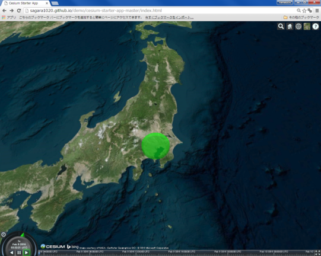

# CZML入門
本教材は、Cesiumで利用できるCZMLファイルの作成手法について解説したものです。[完成例](https://yamauchi-inochu.github.io/cesium-test/Apps/test_c.html)のようなデータの作成やアニメーション表示などを行います。この教材は、[cesiumのサンプルページ](https://cesiumjs.org/Cesium/Build/Apps/Sandcastle/index.html)を参考に作成したものである。

本教材を使用する際は、[利用規約]をご確認いただき、これらの条件に同意された場合にのみご利用下さい。

**Menu**
-------
* [CZMLとは?](#CZMLとは?)
* [点線面の作成](#点線面の作成)
* [実装する](#実装する)
* [オリジナルのアイコンによるポイント表示](#オリジナルのアイコンによるポイント表示)
* [アニメーション](#アニメーション)

------
## <a name="CZMLとは?"></a>CZMLとは?

* CZMLは、Cesiumでの空間データの表現に適したデータ形式
* JSON形式を基本としているため、軽量
* 3次元のデータや時間データの表現が多彩
> https://github.com/AnalyticalGraphicsInc/cesium/wiki/CZML-Guide を参考に作成

## <a name="点線面の作成"></a>点線面の作成
### 点の作成
以下のコードをコピーし、拡張子を.czmlとしたテキストファイルを作成する。作成したファイルをCesiumの[ビューワー]にドラックアンドドロップするとデータが表示される。

[ビューワー]:http://cesiumjs.org/Cesium/Build/Apps/CesiumViewer/index.html

```
[{
  "id" : "document",
  "name" : "Nihon Sankei",
  "version" : "1.0"
}, {
  "id" : "1",
  "name" : "Matsusima",
  "description" : "ここは松島です",
  "position" : {
    "cartographicDegrees": [141.064,38.366,100]
  },
  "point": {
     "color": {
         "rgba": [255, 0, 0, 255]
     },
     "pixelSize": 8
   }
 }
]
```
#### ポイント
- "description" : ポイントをクリックするとここに記載したものが表示できる
- "cartographicDegrees": [経度,緯度,高さ]の順で指定する
- "point": 点の色（[R, G, B, 透過度]）、大きさを指定する


### 複数点の作成
複数点を作成する場合は、以下のように記述する。

```
[{
  "id" : "document",
  "name" : "Nihon Sankei",
  "version" : "1.0"
}, {
  "id" : "1",
  "name" : "Matsusima",
  "description" : "ここは松島です",
  "position" : {
    "cartographicDegrees": [141.064,38.366,100]
  },
  "point": {
     "color": {
         "rgba": [255, 0, 0, 255]
     },
     "pixelSize": 8
   }
 },{
   "id" : "2",
   "name" : "Amanohashidate",
   "description" : "ここは天橋立です",
   "position" : {
     "cartographicDegrees": [135.190,35.567,100]
   },
   "point": {
      "color": {
          "rgba": [0, 255, 0, 255]
      },
      "pixelSize": 8
    }
 },{
   "id" : "3",
   "name" : "Miyajima",
   "description" : "ここは宮島です",
   "position" : {
     "cartographicDegrees": [132.318,34.297,100]
   },
   "point": {
      "color": {
          "rgba": [0, 0, 255, 255]
      },
      "pixelSize": 8
    }
 }
]
```


### 線の作成

```
[{
  "id" : "document",
  "name" : "line",
  "version" : "1.0"
},{
  "id" : "0",
  "name" : "line",
  "description" : "ライン",
  "polyline" : {
      "positions" : {
          "cartographicDegrees" : [
              141.064,38.366,0,
              135.190,35.567,0,
              132.318,34.297,0
          ]
      },
      "material" : {
          "solidColor" : {
              "color" : {
                  "rgba" : [255, 255, 255, 100]
              }
          }
      },
      "width" : 0.5
  }
}
]
```

### 面の作成

```
[{
  "id" : "document",
  "name" : "polygon",
  "version" : "1.0"
},{
  "id" : "1",
  "name" : "Matsushima area",
  "description" : "松島とその周辺の観光地",
  "polygon" : {
      "positions" : {
          "cartographicDegrees" : [
            140.94532,38.337405,0,
            141.061363,38.238789,0,
            141.215858,38.341713,0,
            141.099129,38.439652,0
            140.94532,38.337405,0]
      },
      "material" : {
          "solidColor" : {
              "color" : {
                  "rgba" : [255, 0, 0, 100]
              }
          }
      }
  }
},{
"id" : "2",
"name" : "Amanohashidate area",
"description" : "天橋立とその周辺の観光地",
"polygon" : {
    "positions" : {
        "cartographicDegrees" : [
          135.14831542968753,35.58920198716242,0, 135.14488220214847,35.54619518601583,0, 135.20942687988284,35.544519165584674,0, 135.21080017089847,35.586968406786504,0, 135.14831542968753,35.58920198716242,0]
    },
    "material" : {
        "solidColor" : {
            "color" : {
                "rgba" : [0, 255, 0, 100]
            }
        }
    }
}
},{
"id" : "3",
"name" : "Miyajima area",
"description" : "宮島とその周辺の観光地",
"polygon" : {
    "positions" : {
        "cartographicDegrees" : [
          132.24929809570315,34.31650345811414,0, 132.24826812744143,34.225704902867896,0, 132.38250732421878,34.22769216967081,0, 132.38216400146487,34.31650194389378,0, 132.24929809570315,34.31650345811414,0]
    },
    "material" : {
        "solidColor" : {
            "color" : {
                "rgba" : [0, 0, 255, 100]
            }
        }
    }
}
}

]
```

### 3Dポリゴン
ポリゴンを立体化する場合は、以下のようにする。

```
"extrudedHeight" : {
"number" : 500
}
```

### その他の表現
円ポリゴンの作成などその他の表現については、[cesiumのサンプルページ](https://cesiumjs.org/Cesium/Build/Apps/Sandcastle/index.html)が詳しい

## <a name="実装する"></a>実装する


```
var czml = [{
   "id" : "document",
   "name" : "CZML",
   "version" : "1.0"
 },
 {
   "id" : "shape1",
   "name" : "TOKYO",
   "position" : {
     "cartographicDegrees" : [139.77, 35.68, 20000.0]
   },
   "ellipse" : {
     "semiMinorAxis" : 50000.0,
     "semiMajorAxis" : 50000.0,
     "extrudedHeight" : {
       "number" : 20000.0
     },
     "rotation" : {
       "number" : 0.8
     },
     "material" : {
       "solidColor" : {
         "color" : {
           "rgba" : [0, 255, 0, 100]
         }
       }
     },
     "outline" : true,
     "outlineColor" : {
       "rgba" : [255, 0, 0, 0]
     }
   }
 }];
var viewer = new Cesium.Viewer('cesiumContainer');
viewer.dataSources.add(Cesium.CzmlDataSource.load(czml));
```
## オリジナルのアイコンによるポイント表示
PowerPointやペイントなどを利用し、図を作成する（拡張子は`.png` or `.jpg`）。作成した画像は、GitHubなどでwebにあげておき、画像のurlを取得する。billboardを用いて、オリジナルのアイコンを読み込む。

```
[{
    "id" : "document",
    "name" : "marker",
    "version" : "1.0"
  }, {
    "id" : "1",
    "name" : "marker",
    "description" : "マーカーの練習。",
    "billboard" : {
      "image" : "コピーしたURLを貼り付ける",
      "scale" : 0.2
    },
    "position" : {
      "cartographicDegrees": [
        133.672028,33.544614,200
      ] }}]
```

### ラベルを追加する

ポイントにラベルを追加する際は、以下のようにする。
```
"label" : {
  "fillColor" : {
    "rgba" : [0, 0, 0, 255]
  },
  "font" : "12pt Lucida Console",
  "horizontalOrigin" : "CENTER",
  "outlineColor" : {
    "rgba":[0, 0, 0, 255]
  },
  "outlineWidth" : 1.2,
  "pixelOffset" : {
    "cartesian2" : [0, 25]
  },
  "style" : "FILL_AND_OUTLINE",
  "text" : "テスト"
}
```


## アニメーション
Cesiumでは、CZMLで設定した時間の値を使ったデータ表現が可能です。以下では、"availability"と"epoch"（"position"内にある）に値を設定して、アイコンをアニメーションで表現しています。


```
var animation =
[{
  "id" : "document",
  "name" : "name",
  "version" : "1.0"
},{
  "id" : "1",
  "name" : "animation",
  "description" : "動きます",
  "availability":"2018-03-13T12:00:00Z/2018-03-13T12:01:00Z",
  "billboard" : {
    "image" : "imageURL.png",
    "scale" : 0.3
  },
  "position" : {
    "epoch":"2018-03-13T12:00:00Z",
    "cartographicDegrees": [0,139,35,0,
                            5,141.064,38.366,0,
                            6,140.94532,38.337405,0,
                            7,141.061363,38.238789,0,
                            8,141.215858,38.341713,0,
                            9,141.099129,38.439652,0,
                            10,140.94532,38.337405,0,
                            15,135.190,35.567,0,
                            16,135.14831542968753,35.58920198716242,0, 17,135.14488220214847,35.54619518601583,0, 18,135.20942687988284,35.544519165584674,0, 19,135.21080017089847,35.586968406786504,0, 20,135.14831542968753,35.58920198716242,0,
                            25,132.318,34.297,0,
                            26,132.24929809570315,34.31650345811414,0, 27,132.24826812744143,34.225704902867896,0, 28,132.38250732421878,34.22769216967081,0, 29,132.38216400146487,34.31650194389378,0,
                            30,132.24929809570315,34.31650345811414,0
                          ]
  }
}
];
```
#### ポイント
- "availability":タイムスケールバーの開始時間と終了時間
- "epoch":データ表示の開始時間
- "cartographicDegrees": [時間,経度,緯度,高さ] ＝> 開始からx秒のときの経緯度と標高


### GPXファイルの活用
GPXファイルを利用する際に、以下のようにすると簡単にデータを作成できる。まず、QGISに.gpxファイルをドラックアンドドロップし、「ベクタレイヤに名前をつけて保存する」から、CSVファイルで保存する。


次に、エクセルを利用し、カンマなどの配列を整え、A列に秒（何秒で移動するか）をC列に経度、E列に緯度、G列に高さを追加する。全体をコピーする。


ポイントの表示に使用したczmlファイルを開き、赤枠の箇所を追加する。


データの確認時に、タイマーの速度を変更すると、アイコンの動く速度が変化する。


[▲メニューへもどる]

#### ライセンスに関する注意事項
本教材で利用しているキャプチャ画像の出典やクレジットについては、[その他のライセンスについて]よりご確認ください。

[その他のライセンスについて]:../../license.md
[▲メニューへもどる]:./CZML.md#Menu
[利用規約]:../../../policy.md
[利用規約]:../../../policy.md
[その他のライセンスについて]:../../license.md
[よくある質問とエラー]:../../questions/questions.md

[GISの基本概念]:../../00/00.md
[QGISビギナーズマニュアル]:../../QGIS/QGIS.md
[GRASSビギナーズマニュアル]:../../GRASS/GRASS.md
[リモートセンシングとその解析]:../../06/06.md
[既存データの地図データと属性データ]:../../07/07.md
[空間データ]:../../08/08.md
[空間データベース]:../../09/09.md
[空間データの統合・修正]:../../10/10.md
[基本的な空間解析]:../../11/11.md
[ネットワーク分析]:../../12/12.md
[領域分析]:../../13/13.md
[点データの分析]:../../14/14.md
[ラスタデータの分析]:../../15/15.md
[傾向面分析]:../../16/16.md
[空間的自己相関]:../../17/17.md
[空間補間]:../../18/18.md
[空間相関分析]:../../19/19.md
[空間分析におけるスケール]:../../20/20.md
[視覚的伝達]:../../21/21.md
[参加型GISと社会貢献]:../../26/26.md

[地理院地図]:https://maps.gsi.go.jp
[e-Stat]:https://www.e-stat.go.jp/
[国土数値情報]:http://nlftp.mlit.go.jp/ksj/
[基盤地図情報]:http://www.gsi.go.jp/kiban/
[地理院タイル]:http://maps.gsi.go.jp/development/ichiran.html

[課題ページ_QGISビギナーズマニュアル]:../../tasks/t_qgis_entry.md
[課題ページ_GRASSビギナーズマニュアル]:../../tasks/t_grass_entry.md
[課題ページ_リモートセンシングとその解析]:../../tasks/t_06.md
[課題ページ_既存データの地図データと属性データ]:../../tasks/t_07.md
[課題ページ_空間データ]:../../tasks/t_08.md
[課題ページ_空間データベース]:../../tasks/t_09.md
[課題ページ_空間データの統合・修正]:../../tasks/t_10.md
[課題ページ_基本的な空間解析]:../../tasks/t_11.md
[課題ページ_ネットワーク分析]:../../tasks/t_12.md
[課題ページ_基本的な空間解析]:../../tasks/t_13.md
[課題ページ_点データの分析]:../../tasks/t_14.md
[課題ページ_ラスタデータの分析]:../../tasks/t_15.md
[課題ページ_空間補間]:../../tasks/t_18.md
[課題ページ_視覚的伝達]:../../tasks/t_21.md
[課題ページ_参加型GISと社会貢献]:../../tasks/t_26.md
