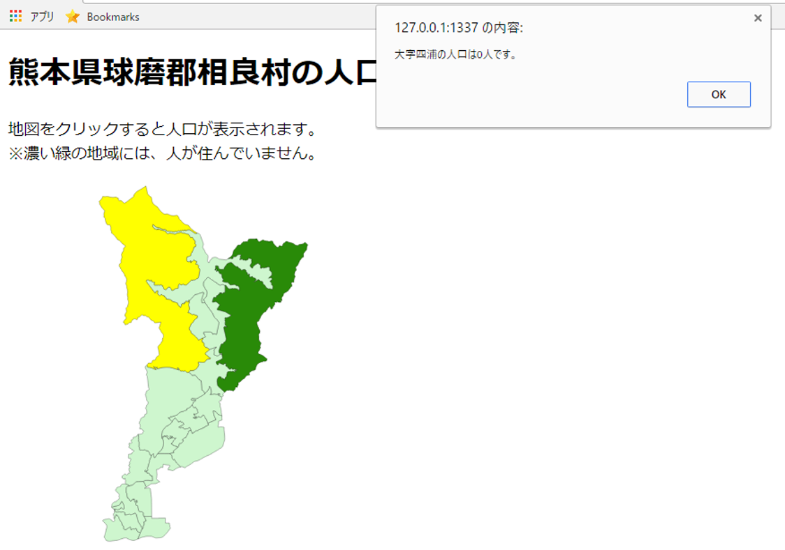

# D3.js入門

この教材は、D3.jsを用いてGISデータをビジュアライズし、WEB上に表示する初歩的な手法について解説しています。QGISと連携してデータを作成するため、QGISの基本操作やJavaScriptについて理解のある方を対象とします。QGISで簡単にファイルを出力したい方は、QGISで作成の項目を読み進めてください。

本教材を使用する際は、[利用規約]をご確認いただき、これらの条件に同意された場合にのみご利用下さい。

**Menu**
------
* [D3.jsとは](#d3.jsとは)
* [人口表示アプリの作成](#人口表示アプリの作成)
* [GeoJSONの出力](#geojsonの出力)
* [コードの記述](#コードの記述)
* [QGISで作成](#QGISで作成)

## D3.jsとは
 [D3.js](https://d3js.org/)(Data-Driven Documents)は、データをビジュアライズするためのJavaScriptライブラリです。様々なグラフの作成やアニメーションを付けた表示などができます。また、GISデータにも対応しているため、地図のビジュアライズにも用いることができます。

D3.jsでどんなことができるかを知りたい方は、[D3.jsのGallery](https://github.com/d3/d3/wiki/Gallery)を参照してください。

 [▲メニューへもどる]

## 人口表示地図の作成
D3.jsの利用方法を地図をクリックすると人口が表示されるWEBアプリ（[完成例](https://yamauchi-inochu.github.io/d3js-sample/sample.html)）の作成を通じて解説します。解説では[e-stat]からダウンロードした熊本県球磨郡相良村の世界測地系のシェープファイルをGeoJSONファイルに加工して使用しています。前半では実際にコードの記載方法を紹介し、後半ではQGISのプラグインで地図を作成するする方法を解説します。

[▲メニューへもどる]

## GeoJSONの出力
GeoJSON形式のデータをD3.jsで読み込むため、QGISでデータ変換を行う。データを読み込み、名前を付けて保存からGeoJSONを選択し、地理座標系で出力する。

[▲メニューへもどる]

## 地図の表示
index.htmlと同じディレクトリにGeoJSONを配置（以下では、`s3.geojsonと表記`）する。また、ローカル環境でのindex.htmlの表示にはローカルサーバーを立ち上げる必要があるため、任意のものを準備する。

### D3.jsのインポートとWeb pageの説明
以下のようにindex.htmlを記述していく。

```html
<!DOCTYPE html>
  <head>
    <meta charset="utf8">
    <title></title>
    <meta charset="UTF-8">
    <script src="https://d3js.org/d3.v6.min.js"></script>
    <style>
    svg{width:700px; height:700px; border:1px; background-color: white; text-align: left;}
    path{fill:white; stroke:black; stroke-width:0.25;}
    h1,p {text-align: left;}
    </style>
  </head>

```

続けて以下のような紹介文を記載する。

```html
<body>
  <h1>熊本県球磨郡相良村の人口マップ</h1>
    <p>地図をクリックすると人口が表示されます。<br>※濃い緑の地域には、人が住んでいません。</p>

<!--
ここに<script></script>が記載される。
-->

</body>
```

次に、表示設定(描画範囲、プロジェクション、パス)を記載していく。

```html
  <script>
  //drawing area
   var width = 500;
   var height = 500;

  // add svg
  var svg = d3.select("body").append("svg").attr("width", width).attr("height", height);

  //projection
  var projection = d3.geoMercator()
      .center([131.00,32.26])
      .scale(100000)

  // path
  var path = d3.geoPath(projection);

  </script>
```

geojsonファイルを用いて、地図を表示する。

```Javascript

// loarding geojson
    d3.json("s3.geojson").then(function(json) {
        svg.append("g").selectAll("path")
            .data(json.features)
            .enter()
            .append("path")
            .attr("d", path)

```

ブラウザで表示して以下のようになっていることを確認する。


### 単色塗りと値による塗り分け

```JavaScript
d3.json("s3.geojson").then(function(json) {
    svg.append("g").selectAll("path")
        .data(json.features)
        .enter()
        .append("path")
        .attr("d", path)
        .style("fill","red") //styleの記述を追加し単色で地図を塗りつぶす
});

```

`.style`の記述を変更し、人口の値によって配色をかえる。ここでは、人口0の場合を緑とし、それ以外を薄い緑とする。人口の値は、GeoJSONの属性値を参照する。

```JavaScript
.style("fill",function(d,i){
      if(d.properties.JINKO=="0"){
        return "#298A08";
      }
      return "#CEF6CE";
      })
    });

```

上記のように記述すると以下のようになる。


### 人口を表示する機能を追加
.styleの下に以下を記述し、alertでクリックした地点の大字名と人口を表示する。

```JavaScript
.on('click', function(event,d){
            alert(d.properties.MOJI+"の人口は"+d.properties.JINKO+"人です。")
        })
});
```

### マウスオーバーとアウトの機能を追加する。
選択する場所を分かりやすくするために、マウスオーバーとアウトの機能を追加します。

```JavaScript
.on('mouseover', function(){
  d3.select(this)
  .style("fill","yellow")
})
.on("mouseout", function(d,i){
d3.select(this)
  .style("fill",function(d,i){
    if(d.properties.JINKO=="0"){
      return "#298A08";
    }
    return "#CEF6CE";
  })
})
});
```

### 表示例とサンプルコード
上記のように記述していくと、以下のようにindex.htmlを表示できます。


[コード全体を表示](https://github.com/yamauchi-inochu/d3js-sample/blob/main/sample.html)

[▲メニューへもどる]

## QGISで作成
QGISには、D3.jsを使って簡単に地図アプリケーションを作成できるプラグインがあります。以下では、d3 Map Rendererを用いて、ベースファイルを出力する手法と出力したファイルの編集手法について解説します。

### d3 Map Rendererとベースファイルの作成
ダウンロードしたシェープファイルを読み込んで、QGISで表示する。プラグイン＞プラグインの管理とインストールから、d3 Map Rendererをインストールする（表示されない場合は、設定＞実験的プラグインも表示するにチェックをつける）。


WEB(W)＞d3 Mapをクリックし、パラメータを指定する。


1. 任意のタイトルを入力する。
2. 入力したレイヤを指定する。
3. ProjectionをMercatorにする。
4. 出力するフォルダを指定する。
5. 次のタブをクリックする。


6. Allow zoom and panにチェックをする。
7. Include a legendにチェックをする。
8. 次のタブをクリックする。


9. Include information popup にチェックをする。
10. ポップアップで表示したい項目（人口、面積、大字名等）にチェックをする。
11. OKをクリックする。


ローカルサーバーを立ち上げ、出力したindex.htmlを開くと作成したファイルが表示される。


### ベースファイルの編集
以下では、出力したベースファイルの編集手法について、人口で表示を変える場合を例として、解説しています。

#### 属性値と対応した配色の変更
出力時に凡例を整えて出力している場合は、この項目を読み飛ばしてください。今回は人口ありのエリアとなしのエリアで色を変えて出力します。人口ありとなしのエリアの色をつけるため、css>color.cssを開き.10r1を追加する。

```css

.l0r1 { stroke: #000000; stroke-width: 0.26; stroke-opacity: 1.0; stroke-dasharray: ; fill: #0094f6; fill-opacity: 1.0; }

```

JSONファイルを開き、510001019以外を10r0から10r1にかえる。テキストエディタで、10r0を10r1に置換してから、510001019を検索し10r1から10r0にする。

```json
{ "type": "Feature", "properties": { "KEYCODE1": "510003012", "d3Css": "l0r1" }, "geometry": { "type": "Polygon", "coordinates": [ [ [ 130.8038044790141, 32.233847444567672 ]]]}}

//コードは省略しています。
```


#### 凡例の修正
凡例が表示されない場合は、data>legend.cssを開き以下のよう編集にする。

```csv
Width,Height,Color,Text
20,20,l0r0,相良村人口なしエリア
20,20,l0r1,相良村人口ありエリア
```

#### 属性を日本語にする
属性名が日本語になっていないため、以下のように編集し日本語にする。

```html

<div id="template" style="display: none">
  <!--Tooltip template-->
<table>
<tr><td>面積</td><td>{AREA}</td></tr>
<tr><td>人口</td><td>{JINKO}</td></tr>
<tr><td>市町村</td><td>{CSS_NAME}</td></tr>
<tr><td>大字</td><td>{MOJI}</td></tr>
</table>
</div>

```

#### 編集したファイルの表示
上記の箇所を編集すると下記のように表示できます。


[▲メニューへもどる]

## 参考書籍・ページ
本教材は、公式ページの他に、以下の書籍とページを参考に作成しました。

- 古籏一浩(2014)『データビジュアライゼーションのためのD3.js徹底入門』SBクリエイティブ
- @napinoco 氏 [d3.js (v5) を使って白地図を描く](https://qiita.com/napinoco/items/230737128f490f277247)

[▲メニューへもどる]

[▲メニューへもどる]:D3js.md#Menu
[e-stat]:https://www.e-stat.go.jp/SG1/estat/eStatTopPortal.do
[利用規約]:../../../policy.md
[利用規約]:../../../policy.md
[その他のライセンスについて]:../../license.md
[よくある質問とエラー]:../../questions/questions.md

[GISの基本概念]:../../00/00.md
[QGISビギナーズマニュアル]:../../QGIS/QGIS.md
[GRASSビギナーズマニュアル]:../../GRASS/GRASS.md
[リモートセンシングとその解析]:../../06/06.md
[既存データの地図データと属性データ]:../../07/07.md
[空間データ]:../../08/08.md
[空間データベース]:../../09/09.md
[空間データの統合・修正]:../../10/10.md
[基本的な空間解析]:../../11/11.md
[ネットワーク分析]:../../12/12.md
[領域分析]:../../13/13.md
[点データの分析]:../../14/14.md
[ラスタデータの分析]:../../15/15.md
[傾向面分析]:../../16/16.md
[空間的自己相関]:../../17/17.md
[空間補間]:../../18/18.md
[空間相関分析]:../../19/19.md
[空間分析におけるスケール]:../../20/20.md
[視覚的伝達]:../../21/21.md
[参加型GISと社会貢献]:../../26/26.md

[地理院地図]:https://maps.gsi.go.jp
[e-Stat]:https://www.e-stat.go.jp/
[国土数値情報]:http://nlftp.mlit.go.jp/ksj/
[基盤地図情報]:http://www.gsi.go.jp/kiban/
[地理院タイル]:http://maps.gsi.go.jp/development/ichiran.html

[課題ページ_QGISビギナーズマニュアル]:../../tasks/t_qgis_entry.md
[課題ページ_GRASSビギナーズマニュアル]:../../tasks/t_grass_entry.md
[課題ページ_リモートセンシングとその解析]:../../tasks/t_06.md
[課題ページ_既存データの地図データと属性データ]:../../tasks/t_07.md
[課題ページ_空間データ]:../../tasks/t_08.md
[課題ページ_空間データベース]:../../tasks/t_09.md
[課題ページ_空間データの統合・修正]:../../tasks/t_10.md
[課題ページ_基本的な空間解析]:../../tasks/t_11.md
[課題ページ_ネットワーク分析]:../../tasks/t_12.md
[課題ページ_基本的な空間解析]:../../tasks/t_13.md
[課題ページ_点データの分析]:../../tasks/t_14.md
[課題ページ_ラスタデータの分析]:../../tasks/t_15.md
[課題ページ_空間補間]:../../tasks/t_18.md
[課題ページ_視覚的伝達]:../../tasks/t_21.md
[課題ページ_参加型GISと社会貢献]:../../tasks/t_26.md
