# GitHubビギナーズマニュアル

本サイトで公開している教材は、GitHubで管理しています。GISソフトウェアのバージョン変更により、本教材が対応しない場合に利用者による教材の修正案の提出が可能になります。また、教材修正の要望や質問投稿などが行えます。

以下では、GitHubの基本操作と本教材の変更方法（Pull request）や質問投稿(Issue)について解説しています。教材変更や質問投稿についてのみ知りたい場合は、Pull requestによる教材の変更とIssueによる投稿を参照してください。

本教材を使用する際は、[利用規約]をご確認いただき、これらの条件に同意された場合にのみご利用下さい。

**Menu**
------
- [GituHubとは？](#GitHubとは？)
- [GitHubアカウントの取得](#GitHubアカウントの取得)
- [用語の解説](#用語の解説)
- [クライアントソフトのインストール](#クライアントソフトのインストール)
- [Repositoryの作成](#Repositoryの作成)
- [gh-pagesを作成する](#gh-pagesを作成する)
- [Repositoryをcloneする](#Repositoryをcloneする)
- [Pull_requestによる教材修正の提案](#Pull_requestによる教材修正の提案)
- [Issueによる投稿](#Issueによる投稿)

----------

## <a name="GitHubとは？"></a>GitHubとは？
- Git(バージョン管理システム)をホスティングするサービス
- 複数人による開発（リモート作業）が可能
- コラボレーションツールによる、円滑なコミュニケーション
- web開発や出版などにも活用されている

>塩谷啓,紫竹佑騎,原一成,平木聡（2014）『Web制作者のためのGitHubの教科書 チームの効率を最大化する共同開発ツール』を参考に作成

[▲メニューへもどる]

## <a name="GitHubアカウントの取得"></a>GitHubアカウントの取得
以下では、GitHubを利用するためのアカウントを取得する手法について解説しています。まず、[GitHubのサイト]にアクセスして、ページ右上の`Sign up`をクリックする。


Free を選択し、`Finish sign up `をクリックする。


GitHubアカウントが作成できた。登録したメールアドレス宛に、確認メールが届いているためそれを開き、`Verify email address`をクリックする。


[▲メニューへもどる]

## 用語の解説
GitHubの操作中では、以下の用語が良く利用される。

- repository　・・・　プロジェクトが保存される場所、ローカルリポジトリとリモートリポジトリがある。

- fork　・・・　他人のリモートリポジトリを自分のリモートリポジトリにコピーすること。

- branch　 ・・・ プロジェクトを分割したもの、branchをつくることで複数人による同時編集を効率化する。

- clone　・・・　他人もしくは、自分のリモートリポジトリを複製して、ローカルリポジトリにコピーすること。

- commit　・・・　ファイルの変更履歴をまとめて記録すること。

- push　・・・　ローカルリポジトリの編集をリモートリポジトリに反映させること。

- Pull Request　 ・・・　自分の変更を別のリモートリポジトリにマージしてもらうための依頼。

- merge　 ・・・　複数のブランチとコミットをまとめ一つにすること。

- Issue　・・・　作業の進度や疑問点などを報告するためのコミュニケーションの場。

>塩谷啓,紫竹佑騎,原一成,平木聡（2014）『Web制作者のためのGitHubの教科書 チームの効率を最大化する共同開発ツール』を参考に作成

[▲メニューへもどる]

## クライアントソフトのインストール
クライアントソフトは、ローカルのリポジトリとWebのリポジトリを繋げ、両リポジトリの編集結果をやり取りできる。ソフトウェアはいくつかあるが、環境や作業感に合わせて使いやすいものを選択する。ここでは、GitHub desktopを利用し解説している。[https://desktop.github.com](https://desktop.github.com)にアクセスし、クライアントソフトをインストールする。
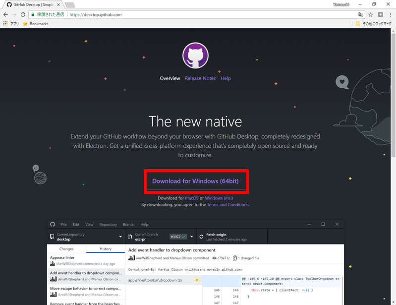

インストールしたクライアントソフトを起動すると以下のような画面が表示される。※指定した場所にGitHubフォルダーが作成され、そのフォルダーの変更内容がクライアントソフトと連動する。


[▲メニューへもどる]

## <a name="Repositoryの作成"></a>Repositoryの作成
New repositoryをクリックすると、新規にRepositoryを作成することができる。
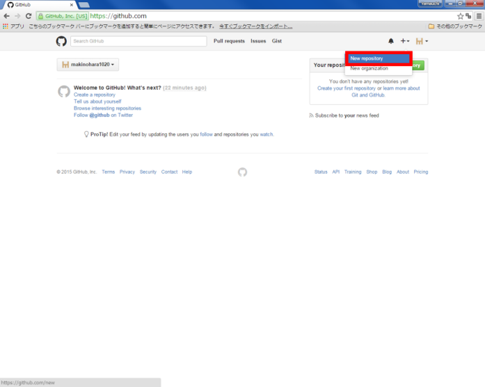


Repository nameを入力し、READMEをチェックし、`Create Repository`をクリックする。
echizenとい名前のrepositoryが新規に作成された。
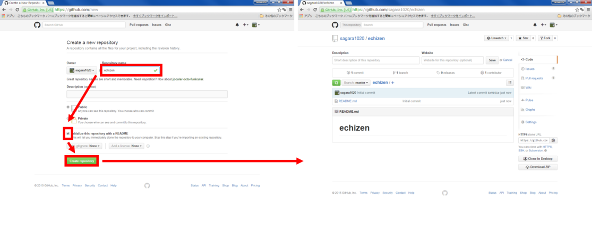


[▲メニューへもどる]

## <a name="gh-pagesを作成する"></a>gh-pagesを作成する
GitHub Pagesは、静的なWebサイトをテストすることができる機能である。この機能を利用すると、簡易的なWebサイトを構築し、公開することができる。GitHub Pagesの設定は、`Settings` をクリックし、`source > master branch > Save` をクリックして行う。
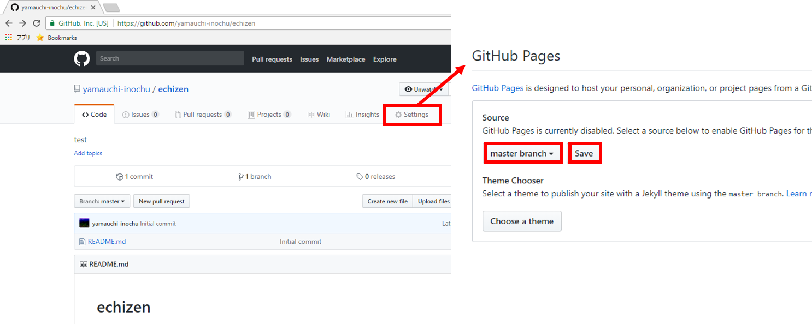


GitHub Pagesに`https://yourID.github.io/echizen/`が追加される

[▲メニューへもどる]

## repositoryをCloneする
repositoryの編集は、ローカルだけでなくweb上でも編集が可能だが、以下ではローカルで編集したものをWebにアップロードする手法について解説している。`Clone In Desktop` をクリックすると、ローカルにrepositoryを複製することができる。


クライアントソフトが自動的に立ち上がるので、複製するディレクトリを選択する。自動で立ち上がらない場合は、手動でクライアントソフトを立ち上げる。
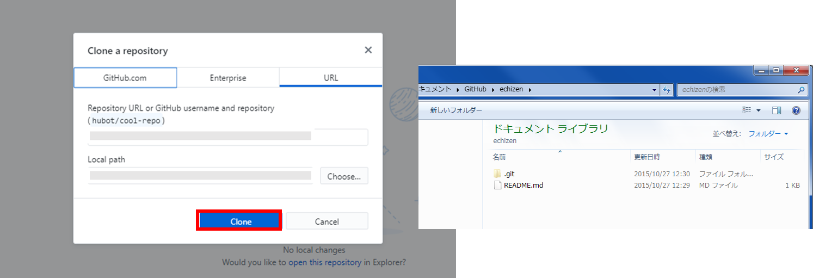


1. ローカルに複製したリポジトリが表示される。
2. リポジトリの編集が表示される。
3. リポジトリの内の編集の詳細が表示される。
4. Webのリポジトリに繁栄させるため、ローカルの変更内容をタイトルと詳細として記入する（コミット）。
5. Webのリポジトリに変更内容を反映させる（push）。
6. branchの切り替え。

### repositoryの編集
ここでは、ローカルからのアップロードの練習として、画像ファイルをリポジトリに追加し、webで表示していく。

リポジトリを複製したディレクトリを開き、画像ファイルを追加する。
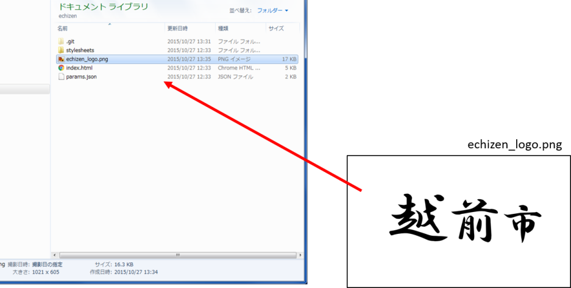

フォルダ内に画像を追加したことが、クライアントソフト上で表示される。編集を有効にするには、コミットメッセージを入力し、 `Commit to master`をクリックし、 `Push origin` をクリックする。


`Sync`が完了すると、デフォルトの画面が表示される。Webのリポジトリにローカルの編集内容が反映されている。


GitHubで作成したリポジトリにアクセスし、画像が追加されていることを確認する。


`Settings`をクリックし、アドレスをコピーし、画像のタイトルと拡張子をつけ、Webブラウザで検索する。
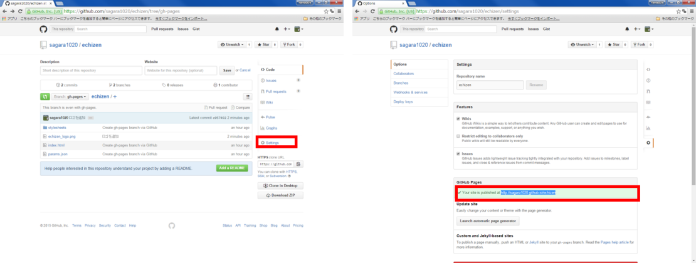

```
 http://（ユーザー名）.github.io/echizen/echizen_logo.png
```

Webに画像がアップロードされていることを確認できた
※　gh-pagesを利用した、WebでのGISデータの公開などについては、別ページで解説している。
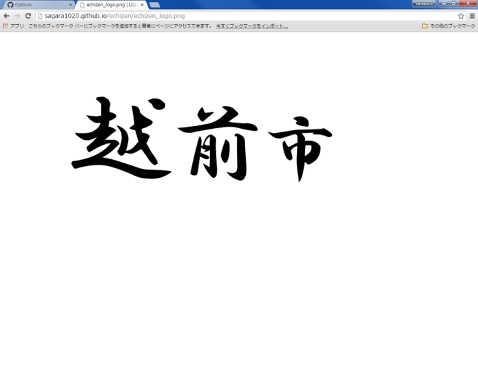


[▲メニューへもどる]

## <a name="Pull_requestによる教材修正の提案"></a>Pull_requestによる教材修正の提案

GitHubで教材ページのリポジトリを開く。
`Fork`をクリックすると自分のリポジトリにコピーされる。自分のリポジトリに戻り、Forkしたリポジトリを開き、branch名を入力し、編集用のbranchを作成する。


作成したbranch内の.mdファイルを開き、編集を行う。
今回は、ベクタの読み込みに一文追加している。
編集終了後に、Commit changes をクリックする。


編集用のリポジトリに戻り、Compare & Pull requestをクリックする。編集内容を入力し、Create pull request をクリックする。
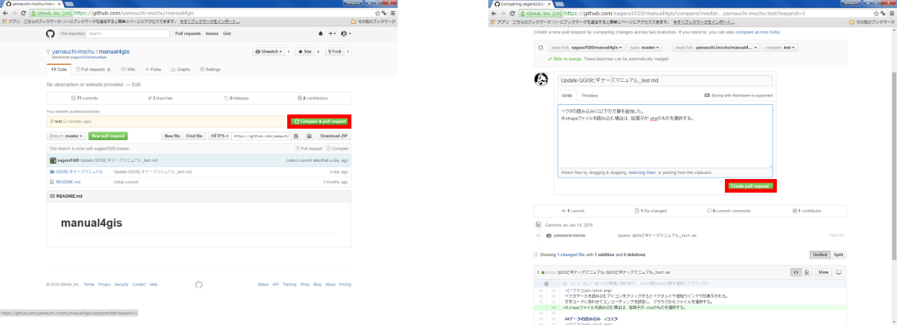

管理者によってPull requestがマージされると右のような画面が表示される。


※ forkしたリポジトリは、fork元のリポジトリの変更は反映されないため、GitコマンドかSourcetreeの追跡機能を利用する必要がある。

[▲メニューへもどる]

## <a name="Issueによる投稿"></a>Issueによる投稿
本来はソフトウェア開発等に利用する技術的な意見交換等に利用されるIssueを利用して、質問や教材改良の要望を受け付けている。

教材ページのリポジトリへ行き、New issueをクリックし、issueを立ち上げる。質問や要望などを入力し、submit new issueをクリックする。
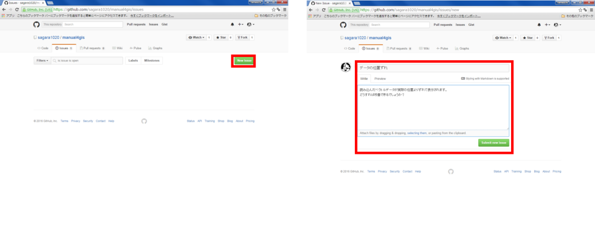

質問や要望への返答は右の画面のように表示される。issueでは、画像を送ることも可能。
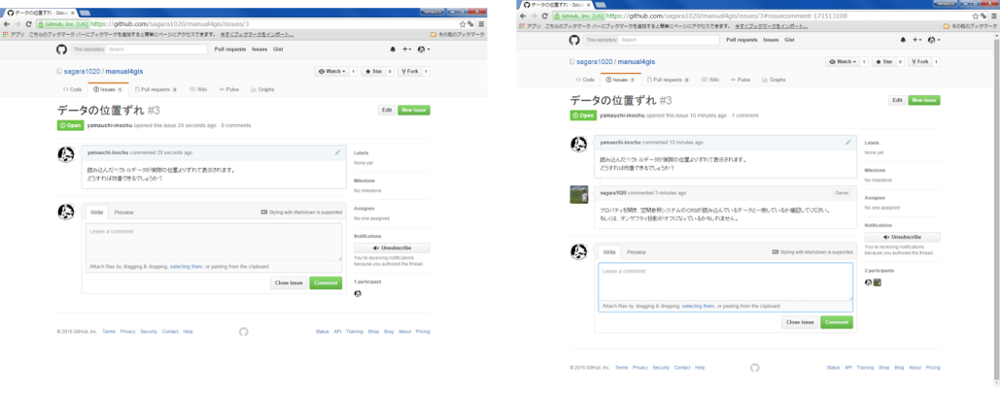

[▲メニューへもどる]


#### ライセンスに関する注意事項
本教材で利用しているキャプチャ画像の出典やクレジットについては、[その他のライセンスについて]よりご確認ください。

[▲メニューへもどる]:./GitHub.md#Menu
[その他のライセンスについて]:../../lisence.md
[GitHubのサイト]:https://github.com
[利用規約]:../../../policy.md
[利用規約]:../../../policy.md
[その他のライセンスについて]:../../license.md
[よくある質問とエラー]:../../questions/questions.md

[GISの基本概念]:../../00/00.md
[QGISビギナーズマニュアル]:../../QGIS/QGIS.md
[GRASSビギナーズマニュアル]:../../GRASS/GRASS.md
[リモートセンシングとその解析]:../../06/06.md
[既存データの地図データと属性データ]:../../07/07.md
[空間データ]:../../08/08.md
[空間データベース]:../../09/09.md
[空間データの統合・修正]:../../10/10.md
[基本的な空間解析]:../../11/11.md
[ネットワーク分析]:../../12/12.md
[領域分析]:../../13/13.md
[点データの分析]:../../14/14.md
[ラスタデータの分析]:../../15/15.md
[傾向面分析]:../../16/16.md
[空間的自己相関]:../../17/17.md
[空間補間]:../../18/18.md
[空間相関分析]:../../19/19.md
[空間分析におけるスケール]:../../20/20.md
[視覚的伝達]:../../21/21.md
[参加型GISと社会貢献]:../../26/26.md

[地理院地図]:https://maps.gsi.go.jp
[e-Stat]:https://www.e-stat.go.jp/
[国土数値情報]:http://nlftp.mlit.go.jp/ksj/
[基盤地図情報]:http://www.gsi.go.jp/kiban/
[地理院タイル]:http://maps.gsi.go.jp/development/ichiran.html

[課題ページ_QGISビギナーズマニュアル]:../../tasks/t_qgis_entry.md
[課題ページ_GRASSビギナーズマニュアル]:../../tasks/t_grass_entry.md
[課題ページ_リモートセンシングとその解析]:../../tasks/t_06.md
[課題ページ_既存データの地図データと属性データ]:../../tasks/t_07.md
[課題ページ_空間データ]:../../tasks/t_08.md
[課題ページ_空間データベース]:../../tasks/t_09.md
[課題ページ_空間データの統合・修正]:../../tasks/t_10.md
[課題ページ_基本的な空間解析]:../../tasks/t_11.md
[課題ページ_ネットワーク分析]:../../tasks/t_12.md
[課題ページ_基本的な空間解析]:../../tasks/t_13.md
[課題ページ_点データの分析]:../../tasks/t_14.md
[課題ページ_ラスタデータの分析]:../../tasks/t_15.md
[課題ページ_空間補間]:../../tasks/t_18.md
[課題ページ_視覚的伝達]:../../tasks/t_21.md
[課題ページ_参加型GISと社会貢献]:../../tasks/t_26.md
