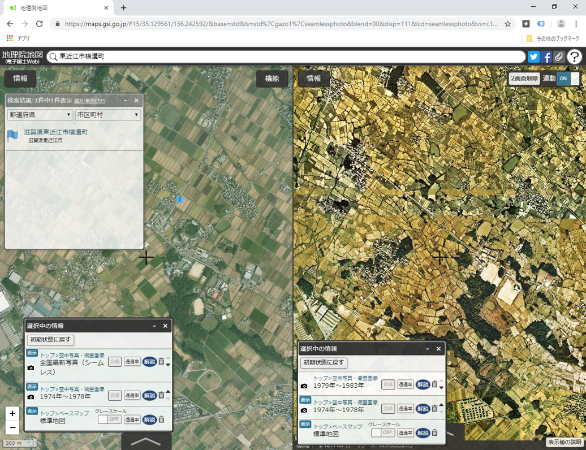
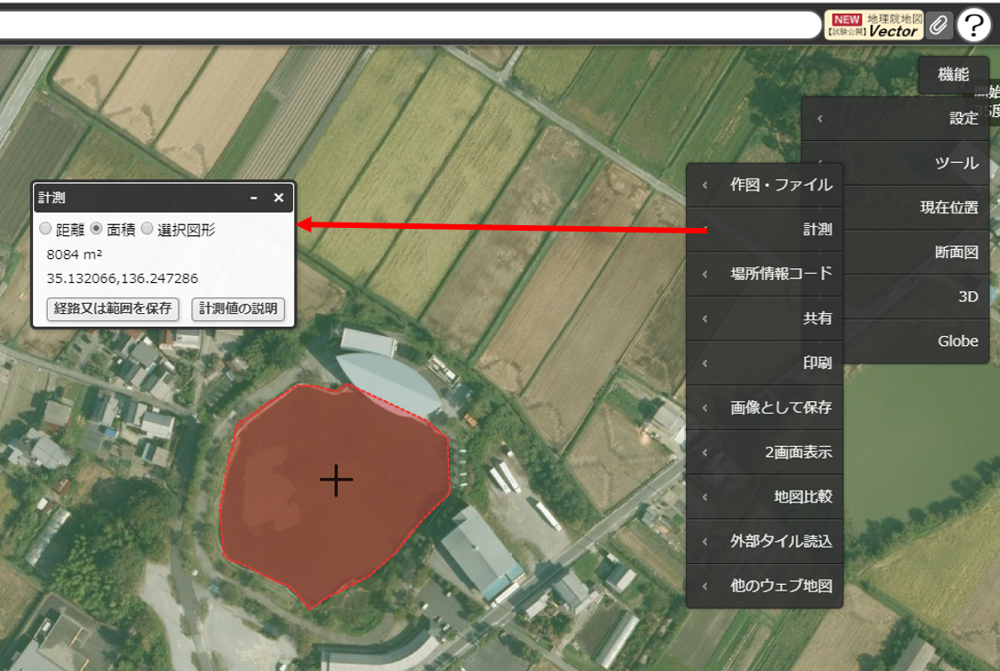
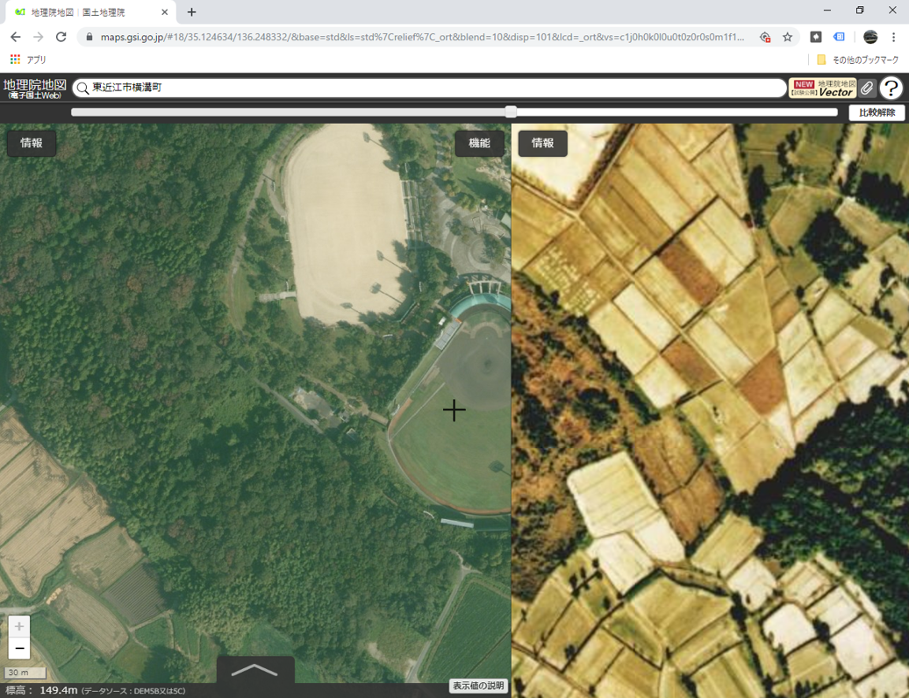
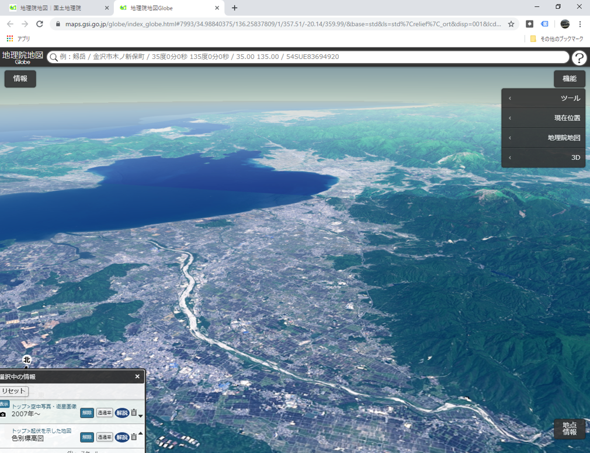
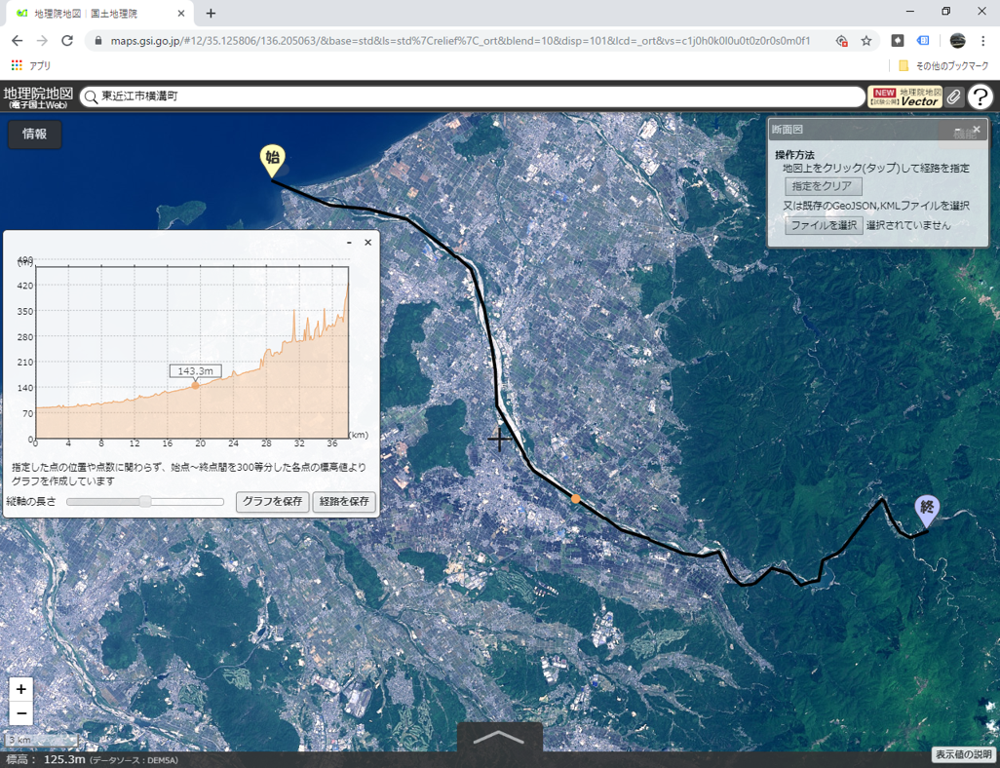
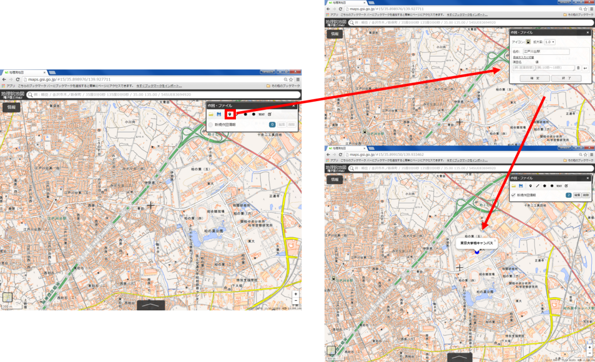
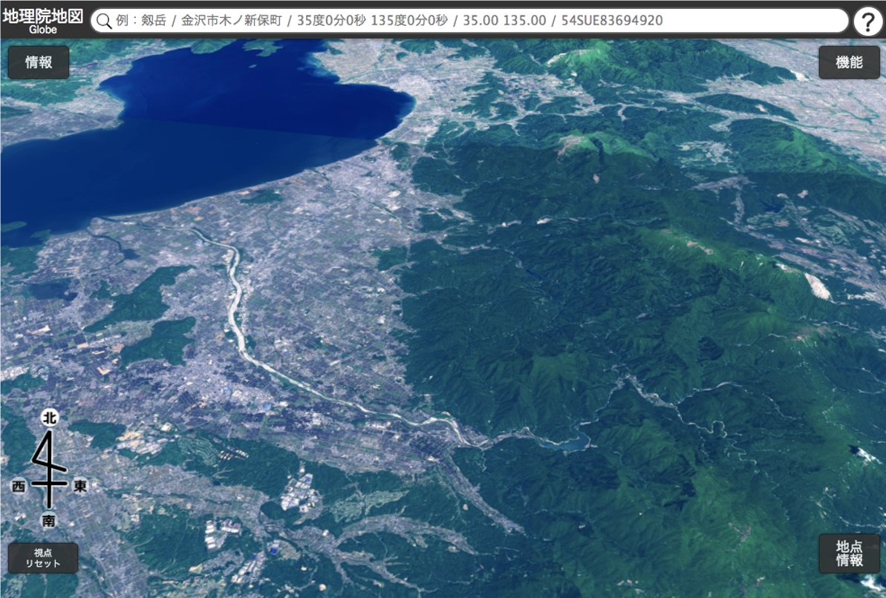
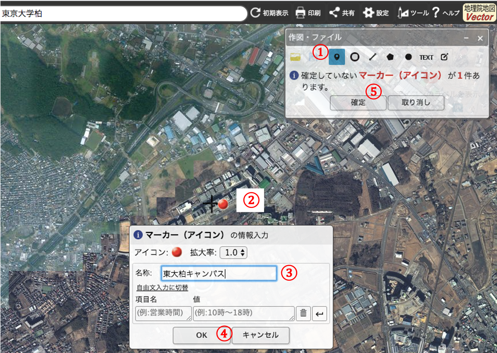

# 地理院地図入門
本教材は、地理院地図の基本機能を解説しています。地理院地図の活用のパートでは、実際に地理院地図を活用して地域学習をする手法を解説しています。その他に、地理院地図の機能の解説や作図ツールを用いたデータ作成を行います。本教材を使用する際は、[利用規約]をご確認いただき、これらの条件に同意された場合にのみご利用下さい。

**Menu**
------
* [地理院地図とは](#地理院地図とは)
* [地理院地図の基本機能](#地理院地図の基本機能)
* [地理院地図の活用](#地理院地図の活用)
* [その他の有用な機能](#その他の有用な機能)

--------

## 地理院地図とは

- 国土地理院の地図、空中写真を無償で閲覧できるサービス
- 基準点や土地条件図などの情報が公開されている
- 災害に関する情報の更新が早い
- 様々な地図、空中写真をタイルで配信している（他のWeb地図でも利用できる）
- GitHubでソースコードが公開されている
- スマートフォンでも表示、操作が可能

[▲メニューへもどる]

## 地理院地図の基本機能
以下では、[地理院地図]の基本機能について、解説します。インターネットから、[地理院地図]にアクセスしてください。

地理院地図は、主に以下の①～④の機能で構成されている。

1. 情報：空中写真や基準点等の表示。
2. 地図の移動：住所検索、マウス操作による移動
3. 機能：地物の計測、2画面表示、データ作成等
4. 地点の情報：カーソル位置の標高や緯度経度等の表示

### 「情報」について
以下は、地理院地図で閲覧できる情報を示す（2019年7月現在）。
- ベースマップ
- 空中写真・衛星画像
- 起伏を示した地図
- 土地の特徴を示した地図
- 地図の更新状況や提供地域等
- 基準点・測地観測
- 地震、台風・豪雨等、火山
- 指定緊急避難場所
- 自然災害伝承碑
- 南極の地理空間情報
- 地理教育の道具箱
- 他機関の情報
- ベクトルタイル提供実験

### 「機能」について
以下は、地理院地図で閲覧できる機能を示す（2019年7月現在）。
- 設定
  - 広域図、中心線の表示切り替え等
- ツール
  - 作図、計測、印刷、2画面表示、地図比較、外部タイルの読み込み
- 現在位置
- 断面図
- 3D、Globe

[▲メニューへもどる]

## 地理院地図の活用
　以下では、GIS初学者向けに、東近江市（旧湖東町）の地形と土地利用の変遷の学習を例にあげ、地理院地図の活用について解説します。上記の「地理院地図とは」、「地理院地図の基本機能」を学習した後、本実習をはじめてください。この実習は、PCのみでなくスマートフォンでも行うことができます。※この実習は[「社会科現地研修　西堀榮三郎記念探検の殿堂で博物館の機能を学ぼう」](http://hdtopography.blogspot.com/2019/07/blog-post.html)で実施したものを改良したものです。

### 本実習の目的
現在の東近江市の地域課題を学習するための、導入として実践する。この講習では、空中写真や地図を利用し、東近江市（旧湖東町）の地理的特徴や土地利用の変遷を学習する。使用する情報は、東近江市の位置、地形図、標高情報、現在の空中写真、古い空中写真とする。

### 地図を移動し、表示画面を切り替える
まず、地図の操作方法を学ぶため、ズームインやズームアウト、マウス操作で滋賀県東近江市の位置まで移動する（後ほど、住所検索の手法を解説）。3分ほど操作して、見つけることができなかった場合は、以下の[東近江市の位置を表示する]をクリックする。

スマートフォンの場合は、以下のように操作する。

[東近江市の位置を表示する]

[東近江市の位置を表示する]:https://maps.gsi.go.jp/#12/35.100249/136.220512/&base=std&ls=std&disp=1&vs=c1j0h0k0l0u0t0z0r0s0m0f1

### 標高情報を表示する
次に、東近江市周辺の地形を把握するため、`情報＞起伏を示した地図＞色別標高図`をクリックする。表示した情報は、クリックで切り替えることができ、ゴミ箱マークで消すことができる。最後に情報リストを×で閉じる。

その他に、`情報＞起伏を示した地図＞陰影起伏図`等の別の情報を表示することも可能。ここで提供されている情報には、それぞれ拡大縮小できるレベルや、地図の範囲が設定されている点に注意する。

### 特定の地域を検索する
この実習では、旧湖東町周辺に範囲を絞るため、地理院地図の住所検索機能から、以下のように`東近江市横溝町`と入力する。次に検索結果から、東近江市横溝町をクリックし、表示場所を移動する。最後にウィンドウを閉じる。

### 空中写真を読み込む
`情報＞空中写真・衛星画像`から、全国最新写真（シームレス）を読み込む。次に、土地利用の変化を比較するため、空中写真が表示できたら、1974年～1978年を読み込む。地図は`選択中の情報`のリストから表示・非表示、上層下層を選択できる。ここでは、最新の写真を一番上に設置し、次に1974年～1978年を配置する。

### 2画面表示で土地利用の違いを確認する
`機能＞ツール＞二画面表示`をクリックすると、２つの地図を同時に表示し動かすことができる。通常の画面表示や、この機能や、目視で住宅地、ため池、圃場の区画整備等の変化を確認する。余裕があれば、ため池の増減や圃場の区画の違いについて考える。※実習では、「ほ場整備事業」、「永源寺ダム」等についても解説した。

## その他の有用な機能
地理院地図では、`機能`から以下のような有用な機能を呼び出すことができます。ここでは、いくつかの機能の利用法について解説します。

### 計測機能
`機能＞ツール＞計測`から、距離や面積が計算できる。

### 地図比較
`機能＞ツール＞地図比較`から、一画面上で異なる地図を表示・比較できる。

### Globe
`機能＞Globe`から、3D地図を表示できる。

### 断面図
`機能＞断面図`から、標高に応じた断面図が作成できる。以下は、例として、愛知川の河川縦断面を表示した。

### データの作成
以下では、地理院地図の作図機能を用いて、データを作成する手法を「柏キャンパスのアクセスマップ作成」を例にあげ、解説する。まず、`機能＞ツール＞作図・ファイル`を開く。柏キャンパスの位置を入力するため、`マーカー（アイコン）の追加`ボタンをクリックし、ポイントの情報を入力し、任意の点をクリックする。

アイコンの作成と同様に、先にラインの情報（ここでは経路とする）を入力する。次に、`線の追加`ボタンをクリックし、アクセス経路を作成する。線の作成が完了したら、ダブルクリックした後、`確定`をクリックする。

`ポリゴンを追加`ボタンをクリックし、情報を入力する（ここでは、実習場所とする）。線の追加と同じようにポリゴンを作成し、`確定`をクリックする。

#### データを保存する
保存ボタンをクリックし、データ形式を選択しデータをダウンロードする(ここでは、GeoJSON形式で保存する)。作成したデータは、ドラッグアンドドロップで地理院地図で表示できる。その他に、[QGISビギナーズマニュアル]のベクトルデータの読み込みを参考にすると、ダウンロードしたGeoJSONをQGISで表示できる。

[▲メニューへもどる]

#### ライセンスに関する注意事項
本教材で利用しているキャプチャ画像の出典やクレジットについては、[その他のライセンスについて]よりご確認ください。

[その他のライセンスについて]:../../lisence.md
[地理院地図]:http://maps.gsi.go.jp
[▲メニューへもどる]:./gsimap.md#Menu
[利用規約]:../../../policy.md
[利用規約]:../../../policy.md
[その他のライセンスについて]:../../license.md
[よくある質問とエラー]:../../questions/questions.md

[GISの基本概念]:../../00/00.md
[QGISビギナーズマニュアル]:../../QGIS/QGIS.md
[GRASSビギナーズマニュアル]:../../GRASS/GRASS.md
[リモートセンシングとその解析]:../../06/06.md
[既存データの地図データと属性データ]:../../07/07.md
[空間データ]:../../08/08.md
[空間データベース]:../../09/09.md
[空間データの統合・修正]:../../10/10.md
[基本的な空間解析]:../../11/11.md
[ネットワーク分析]:../../12/12.md
[領域分析]:../../13/13.md
[点データの分析]:../../14/14.md
[ラスタデータの分析]:../../15/15.md
[傾向面分析]:../../16/16.md
[空間的自己相関]:../../17/17.md
[空間補間]:../../18/18.md
[空間相関分析]:../../19/19.md
[空間分析におけるスケール]:../../20/20.md
[視覚的伝達]:../../21/21.md
[参加型GISと社会貢献]:../../26/26.md

[地理院地図]:https://maps.gsi.go.jp
[e-Stat]:https://www.e-stat.go.jp/
[国土数値情報]:http://nlftp.mlit.go.jp/ksj/
[基盤地図情報]:http://www.gsi.go.jp/kiban/
[地理院タイル]:http://maps.gsi.go.jp/development/ichiran.html
