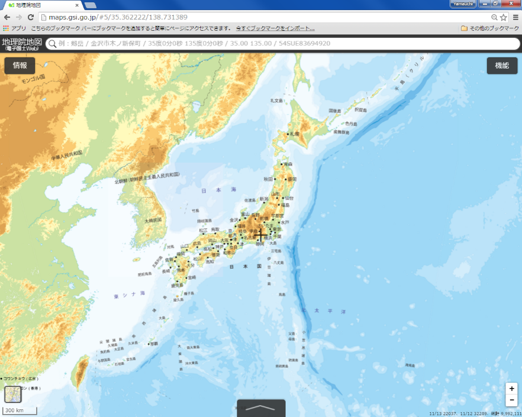
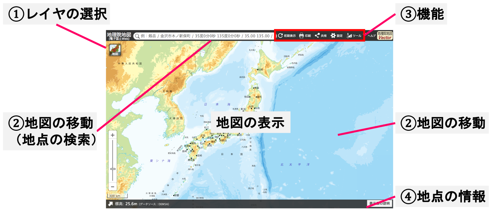
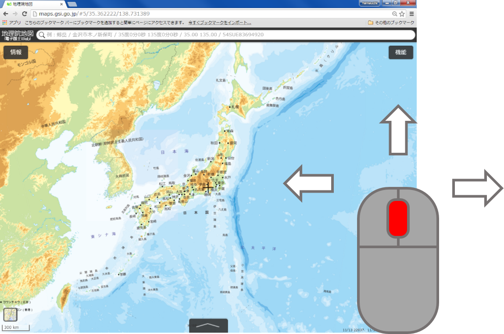
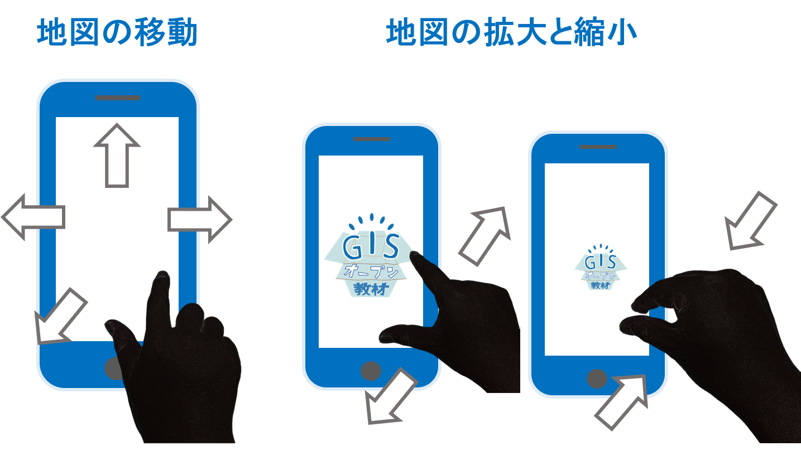
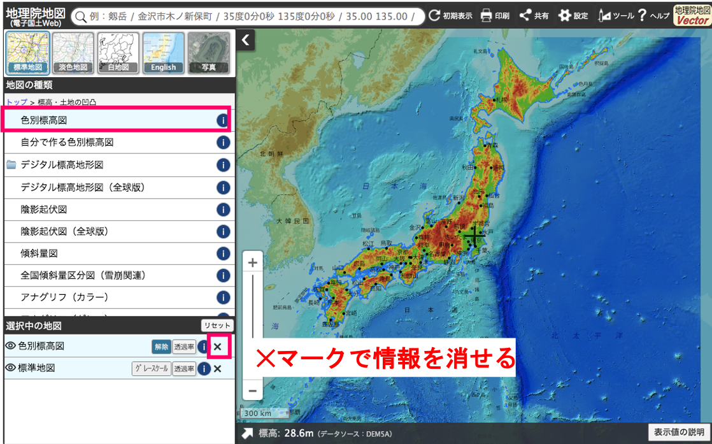
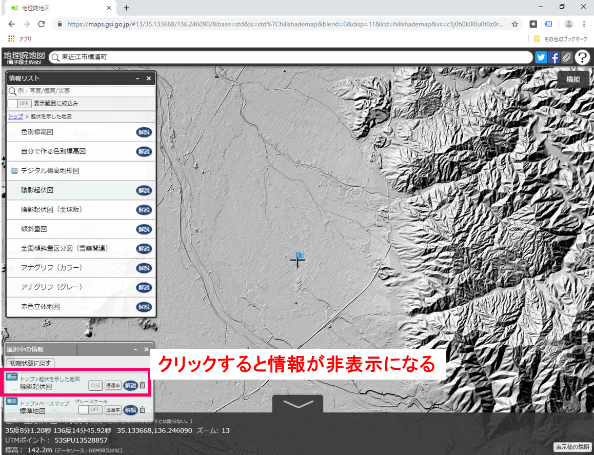
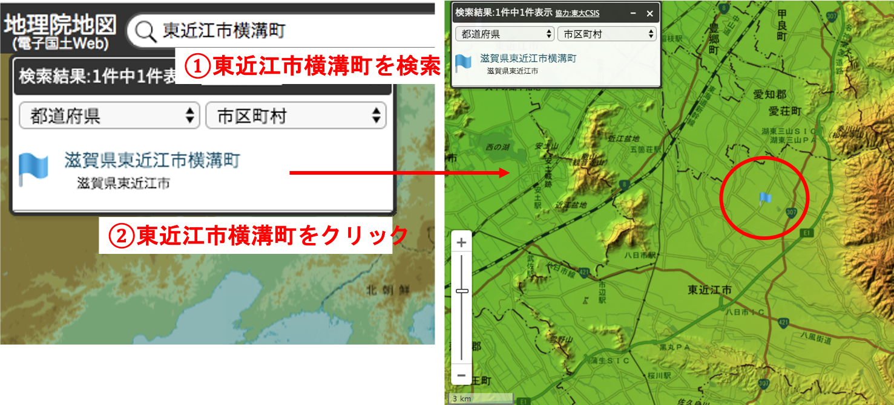
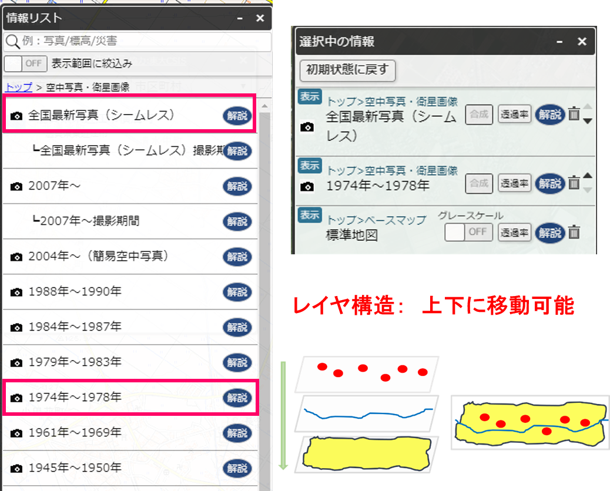

# 地理院地図入門
本教材は、地理院地図の基本機能を解説しています。地理院地図の活用のパートでは、実際に地理院地図を活用して地域学習をする手法を解説しています。その他に、地理院地図の機能の解説や作図ツールを用いたデータ作成を行います。本教材を使用する際は、[利用規約]をご確認いただき、これらの条件に同意された場合にのみご利用下さい。

**Menu**
------
* [地理院地図とは](#地理院地図とは)
* [地理院地図の基本機能](#地理院地図の基本機能)
* [地理院地図の活用](#地理院地図の活用)
* [その他の有用な機能](#その他の有用な機能)

--------

## 地理院地図とは

- 国土地理院の地図、空中写真を無償で閲覧できるサービス
- 基準点や土地条件図などの情報が公開されている
- 災害に関する情報の更新が早い
- 様々な地図、空中写真をタイルで配信している（他のWeb地図でも利用できる）
- GitHubでソースコードが公開されている

[▲メニューへもどる]

## 地理院地図の機能

[地理院地図]には多くの機能が実装されています。

上の検索ボックスから住所や緯度経度の検索ができ、下のボックスで緯度経度や標高値が確認できる。

1. 表示中の情報：
現在表示しているレイヤの詳細などを確認できる。
2. 表示できる情報：
空中写真や基準点など表示できるレイヤを選択できる。
3. 地理院地図について：
ヘルプ、利用規約、お知らせなどが確認できる。
4. ベースマップの選択や透過率が選択できる。

[▲メニューへもどる]

## 地理院地図の活用
以下では、東近江市（旧湖東町）の地形と土地利用の変遷の学習を例にあげ、地理院地図の活用について解説します。地理院地図にアクセスした後、実習をはじめてください。※この実習は「」で行ったものを改良したものです。

### 本講習の目的
現在の東近江市の地域課題を学習するための、導入として実践する。この講習では、空中写真や地図を利用し、東近江市（旧湖東町）の地理的特徴や土地利用の変遷を学習する。使用する情報は、東近江市の位置、地形図、標高情報、現在の空中写真、古い空中写真とする。

###　地図を移動し、表示画面を切り替える
まず、地図の操作方法を学ぶため、ズームインやズームアウト、マウス操作で滋賀県東近江市の位置まで移動する（後ほど、住所検索の手法を解説）。

### 標高情報を表示する
東近江市周辺の地形を把握するため、`情報＞起伏を示した地図＞色別標高図`をクリックする。表示した情報は、クリックで切り替えることができ、ゴミ箱マークで消すことができる。

### 特定の地域を検索する
地理院地図の住所検索機能から、以下のように`東近江市横溝町`と入力する。次に検索結果から、東近江市横溝町をクリックし、表示場所を移動する。最後にウィンドウを閉じる。

### 空中写真を読み込む
`情報＞空中写真・衛星画像`から、全国最新写真（シームレス）を読み込む。次に、土地利用の変化を比較するため、空中写真が表示できたら、1974～1978を読み込む。

地図は`選択中の情報`のリストから表示・非表示、上層下層を選択できる。ここでは、最新の写真を一番上に設置し、次に1974～1978を設置する。

### 2画面表示で土地利用の違いを確認する
`機能＞ツール＞二画面表示`をクリックすると、２つの地図を同時に表示し動かすことができる。

### 新旧の空中写真を比較する
住宅地、ため池、圃場の区画整備等の変化を確認する。　

## その他の有用な機能
地理院地図では、`機能`から以下のような有用な機能を呼び出すことができます。ここでは、いくつかの機能の利用法について解説します。

### 計測機能

### 3D表示

### データの作成

ポイントの作成ボタンをクリックし、任意の点をクリックする。ポイントの情報を入力し、確定をクリックする。

ラインの作成ボタンをクリックし、任意の点をクリックする。ラインの情報を入力し、確定をクリックする。

ポリゴンの作成ボタンをクリックし、任意の点をクリックする。ポリゴンの情報を入力し、確定をクリックする。

#### データを保存する

保存ボタンをクリックし、データ形式を選択しデータをダウンロードする。

#### データを表示する
QGISでGeoJSONを表示する。

[▲メニューへもどる]

#### ライセンスに関する注意事項
本教材で利用しているキャプチャ画像の出典やクレジットについては、[その他のライセンスについて]よりご確認ください。

[その他のライセンスについて]:../../lisence.md
[地理院地図]:http://maps.gsi.go.jp
[▲メニューへもどる]:./gsimap.md#Menu
[利用規約]:../../../policy.md
[利用規約]:../../../policy.md
[その他のライセンスについて]:../../license.md
[よくある質問とエラー]:../../questions/questions.md

[GISの基本概念]:../../00/00.md
[QGISビギナーズマニュアル]:../../QGIS/QGIS.md
[GRASSビギナーズマニュアル]:../../GRASS/GRASS.md
[リモートセンシングとその解析]:../../06/06.md
[既存データの地図データと属性データ]:../../07/07.md
[空間データ]:../../08/08.md
[空間データベース]:../../09/09.md
[空間データの統合・修正]:../../10/10.md
[基本的な空間解析]:../../11/11.md
[ネットワーク分析]:../../12/12.md
[領域分析]:../../13/13.md
[点データの分析]:../../14/14.md
[ラスタデータの分析]:../../15/15.md
[傾向面分析]:../../16/16.md
[空間的自己相関]:../../17/17.md
[空間補間]:../../18/18.md
[空間相関分析]:../../19/19.md
[空間分析におけるスケール]:../../20/20.md
[視覚的伝達]:../../21/21.md
[参加型GISと社会貢献]:../../26/26.md

[地理院地図]:https://maps.gsi.go.jp
[e-Stat]:https://www.e-stat.go.jp/
[国土数値情報]:http://nlftp.mlit.go.jp/ksj/
[基盤地図情報]:http://www.gsi.go.jp/kiban/
[地理院タイル]:http://maps.gsi.go.jp/development/ichiran.html

[課題ページ_QGISビギナーズマニュアル]:../../tasks/t_qgis_entry.md
[課題ページ_GRASSビギナーズマニュアル]:../../tasks/t_grass_entry.md
[課題ページ_リモートセンシングとその解析]:../../tasks/t_06.md
[課題ページ_既存データの地図データと属性データ]:../../tasks/t_07.md
[課題ページ_空間データ]:../../tasks/t_08.md
[課題ページ_空間データベース]:../../tasks/t_09.md
[課題ページ_空間データの統合・修正]:../../tasks/t_10.md
[課題ページ_基本的な空間解析]:../../tasks/t_11.md
[課題ページ_ネットワーク分析]:../../tasks/t_12.md
[課題ページ_基本的な空間解析]:../../tasks/t_13.md
[課題ページ_点データの分析]:../../tasks/t_14.md
[課題ページ_ラスタデータの分析]:../../tasks/t_15.md
[課題ページ_空間補間]:../../tasks/t_18.md
[課題ページ_視覚的伝達]:../../tasks/t_21.md
[課題ページ_参加型GISと社会貢献]:../../tasks/t_26.md
